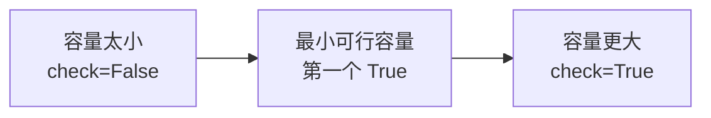

# 04 二分查找与滑动窗口

## 学习目标

- 能判断二分查找中 `L/R/mid` 每次移动后，哪些位置已经被排除，哪些位置仍可能是答案。
- 能区分普通查找、边界查找、峰值查找、答案二分。
- 能解释滑动窗口中左边界、右边界、窗口统计量和答案更新的关系。
- 能读懂单调队列维护窗口最大值时，队首过期、队尾删除、答案输出的顺序。

本讲义选题已检查：与 00-03 讲义中使用过的题库原题不重复；本讲义内部每道题也只使用一次。

## 核心模型

### 1. 普通二分

普通二分查找的是“某个值是否存在”。`mid` 已经比较过，所以左右边界通常移动到 `mid+1` 或 `mid-1`。

```python
L = 0
R = len(a) - 1
while L <= R:
    mid = (L + R) // 2
    if a[mid] == key:
        break
    elif a[mid] < key:
        L = mid + 1
    else:
        R = mid - 1
```

### 2. 边界二分

边界二分查找的是“第一个满足条件的位置”或“最后一个满足条件的位置”。此时 `mid` 有时不能排除，要保留在新区间内。

#### 找第一个 `>= key` 的位置：

```python
L = 0
R = len(a)  #为什么不是len(a)-1
while L < R: #为什么不是L<=R
    mid = (L + R) // 2
    if a[mid] < key:
        L = mid + 1
    else:
        R = mid
```

关键：当 `a[mid] >= key` 时，`mid` 可能就是第一个满足条件的位置，所以写 `R = mid`。
R：第一个$>= key$ 的位置
##### 为什么这样一定能找到边界

以“找第一个 `>= key` 的位置”为例，数组可以被分成两段：

```text
下标:   0   1   2   3   4   5   6
值:     1   3   6   6   6   8   9
判断:   F   F   T   T   T   T   T
目标:           ↑
            第一个 T
```


二分过程中始终保留一个事实：真正的边界一定还在 `[L, R]` 里。

- 如果 `a[mid] < key`，说明 `mid` 以及 `mid` 左边都太小，不可能是第一个 `>= key` 的位置，所以可以放心丢掉：`L = mid + 1`。
- 如果 `a[mid] >= key`，说明 `mid` 已经满足条件，但它左边可能还有更早满足条件的位置；同时 `mid` 自己也可能就是第一个满足条件的位置，所以不能写 `R = mid - 1`，必须写 `R = mid`。

用 `a = [1,3,6,6,6,8,9]`，`key = 6` 追踪：

|  步骤 |   L |   R | mid | a[mid] | 判断                        | 新区间     |
| --: | --: | --: | --: | -----: | ------------------------- | ------- |
|   1 |   0 |   7 |   3 |      6 | `a[mid] >= key`，mid 可能是答案 | `[0,3]` |
|   2 |   0 |   3 |   1 |      3 | `a[mid] < key`，mid 及左边都排除 | `[2,3]` |
|   3 |   2 |   3 |   2 |      6 | `a[mid] >= key`，mid 可能是答案 | `[2,2]` |

当 `L == R` 时，区间里只剩一个位置。由于每一步都没有丢掉真正答案，最后这个位置就是第一个 `>= key` 的位置。

##### 为什么不是len(a)-1
如果数组里**所有元素都小于 `key`**（例如 `a = [1, 2, 3]`, `key = 6`）：
1. `L` 会一路向右推，最后 `L` 和 `R` 会卡在 `len(a) - 1`（即下标 `2`）。
2. 循环结束时 `L == R == 2`，算法会告诉你“第一个 `>= 6` 的位置是下标 `2`（值是3）”，**得出错误结论**！
**正确做法**：将初始值设为 `R = len(a)`。
- 如果全盘小于 `key`，`L` 会被推到 `len(a)`。循环结束后检查 `L == len(a)` 即可知道“不存在满足条件的元素”。

##### 为什么循环条件 L < R
- 当 `a[mid] >= key` 时，执行的是 **`R = mid`**。
- 如果此时 `L == R`，`mid` 就会等于 `L`（也等于 `R`）。
- 如果你写了 `while L <= R:`，程序就会在 `R = mid` 这里**陷入死循环**！

#### 变式一：第一个$>= key$ 的位置
```python
while L <= R: 
	mid = (L + R) // 2 
	if a[mid] < key: 
		L = mid + 1 
	else:
		R = mid - 1
```
结束循环时：
L：`___________________________________`
R：`__________________________________`

答案：
L：第一个$>= key$ 的位置
R：最后一个 $< key$ 的位置

- **`a[mid] < key`**：说明当前 `mid` **太小了**，一定不是答案，所以把 `L` 往右移到 `mid + 1`。因此 **`L` 左侧的所有元素都严格小于 `key`**。
    
- **`a[mid] >= key`**（即 `else` 分支）：注意！这里把等于 `key` 的情况也放进了 `else`。说明只要当前元素大于或**等于** `key`，我们就会强制把 `R` 向左推（`R = mid - 1`）。
    
- 这样持续压缩的结果，就是把 `R` 一路往左推，直到推到所有 $\ge key$ 的元素左边；而 `L` 则被一路往右推，刚好停在第一个 $\ge key$ 的位置上。

#### 变式二：找最后一个 `<= key` 的位置

如果题目要找“最后一个 `<= 6` 的位置”，这时 `a[mid] <= 6` 只能说明 `mid` 可行，不代表它已经是最后一个可行位置。它的右边可能还有 `<= 6` 的数，所以要把 `mid` 保留下来，写成 `L = mid`：

```python
L = 0
R = len(a) - 1

while L < R:
    mid = (L + R + 1) // 2  # 注意：上取整！
    if a[mid] <= 6:
        ________________
    else:
        ________________

print(_____)  # 此时 L == R，返回 L 即为最后一个 <= 6 的下标
```

答案：
L = mid  # mid 可能是最后一个，保留在左侧区间
R = mid - 1  # mid 太大，直接排除
L


L：最后一个 $<= key$ 的位置

这里会出现一个新的问题：因为分支中有 `L = mid`，当区间只剩 2 个元素时，比如 $L=2, R=3$，如果仍然用普通写法
$$
mid = (L + R ) // 2
$$

就会得到 `mid = 2`，也就是 `mid == L`。如果此时 `a[mid] <= 6` 成立，执行 `L = mid` 后，`L` 仍然是 2，区间没有缩小，程序会死循环。

所以，找“最后一个满足条件的位置”时，中点必须上取整：

$$
mid = (L + R + 1) // 2
$$

这样当 $L=2, R=3$ 时，`mid = 3`，若 3 号位置可行，就能把 `L` 推到 3；若 3 号位置不可行，就执行 `R = mid - 1` 回到 2，区间都会缩小。

##### 简便替代方案：转换思路

```text
最后一个 <= 6 的位置  <=>  第一个 > 6 的位置 - 1
```

也就是先用“找第一个满足条件的位置”的标准边界二分，去找第一个 `> 6` 的位置。这个写法不需要上取整，满足条件时仍然写 `R = mid`：

```python
L = 0
R = len(a)

while L < R:
    mid = (L + R) // 2
    if a[mid] > 6:
        R = mid  
    else:
        L = mid + 1  

idx = L
print(idx - 1) 
```

1. **`if a[mid] > key:`**
    
    说明当前 `mid` 的值**已经大于 key** 了。它**有可能是**“第一个大于 key”的数，但也可能它左边还有更大的数。
    
    - 因此，不能把 `mid` 排除掉，必须把右边界收缩到 **`R = mid`**。
        
    - 这保证了 **`R` 及其右侧的元素都 $> key$**（`R` 始终维护着一个合法候选者）。
        
1. **`else:`（即 `a[mid] <= key`）**
    
    说明当前 `mid` **小于或等于 key**。它绝对不可能是“大于 key”的数，而且它左边的所有数也都不可能。
    
    - 因此，可以彻底排除 `mid`，将左边界推到 **`L = mid + 1`**。
        
    - 这保证了 **`L` 左侧的所有元素都 $\le key$**。
        

随着区间不断收缩，`L` 向右推，`R` 向左靠，最终会在 `L == R` 时停下。这个停下的位置就是**第一个 $> key$ 的元素索引**。

##### 若所有元素都>key？
- - 第一个 `> key` 的位置是 `L = 0`。
        
    - `idx - 1` 计算出来是 `-1`。
        
    - 在 Python 里，`a[-1]` 会直接取到数组最后一个元素，导致逻辑崩溃！
        
- **正确补丁**：计算出 `idx = L` 后，必须判断 `idx > 0`。如果 `idx == 0`，说明**不存在 $\le key$ 的元素**。

#### 变式三：找最后一个 `<= key` 的位置
```python
while L <= R:
    mid = (L + R) // 2
    if ____________:
        R = mid - 1
    else:  
        L = mid + 1
```

答案：`a[mid] > key`


- **`L`**：**第一个 $> key$ 的位置
- **`R`** ：**最后一个 $\le key$ 的位置

- **强行向右推 `L`**：当 `a[mid] == key` 时，算法并没有停下，而是执行 `L = mid + 1`。这相当于告诉程序：“即使找到了 `key`，我也要跳过它，去右边看看还有没有 `key` 或者比它更大的数。”
    
- **`L` 最终跨越界限**：这种向右推送会一直持续，直到 `L` 彻底越过所有 $\le key$ 的元素，停在**第一个 $> key$** 的位置。
    
- **`R` 留在界限左侧**：当 `L` 跨过去之后，下一次计算的 `mid` 会落在大于 `key` 的区间，触发 `if` 执行 `R = mid - 1`，将 `R` 拉回到 **$\le key$ 区域的最后一个位置**。

##### 边界二分归纳表

| **维度**       | **流派 A：双闭区间**                                           | **流派 B：左闭右开**                                                          |
| ------------ | ------------------------------------------------------- | ---------------------------------------------------------------------- |
| **循环条件**     | **`while L <= R:`**                                     | **`while L < R:`**                                                     |
| **右界初始值**    | `R = len(a) - 1`                                        | **`R = len(a)`** _(非常重要！)_                                             |
| **指针更新**     | `L = mid + 1`<br><br>  <br><br>`R = mid - 1`            | 找左界：`L = mid + 1, R = mid`<br><br>  <br><br>找右界：`L = mid, R = mid - 1` |
| **`mid` 取整** | 均为 `(L + R) // 2`                                       | 找右界（含 `L = mid`）时**必须上取整 `(L + R + 1) // 2`**                          |
| **终止状态**     | **`L > R`** (错开 $L = R + 1$)                            | **`L == R`** (重合)                                                      |
| **答案位置**     | 找第一个 `>(=)`: 停在 **`L`**<br><br>找最后一个 `<(=)`: 停在 **`R`** | 停在 **`L`**（或 `R`）                                                      |

##### 流派A归纳表

| **判断条件 (if)**                   | **循环结束（L > R）后的含义**                               |
| ------------------------------- | ------------------------------------------------- |
| `if a[mid] < key: L = mid + 1`  | `L` 为第一个 $\ge key$<br><br><br>`R` 为最后一个 $< key$   |
| `if a[mid] <= key: L = mid + 1` | `L` 为第一个 $> key$<br><br>  <br>`R` 为最后一个 $\le key$ |

### 3. 答案二分

答案二分不是在数组中找元素，而是在答案范围中试答案。
#### 找“最小可行值”
```python
L = 最小可能答案
R = 最大可能答案
while L <= R:
    mid = (L + R) // 2
    if check(mid):
        R = mid - 1
    else:
        L = mid + 1
print(L)
```

关键：`check(mid)` 为 True，只能说明 `mid` 可行，不代表它最小。

#### 为什么 `check(mid)` 为 True 还要继续找

答案二分成立的前提是“可行性具有单调性”。以“调度车容量最小值”为例：

- 容量太小：装不下，`check(M)` 为 False。
- 容量足够：能完成，`check(M)` 为 True。
- 如果容量 `M` 能完成，那么比 `M` 更大的容量也一定能完成。



目标不是找任意一个 True，而是找第一个 True。

如果 `check(mid)` 为 True，只能说明：

```text
mid 可行，答案 <= mid
```

但答案可能就是 `mid`，也可能在 `mid` 左边。所以要继续向左侧试探：

```python
R = mid - 1
```

如果 `check(mid)` 为 False，说明：

```text
mid 不可行，答案 > mid
```

于是可以丢掉 `mid` 及其左边：

```python
L = mid + 1
```

#### 模拟查找过程：求最小可行容量
假设答案是4

|  步骤 |   L |   R | mid | check(mid) | 说明                             | 更新                |
| --: | --: | --: | --: | ---------- | ------------------------------ | ----------------- |
|   1 |   1 |   7 |   4 | True       | 容量 4 已经足够，但更小容量可能也足够；去左侧继续找    | `R = mid - 1 = 3` |
|   2 |   1 |   3 |   2 | False      | 容量 2 太小，它和左侧容量 1 全部不可行；答案只能在右侧 | `L = mid + 1 = 3` |
|   3 |   3 |   3 |   3 | False      | 容量 3 仍然不可行；答案只能比 3 更大          | `L = mid + 1 = 4` |

### 4. 滑动窗口

滑动窗口处理连续区间问题。右边界扩张，窗口不合法时移动左边界。

```python
i = 0
统计量 = 0
for j in range(len(a)):
    加入 a[j]
    while 窗口不合法:
        移出 a[i]
        i += 1
    更新答案
```

判断窗口题时先问四个问题：

1. 窗口范围是 `[i, j]` 还是 `[i, j)`。
2. 统计量是什么。
3. 什么时候移动左边界。
4. 什么时候更新答案。

## 例题1：边界二分统计重复次数

出处：选自 [[13查找与排序/202511-浙东北县域名校发展联盟-高三-一模-10|202511-浙东北县域名校发展联盟-高三-一模-10]]。

已知非降序列表 `a` 由若干个整型元素构成。现要查找并输出整数 `key` 出现的次数。实现该功能的程序段如下：

```python
def search(k):
    i, j = 0, len(a) - 1
    while i <= j:
        m = (i + j) // 2
        if           :
            i = m + 1
        else:
            j = m - 1
    return i

a = [1, 3, 6, 6, 6, 8, 9, 9, 9, 9, 10]
key = int(input("输入查找键: "))
x = search(key)
y = search(key - 1)
print("出现的次数: " + str(x - y))
```

加框处应填入的正确代码为（   ）

- A. `k <= a[m]`
- B. `k < a[m]`
- C. `k >= a[m]`
- D. `k > a[m]`

### 讲解

`search(k)` 要返回第一个大于 `k` 的位置。

- 当 `a[m] <= k` 时，当前位置及左侧都不可能是“第一个大于 k”，所以 `i = m + 1`。
- 当 `a[m] > k` 时，当前位置可能是答案，所以向左收缩，`j = m - 1`。

因此判断条件可以写成 `k >= a[m]`，选 C。

`x = search(key)` 是第一个大于 `key` 的位置，`y = search(key-1)` 是第一个大于 `key-1` 的位置，两者相减就是 `key` 出现次数。

## 练习1：左边界查找

出处：选自 [[13查找与排序/202512-嘉兴-高三-一模-12|202512-嘉兴-高三-一模-12]]。

在非降序有序数组 `a` 中查找元素 `key` 所处的位置，`L`、`R` 为查找时数组 `a` 的左右边界位置。若函数 `f1`、`f2` 功能相同，则函数 `f2` 加框处的正确代码为（   ）

```python
def f1(a, key, L, R):
    if L > R:
        return -1
    M = (L + R) // 2
    if a[M] == key:
        if M == L or a[M-1] != key:
            return M
        else:
            return f1(a, key, L, M-1)
    elif key > a[M]:
        return f1(a, key, M+1, R)
    else:
        return f1(a, key, L, M-1)

def f2(a, key, L, R):
    while L < R:
        M = (L + R) // 2
        # 加框处
    if a[L] == key:
        return L
    else:
        return -1
```

- A.

```python
if key > a[M]:
    L = M + 1
else:
    R = M
```

- B.

```python
if key > a[M]:
    L = M
else:
    R = M - 1
```

- C.

```python
if key > a[M]:
    L = M + 1
else:
    R = M - 1
```

- D.

```python
if key > a[M]:
    L = M
else:
    R = M + 1
```

参考答案：A。

### 解析要点

`f1` 查找的是 `key` 第一次出现的位置，`f2` 也必须返回左边界。

- 当 `key > a[M]` 时，说明 `a[M]` 以及左侧都小于 `key`，不可能是答案，所以 `L = M + 1`。
- 当 `key <= a[M]` 时，`M` 可能就是第一个 `key`，也可能答案还在左侧，所以不能排除 `M`，要写 `R = M`。

因此加框处选 A。

以 `a = [1,3,6,6,6,8,9]`、`key = 6` 为例，`f2` 的查找过程如下：

| 步骤 | L | R | M | a[M] | 判断 | 更新 |
|---:|---:|---:|---:|---:|---|---|
| 1 | 0 | 6 | 3 | 6 | `key <= a[M]`，M 可能是第一个 6 | `R = M = 3` |
| 2 | 0 | 3 | 1 | 3 | `key > a[M]`，左侧排除 | `L = M + 1 = 2` |
| 3 | 2 | 3 | 2 | 6 | `key <= a[M]`，M 可能是第一个 6 | `R = M = 2` |

最后 `L == R == 2`，且 `a[L] == key`，返回 2。

## 例题2：旋转数组最大值位置

出处：选自 [[13查找与排序/202511-稽阳联谊-高三-一模-11|202511-稽阳联谊-高三-一模-11]]。

有如下 Python 程序段：

```python
# 输入列表 a，共 n 个元素，各元素递增排列，代码略
a = a[x:] + a[:x]    # (x 为 0~n-1 的正整数)
L = 0
R = len(a) - 1
while L < R:
    m = ①
    if a[m] <= a[R] and a[m] < a[L]:
        R = m - 1
    else:
        L = m
print("数组中的最大值位置为:", ②)
```

为使程序实现所需功能，划线处应填入的代码是（   ）

- A. ① `(L+R+1)//2` ② `m`
- B. ① `(L+R)//2` ② `m`
- C. ① `(L+R+1)//2` ② `L`
- D. ① `(L+R)//2` ② `R`

参考答案：C。

### 讲解

这段程序要找旋转数组中的最大值位置。旋转数组中最大值位于“断点”前一侧。

- 当 `a[m]` 位于右侧递增段，即 `a[m] <= a[R]` 且 `a[m] < a[L]` 时，最大值一定在 `m` 左侧，所以 `R = m - 1`。
- 否则，最大值在 `m` 或 `m` 右侧，`m` 仍可能是答案，所以 `L = m`。

因为程序存在 `L = m`，当区间只剩 2 个元素时，`m` 必须上取整，否则可能死循环。因此 ① 填 `(L+R+1)//2`。循环结束时 `L == R`，答案位置就是 `L`，所以 ② 填 `L`，选 C。

以 `a = [6,8,9,1,3]` 为例：

| 步骤 | L | R | m | a[m] | 判断 | 更新 |
|---:|---:|---:|---:|---:|---|---|
| 1 | 0 | 4 | 2 | 9 | 不在右侧递增段，最大值在 m 或右侧 | `L = m = 2` |
| 2 | 2 | 4 | 3 | 1 | 位于右侧递增段，最大值在左侧 | `R = m - 1 = 2` |

最后 `L == R == 2`，最大值位置为 2。

## 练习2：答案二分

出处：选自 [[03python基础/202511-金华十校-高三-一模-15|202511-金华十校-高三-一模-15]]。

某 n×n 的区域设有一些共享单车停车点，每个停车点设置了目标车辆数，但是实际停车数并不一定等于目标车辆数。每天凌晨会有一辆调度车（有容量限制）从区域左上角即第 0 行第 0 列位置出发，通过以下规则调整实际车辆数为目标车辆数：

调度车每次移动到最近的超出目标车辆数的停车点，将多余的车辆装载（不超调度车容量限制），再移动到最近的小于目标车辆数的停车点，将车辆补足至目标数（可能一次调度无法完全补足）。当所有停车点的数量均达到目标车辆数后，调度车回到 0 号点。

![[attachments/202511金华十校_15_图1.jpg]]

从 `(x1, y1)` 移动到 `(x2, y2)` 的距离计算公式为 `|x1 - x2| + |y1 - y2|`。

（1）若在样例中，调度车的容量为 1 时，则调度车移动的总距离为（   ）。

（2）由于调度车电量有限，移动距离最大为 C，求移动距离不超过 C 的前提下，调度车完成调度所需的最小容量。利用二分查找加速最小容量的计算，请回答下列问题：

```python
# 输入初始数据，代码略
# status 保存实际车辆数，如 [[0,1], [2,2]]
# target 保存目标车辆数，如 [[0,1], [4,0]]
# diff 保存实际车辆数与目标车辆数的差值，如 [[0,0], [-2,2]]
# C 是最大移动距离
diff = [[0] * n for i in range(n)]
for i in range(n):
    for j in range(n):
        diff[i][j] = status[i][j] - target[i][j]
L = 1; R = ▲
while L <= R:
    m = (L + R) // 2
    if check(m, diff) == True:  # 检查容量为 m 时，能否完成调度
        R = m - 1
    else:
        L = m + 1
print(L)
```

对于 R 的初始值，下列设置不正确的是（   ）。
- A. 车辆总数
- B. 所有停车点中实际车辆数的最大值
- C. 停车点总数
- D. 所有停车点中实际车辆数与目标车辆数差值的最大值

（3）函数 `find` 用于在列表中查找距离 `(px, py)` 最近的位置，代码如下。`f` 为 1 时找最近的正数，`f` 为 -1 时找最近的负数。

```python
def find(diff, px, py, f):
    n = len(diff)
    for k in range(1, n * 2):  # 从小到大枚举 k 步下能到达的距离
        for i in range(____③____):
            if px+i<n and py+k-i<n and diff[px+i][py+k-i] * f > 0:
                return px + i, py + k - i
            if px-i>=0 and py+k-i<n and diff[px-i][py+k-i] * f > 0:
                return px - i, py + k - i
            if px+i<n and py-k+i>=0 and diff[px+i][py-k+i] * f > 0:
                return px + i, py - k + i
            if px-i>=0 and py-k+i>=0 and diff[px-i][py-k+i] * f > 0:
                return px - i, py - k + i
    return -1, -1
```

（4）函数 `check(M, diff)` 用于验证限制为 M 的情况下是否可以完成调度，Python 代码如下。请完成划线处的代码填空。

```python
def check(M, diff):
    # 将列表 diff 复制到列表 d，代码略
    px, py = 0, 0    # 当前调度车所在位置
    cnt = 0          # 移动总距离
    while True:
        x, y = find(d, px, py, 1)
        if x == -1: break
        cnt += abs(px - x) + abs(py - y)
        px, py = x, y
        x, y = find(d, px, py, -1)
        if x == -1: break
        cnt += abs(px - x) + abs(py - y)
        if d[px][py] <= M:
            d[x][y] += d[px][py]
            d[px][py] = 0
        else:
            d[x][y] += M
            d[px][py] -= M
        px, py = x, y
        if ②:
            return False
    return True
```

参考答案：
（1）6
（2）**C**

（3）`k + 1`（或 `0, k + 1`）

（4）
① `d[x][y] += d[px][py]`
② `cnt + px + py > C`

### 解析要点

这段代码是在求“最小可行容量”。

- `check(m, diff) == True` 表示容量 `m` 已经能完成调度，但它不一定是最小容量，所以继续向左找，`R = m - 1`。
- `check(m, diff) == False` 表示容量 `m` 太小，容量更小的情况也不可能成功，所以 `L = m + 1`。

因此 `R` 的初始值必须是一个保证不小于答案的上界。

| 选项 | 是否适合作为上界 | 说明 |
|---|---|---|
| A. 车辆总数 | 可以 | 容量不超过全部车辆数 |
| B. 实际车辆数最大值 | 通常可以 | 至少不小于单点可能装走的车辆数 |
| C. 停车点总数 | 不可靠 | 点的个数和车辆容量没有必然关系 |
| D. 实际车辆数与目标车辆数差值最大值 | 通常可以 | 覆盖单个点最大调度差 |

所以不正确的是 C。

## 例题3：字符串滑动窗口

出处：选自 [[03python基础/202511-浙东北县域名校发展联盟-高三-一模-12|202511-浙东北县域名校发展联盟-高三-一模-12]]。

有如下 Python 程序：

```python
s = input("输入字符串: ")
k = [-1] * 128
i = 0
m = 0
for j in range(len(s)):
    cur = s[j]
    if k[ord(cur)] >= i:
        i = k[ord(cur)] + 1
    k[ord(cur)] = j
    m = max(m, j - i + 1)
print(m)
```

程序运行时，输入 `"2025happy"`，输出结果是（   ）

- A. 3
- B. 4
- C. 5
- D. 6

参考答案：D。

### 讲解

这段程序求“最长无重复字符子串长度”。

- `k[ord(cur)]` 记录当前字符上一次出现的位置。
- `i` 是当前窗口左边界。
- `j` 是当前窗口右边界。
- 如果当前字符在窗口内出现过，即 `k[ord(cur)] >= i`，左边界移动到重复字符后一位。

输入 `"2025happy"` 时，窗口变化如下：

| j | cur | 上次位置 | i 更新后 | 当前窗口 | m |
|---:|---|---:|---:|---|---:|
| 0 | 2 | -1 | 0 | `2` | 1 |
| 1 | 0 | -1 | 0 | `20` | 2 |
| 2 | 2 | 0 | 1 | `02` | 2 |
| 3 | 5 | -1 | 1 | `025` | 3 |
| 4 | h | -1 | 1 | `025h` | 4 |
| 5 | a | -1 | 1 | `025ha` | 5 |
| 6 | p | -1 | 1 | `025hap` | 6 |
| 7 | p | 6 | 7 | `p` | 6 |
| 8 | y | -1 | 7 | `py` | 6 |

最长无重复子串是 `025hap`，长度为 6，选 D。

## 练习3：连续货物的最大合法窗口

出处：选自 [[03python基础/202603-金丽衢-高三-二模-13|202603-金丽衢-高三-二模-13]]。

现有一辆卡车需要装货，各个货物的重量数据存储在数组 `a` 中，卡车载重为 `weight`。搬运时必须选择连续排列的货物，要求解不超过卡车载重量且最大载重的货物组合；若有多个组合满足要求，则选取最后一个。

（1）若货物重量为 `[20,10,50,70,25,35,30,5,80]`，卡车载重为 `100`，则选取的货物重量分别是 ＿＿＿＿。

（2）实现上述功能的 Python 程序如下，请在划线处填入合适代码。

```python
a = [20,10,50,70,25,35,30,5,80]
weight = 100
i = j = s = 0
besti = bestj = bests = 0
while ____①____:
    s += a[j]
    j += 1
    while i <= j and s > weight:
        ____②____
        i += 1
    if ____③____:
        bests = s
        besti = i
        bestj = j
print(bests,besti,bestj)
```

参考答案：

（1）`25、35、30、5`

（2）

```python
j < len(a)
s -= a[i]
s >= bests
```

### 解析要点

这段程序要找“不超过载重的连续货物最大总重量”，如果最大总重量相同，要取最后出现的组合。

- 窗口是 `[i, j)`，`s` 是窗口内货物总重量。
- 每次先加入 `a[j]`，再把 `j` 右移，所以外层循环条件是 `j < len(a)`。
- 如果 `s > weight`，就从左侧移出 `a[i]`，所以 ② 填 `s -= a[i]`。
- 因为相同重量要取后出现的组合，所以更新条件不是 `s > bests`，而是 `s >= bests`。

关键窗口过程如下：

| 加入后窗口 | s | 是否超重 | 调整后窗口 | 调整后 s | 是否更新 |
|---|---:|---|---|---:|---|
| `[20]` | 20 | 否 | `[20]` | 20 | 更新 |
| `[20,10,50,70]` | 150 | 是 | `[70]` | 70 | 更新 |
| `[70,25,35]` | 130 | 是 | `[25,35]` | 60 | 不更新 |
| `[25,35,30,5]` | 95 | 否 | `[25,35,30,5]` | 95 | 更新 |
| `[25,35,30,5,80]` | 175 | 是 | `[80]` | 80 | 不更新 |

所以第（1）小题选取的货物是 `25、35、30、5`。


## 例题4：单调队列维护窗口最大值

出处：选自 [[09队列/202511-宁波-高三-一模-12|202511-宁波-高三-一模-12]]。

有一个数字传送带每秒匀速向左移动 1 个数字。其上方有观察数字传送带的固定窗口，宽度为 `k`。操作员需每秒一次记录窗口中的最大值，例如图中的数字每秒记录下来的结果依次为“3 3 5 5 6 7”。

![[attachments/202511宁波_12_图1.png]]

```python
nums = [1, 3, -1, -3, 5, 3, 6, 7]
k = int(input())
n = len(nums)
q = [0] * n
head, tail = 0, 0
ans = []

for i in range(k):
    while head < tail and nums[i] >= nums[q[tail - 1]]:
        tail -= 1
    q[tail] = i
    tail += 1
ans.append(nums[q[head]])

for i in range(k, n):
    while head < tail and nums[i] >= nums[q[tail - 1]]:
        tail -= 1
    q[tail] = i
    tail += 1
    # 方框中填入代码
print(ans)
```

若 `k` 为 3，方框中应填入的正确代码为（   ）

- A.

```python
while tail < head and q[head] <= i - k:
    head += 1
ans.append(nums[q[tail]])
```

- B.

```python
while tail < head and q[tail] <= i + k:
    tail += 1
ans.append(nums[q[head]])
```

- C.

```python
while head < tail and q[tail] <= i - k:
    tail += 1
ans.append(nums[q[tail]])
```

- D.

```python
while head < tail and q[head] <= i - k:
    head += 1
ans.append(nums[q[head]])
```

参考答案：D。

### 讲解

队列 `q[head:tail]` 存的是下标，不是数值。这段程序要维护“当前窗口中的最大值下标”。

- 队首 `q[head]` 是当前窗口最大值的下标。
- 新元素比队尾对应值大或相等时，队尾不可能再成为后续窗口最大值，所以删除队尾。
- 当 `q[head] <= i-k` 时，队首已经离开当前窗口 `[i-k+1, i]`，要 `head += 1`。
- 输出当前窗口最大值：`nums[q[head]]`。

以 `nums = [1,3,-1,-3,5,3,6,7]`、`k = 3` 为例：

| i | 当前窗口 | 加入 nums[i] 后队首对应值 | 是否有过期下标 | 输出 |
|---:|---|---:|---|---:|
| 3 | `[3,-1,-3]` | 3 | 下标 1 未过期 | 3 |
| 4 | `[-1,-3,5]` | 5 | 较小值已从队尾删除 | 5 |
| 5 | `[-3,5,3]` | 5 | 下标 4 未过期 | 5 |
| 6 | `[5,3,6]` | 6 | 较小值已从队尾删除 | 6 |
| 7 | `[3,6,7]` | 7 | 较小值已从队尾删除 | 7 |

因此方框中要先删除过期队首，再输出 `nums[q[head]]`，选 D。

## 课后作业

### 作业1：峰值二分过程判断

出处：选自 [[13查找与排序/202511-台州-高三-一模-11|202511-台州-高三-一模-11]]。

有如下 Python 程序段：

```python
L = 0
R = len(a) - 1
while L < R:
    m = (L + R) // 2
    if a[m] < a[m + 1]:
        L = m + 1
    else:
        R = m
print(L)
```

运行该程序段后，输出结果为 4，则列表 `a` 不可能是（   ）

- A. `[1,3,5,6,8,4,2]`
- B. `[3,5,6,8,9]`
- C. `[1,8,7,4,8,6,5]`
- D. `[1,3,5,8,8,7,4]`

参考答案：D。

### 作业2：三元组数据中的二分查找

出处：选自 [[13查找与排序/202511-温州-高三-一模-11|202511-温州-高三-一模-11]]。

列表 `a` 中每连续 3 个元素依次存储同一考生的考号、笔试成绩和面试成绩，即 `a[0]` 为某考生考号，`a[1]` 为该考生笔试成绩，`a[2]` 为该考生面试成绩。原始数据已按考生考号升序。输入考生考号 `key`，查找该考生的笔试、面试成绩。

```python
i = 0
j = __(1)__
while i <= j:
    m = __(2)__
    if a[m] == key:
        print("考号", key, "笔试成绩为", a[m + 1], "面试成绩为", a[m + 2])
        break
    elif a[m] < key:
        i = __(3)__
    else:
        j = __(4)__
```

可选代码：

① `len(a) // 3 - 1`
② `len(a) - 3`
③ `(i + j) // 2`
④ `(i + j) // 2 * 3`
⑤ `m // 3 + 1`
⑥ `m // 3 - 1`
⑦ `m + 3`
⑧ `m - 3`

划线处应依次填入的是（   ）

- A. ①③⑤⑥
- B. ①④⑤⑥
- C. ②③⑦⑧
- D. ②④⑦⑧

参考答案：B。

### 作业3：随机偶数列表中的窗口统计

出处：选自 [[03python基础/202512-强基联盟-高二-月考-12|202512-强基联盟-高二-月考-12]]。

有如下 Python 程序段：

```python
import random
lst = []
n = 20
for i in range(n):
    k = random.randint(0, 5)
    lst.append(k * 2)
s = 0
maxs = 0
c = 0
for i in range(n):
    s += lst[i]
    c += 1
    while c == 5 or s > 20:
        s -= lst[i + 1 - c]
        c -= 1
    if s > maxs:
        maxs = s
```

执行该程序段后，`maxs` 的值不可能是（   ）

- A. 0
- B. 8
- C. 16
- D. 19

参考答案：D。

### 作业4：固定长度窗口最大值

出处：选自 [[08数组/202603-名校协作体-高二-月考-12|202603-名校协作体-高二-月考-12]]。

有如下 Python 程序段：

```python
a = [1, 2, -1, 3, 5, 7, 1, 4, 9]
n = len(a)
ans = []
k = 3
left = 0
right = left + k - 1
while left <= n - k:
    m = a[left]
    for i in range(left + 1, right + 1):
        if a[i] > m:
            m = a[i]
    ans.append(m)
    left += 1
    right = left + k - 1
```

程序运行后，变量 `ans` 的值是（   ）

- A. `[2,7,9]`
- B. `[5,7,9]`
- C. `[2,3,5,7,7,7,9]`
- D. `[2,3,5,7,7,9,9]`

参考答案：C。

### 作业5：最短覆盖窗口

出处：选自 [[08数组/202601-舟山-高二-期末-15|202601-舟山-高二-期末-15]]。

某高中学校有 3 个年级段，每个年级段有 10 个班级。元旦文艺汇演结束后，演员们横向排成一排合影。由于相机视野有限，校摄影部只能拍摄其中连续的一段演员，但要求这段中包括所有班级（每个班级至少有一个演员）。已知每个演员的信息由年级（1 位）+班级（2 位）构成，如 `"204"` 表示高二 4 班。上台的 `n` 个演员信息按排队顺序存储在 `stu` 列表中。

（1）定义如下 `check(L, R)` 函数，判断 `stu[L]` 到 `stu[R]` 是否包含所有班级，请在划线处填入合适代码。

```python
def check(L, R):
    f = [0] * 30
    for i in range(L, R + 1):
        t = stu[i]
        gra =     ①      # 分离年级
        cla = int(t[1:])  # 分离班级
        idx =        ②
        f[idx] = 1
    cnt = 0
    for i in range(len(f)):
        cnt +=     ③
    if cnt == 30:
        return True
    else:
        return False
```

（2）定义如下 `treat(stu)` 函数求解完成拍摄任务所需最短连续段长度，请在划线处填入合适代码。

```python
def treat(stu):
    n = len(stu)
    for length in range(30, n + 1):
        for st in range(    ①     ):
            ed = st + length - 1
            if     ②     :
                return length
    return -1
```

(3) 主程序如下：

```python
# 演员信息存入 stu 列表，代码略
ans = treat(stu)
if ans == -1:
    print("无法完成拍摄任务")
else:
    print("完成拍摄任务所需的最短连续段长度为:", ans)
```
参考答案：

（1）① `int(t[0])`；② `(gra - 1) * 10 + cla - 1`；③ `f[i]`

（2）① `n - length + 1`；② `check(st, ed)`

### 解析要点

这题表面写的是双重循环枚举长度，本质训练的是“连续窗口是否覆盖全部类别”。

- `check(L, R)` 的窗口是闭区间 `[L, R]`。
- `gra = int(t[0])` 取年级，`cla = int(t[1:])` 取班级。
- 3 个年级、每个 10 个班，可以把班级映射到 `0~29`：`idx = (gra - 1) * 10 + cla - 1`。
- `f[idx] = 1` 表示这个班级在窗口中出现过，最后统计 `f` 中 1 的个数。

`treat(stu)` 的关键是枚举窗口长度：

| 变量 | 含义 |
|---|---|
| `length` | 当前尝试的连续段长度 |
| `st` | 当前窗口左端点 |
| `ed` | 当前窗口右端点，`ed = st + length - 1` |
| `check(st, ed)` | 判断当前窗口是否覆盖全部 30 个班 |

长度为 `length` 的窗口，起点最大是 `n - length`，所以 `st` 的取值范围是 `0` 到 `n-length`，写成 `range(n - length + 1)`。由于 `length` 从小到大枚举，第一次满足 `check(st, ed)` 的长度就是最短连续段长度。
## 错题复盘栏

| 错题 | 错误原因 | 正确边界/窗口含义 |
|---|---|---|
|  |  |  |
|  |  |  |
|  |  |  |

## 教师观察记录

| 观察点 | 记录 |
|---|---|
| 能否说明 `mid` 是否还应保留在新区间 |  |
| 能否区分普通二分、边界二分和答案二分 |  |
| 能否画出窗口 `[i,j]` 或 `[i,j)` 的变化 |  |
| 能否解释窗口统计量何时增加、何时减少 |  |
| 能否说明单调队列存下标而不是存数值 |  |
