# 05 排序专题：从选择排序到快速排序

## 学习目标

- 能说清楚选择排序、冒泡排序、插入排序的每一轮在“确定谁的位置”。
- 能准确写出冒泡排序内外层循环的索引范围，避免 `j+1` 越界或漏比较。
- 能读懂冒泡排序的常见变式：从前往后、从后往前、按关键字排序、稳定排序、提前结束优化。
- 能用“逆序对”解释冒泡排序的交换次数，并读懂记录最后交换位置的优化。
- 能区分数组插入排序和链表插入排序：数组移动元素，链表修改 next。
- 能理解桶排序、基数排序、计数排序、归并排序、快速排序这些常见排序的核心思想。

本讲义重点不是背模板，而是看懂“每一轮循环到底保证了什么”。

## 一、排序先看三件事

读排序代码时，先问三个问题：

1. 排序方向：升序还是降序。
2. 比较依据：直接比较元素，还是比较某个字段、某个表达式。
3. 每轮目标：本轮确定最大值、最小值，还是把一个新元素插入已有有序区。

排序不会改变数据元素本身，只会改变元素之间的先后次序。

- 数组排序：通常通过交换或移动元素，进行物理重排。
- 链表排序：通常不搬动节点的数据域，而是修改 `next` 指针。


常见排序对照：

| 排序   | 每轮核心动作         | 容易考的点                  |
| ---- | -------------- | ---------------------- |
| 选择排序 | 从未排序区选出最小/最大值  | `min_i` / `max_i` 更新条件 |
| 冒泡排序 | 相邻元素不断交换       | 内层循环范围、`j+1` 越界        |
| 插入排序 | 把当前元素插入有序区     | 数组元素后移、链表指针修改          |
| 桶排序  | 按范围分桶，再桶内整理    | 桶编号计算、桶内顺序             |
| 基数排序 | 按个位、十位等逐位分配和收集 | 数位提取、每一轮保持稳定           |
| 计数排序 | 统计每个值出现次数      | 计数数组下标、还原顺序            |
| 归并排序 | 先分后合并          | 合并两个有序段                |
| 快速排序 | 选基准，把小大分开      | 基准、左右指针、递归范围           |


## 二、选择排序

选择排序的思路：第 `i` 轮在 `i ~ n-1` 中找最小值，把它放到位置 `i`。

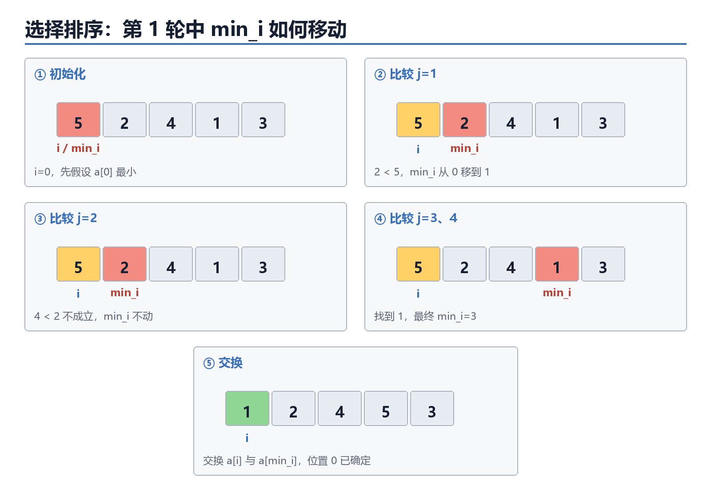

图中黄色表示本轮位置 `i`，红色表示当前找到的最小值位置 `min_i`。扫描结束后只交换一次，因此选择排序的交换次数通常少于冒泡排序。

课堂动态演示：

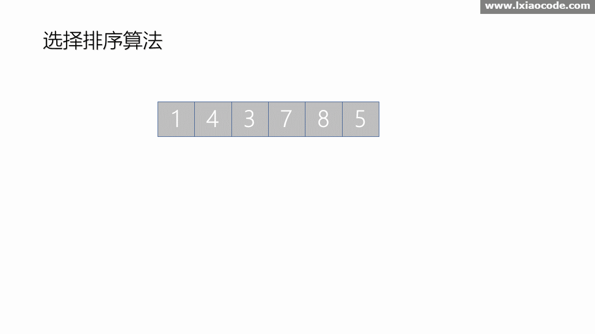

### 1. 标准升序模板

```python
a = [5, 2, 4, 1, 3]
n = len(a)
for i in range(n - 1):
    min_i = i
    for j in range(i + 1, n):
        if a[j] < a[min_i]:
            min_i = ____①____
    a[i], a[min_i] = a[min_i], a[i]
print(a)
```

参考答案：① `j`

追踪表：

| 轮次 i | 未排序区      | 找到的最小值 | 交换后数组 |
| ---: | --------- | -----: | ----- |
|    0 | 5,2,4,1,3 |        |       |
|    1 |           |        |       |
|    2 |           |        |       |
|    3 |           |        |       |

追踪表参考答案：

| 轮次 i | 未排序区      | 找到的最小值 | 交换后数组      |
| ---: | --------- | -----: | ----------- |
|    0 | 5,2,4,1,3 |      1 | 1,2,4,5,3   |
|    1 | 2,4,5,3   |      2 | 1,2,4,5,3   |
|    2 | 4,5,3     |      3 | 1,2,3,5,4   |
|    3 | 5,4       |      4 | 1,2,3,4,5   |

### 2. 选择排序变式：按距离排序

如果要求按“离目标值 24 的距离从小到大”排序。

```python
a = [30, 18, 25, 23, 21, 28]
target = 24
for i in range(len(a) - 1):
    k = i
    for j in range(i + 1, len(a)):
        if ____________________:
            k = j
    a[i], a[k] = a[k], a[i]
```

参考答案：`abs(a[j] - target) < abs(a[k] - target)`


## 三、冒泡排序

冒泡排序的思路：通过相邻比较交换，让最大值或最小值一步步“冒”到边界。

### 先用三步快速判断，不要背四段代码

看到冒泡排序代码，固定按“方向、升降序、索引范围”三步判断。

#### 第一步：看 `range`，判断从哪边往哪边

```python
for j in range(0, n - 1 - i):
```

`j` 逐渐增大，是从前往后比较；通常比较 `a[j]` 和 `a[j+1]`。

```python
for j in range(n - 1, i, -1):
```

第三个参数是 `-1`，`j` 逐渐减小，是从后往前比较；通常比较 `a[j]` 和 `a[j-1]`。

快速判断：

- `range` 中没有 `-1`，`j` 递增：从前往后。
- `range` 的第三个参数是 `-1`，`j` 递减：从后往前。

#### 第二步：先找真正的左值 `L` 和右值 `R`，再判断升降序

if `a[j] > a[j-1]` :交换
交换后的结果`a[j] < a[j-1]`，前一个数大，降序

#### 第三步：`range` 被挖空时，直接用未排序区的左右边界填

考试通常把 `range` 挖空，例如：

```python
for j in range(____①____):
    if a[j] > a[j + 1]:
        ...
```

参考答案：① `n - 1`

0<=j<=j+1<=len-1
j取交集即可

或者：

```python
for j in range(____①____, ____②____, ____③____):
    if a[j] > a[j - 1]:
        ...
```

参考答案：① `n - 1`；② `0`；③ `-1`

### 1. 从前往后冒泡：每轮把最大值放到右边

```python
a = [5, 2, 4, 1, 3]
n = len(a)
for i in range(n - 1):
    for j in range(0, n - 1 - i):
        if a[j] > a[j + 1]:
            a[j], a[j + 1] = a[j + 1], a[j]
```

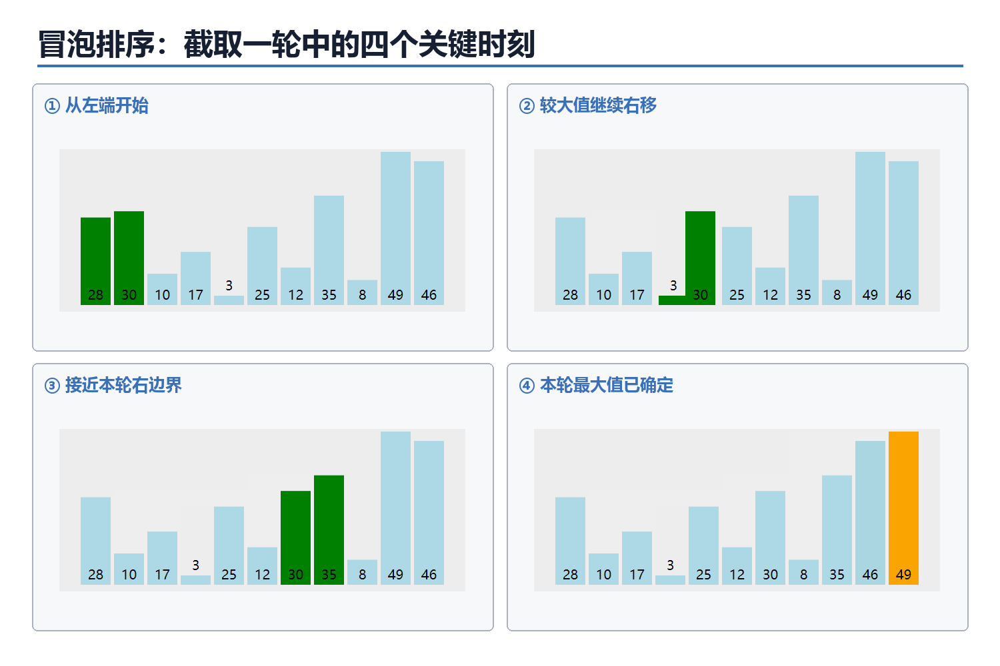

绿色表示当前正在比较的一对相邻元素，橙色表示本轮已经确定的最大值。完整动图如下：

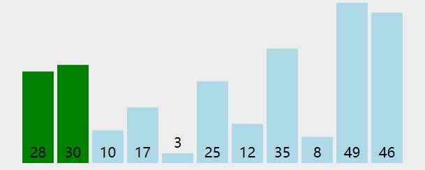


### 2. 从后往前冒泡的降序：每轮把最大值放到左边

```python
a = [5, 2, 4, 1, 3]
n = len(a)
for i in range(n - 1):
    for j in range(___,___,___):
        if a[j] > a[j - 1]:
            a[j], a[j - 1] = a[j - 1], a[j]
```

参考答案：① `n - 1`；② `i`；③ `-1`

### 3. 从前往后冒泡的降序：每轮把最小值放到右边

```python
a = [5, 2, 4, 1, 3]
n = len(a)
for i in range(n-1,0,-1):
    for j in range(0, ____①____):
        if a[j] ____②____ a[j + 1]:
            a[j], a[j + 1] = a[j + 1], a[j]
```

参考答案：① `i`；② `>`


### 4. 从后往前冒泡的升序：每轮把最小值放到左边

```python
a = [5, 2, 4, 1, 3]
n = len(a)
for i in range(1, n):
    for j in range(____①____, ____②____, -1):
        if a[j] < a[j - 1]:
            a[j], a[j - 1] = ____③____
```

参考答案：① `n - 1`；② `i - 1`；③ `a[j - 1], a[j]`


### 5. 冒泡排序的稳定性

如果两个元素关键字相等时不交换，那么冒泡排序是稳定（原数据的先后顺序）的。

```python
if key(a[j]) > key(a[j + 1]):
    a[j], a[j + 1] = a[j + 1], a[j]
```

如果把条件写成 `>=`，相等元素也会交换，稳定性会被破坏。

### 6. 交换次数与逆序对

升序排列时，如果前面的数大于后面的数，这一对数称为一个逆序对。

例如 `[3, 1, 2]` 中有两对逆序对：`(3,1)` 和 `(3,2)`。冒泡排序每交换一次相邻逆序对，逆序对数量就减少 1，因此：

> 冒泡排序的交换次数 = 原序列的逆序对数量。

填空：

序列 `[4, 1, 3, 2]` 中共有 `___` 个逆序对，所以用标准升序冒泡排序时，共交换` ___` 次。

参考答案：`4`；`4`

### 7. 冒泡排序优化

#### 优化一：没有交换就提前结束

```python
for i in range(n - 1):
    flag = False
    for j in range(n - 1 - i):
        if a[j] > a[j + 1]:
            a[j], a[j + 1] = a[j + 1], a[j]
            flag = ____①____
    if not flag:
        ____②____
```

`flag` 的含义：本轮是否发生过交换。若一整轮没有交换，说明数组已经有序，不必继续。

参考答案：① `True`；② `break`

#### 优化二：缩小到“最后一次交换位置”

如果一轮中最后一次交换发生在位置 `last`，那么 `last` 右侧已经有序，下一轮不必再比较。

```python
end = n - 1
while end > 0:
    last = 0
    for j in range(end):
        if a[j] > a[j + 1]:
            a[j], a[j + 1] = a[j + 1], a[j]
            last = ____①____
    end = ____②____
```

`flag` 优化判断“是否可以直接结束”；`last` 优化进一步记录“下一轮比较到哪里为止”。
参考答案：① `j`；② `last`
### 8. 冒泡循环范围判断题

以下代码哪一个不能保证升序？

```python
# A
for i in range(n - 1):
    for j in range(n - 1 - i):
        if a[j] > a[j + 1]:
            a[j], a[j + 1] = a[j + 1], a[j]

# B
for i in range(n - 1):
    for j in range(n - 1, i, -1):
        if a[j] < a[j - 1]:
            a[j], a[j - 1] = a[j - 1], a[j]

# C
for i in range(n - 1):
    for j in range(i + 1, n):
        if a[i] > a[j]:
            a[i], a[j] = a[j], a[i]

# D
for i in range(n - 1):
    for j in range(i, n - 1 - i):
        if a[j] > a[j + 1]:
            a[j], a[j + 1] = a[j + 1], a[j]
```

判断方法：看每一轮是否覆盖了必须比较的相邻位置，尤其注意 `j+1` 是否越界、左右边界是否过早收缩。

参考答案：D

### 9. 局部排序范围

考试中常故意让内层循环不从 `0` 开始，或不遍历到 `n-1`。判断实际排序范围时，不要只看 `j`，还要看参与比较的是 `a[j]` 与 `a[j+1]`，还是 `a[j]` 与 `a[j-1]`。


```python
for j in range(2, n - i - 1):
    if a[j] > a[j + 1]:
        a[j], a[j + 1] = a[j + 1], a[j]
```

- `j` 的范围：`2 ~ n-i-2`。
- 还访问了 `j+1`，所以实际数据下标范围：`2 ~ n-i-1`。

#### 综合判断

```python
for i in range(1, n - 1):
    for j in range(1, n - i - 1):
        if a[j] > a[j - 1]:
            a[j], a[j - 1] = a[j - 1], a[j]
```

填写：

- `j` 递增，所以比较方向是从 ______ 往 ______。
-  ______ 序。
- 第一轮中 `j` 的范围是 ______。
- 第一轮实际参与的数据下标范围是 ______。

参考答案：

- 从前往后。
- 降序。
- `1 ~ n-3`。
- `0 ~ n-3`。


## 四、插入排序

插入排序的思路：左边维护一个有序区，每次把右边第一个元素插入到有序区中正确位置。

### 1. 数组插入排序

数组插入排序会移动元素。

```python
a = [4, 2, 3, 1, 5]
for i in range(1, len(a)):
    t = a[i]
    j = i - 1
    while j >= 0 and a[j] > t:
        a[j + 1] = ____①____
        j -= 1
    ______________②____
```

参考答案：

- ① `a[j + 1] = a[j]`
- ② `a[j + 1] = t`

下面把完整动图中“插入 8”这一轮拆成六个关键帧。打印时可以直接观察：先保存待插入值，再让较大的元素依次后移，最后把待插入值放入空位。

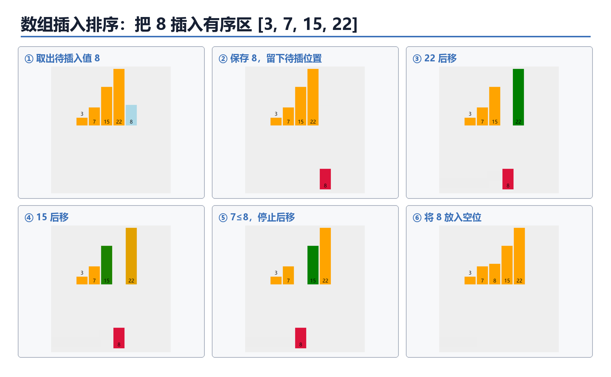

课堂动态演示：

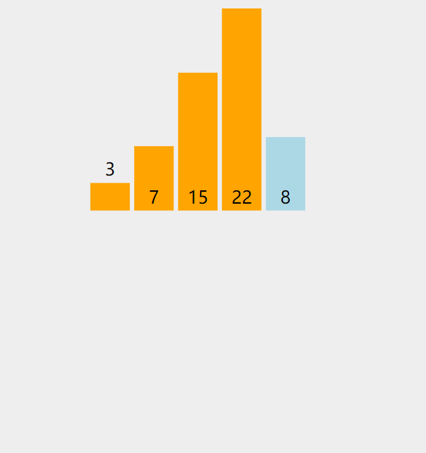

#### 变式
```python
a = [4, 2, 3, 1, 5]

for i in range(1, len(a)):
    t = a[i]
    j =i

    while j > 0 and _____________: 
        j -= 1  
        _____________        

    ____________
print(a)
```

 参考答案：
 j是当前空出来的位置
 用j-1项比较，符合就后移
`a[j - 1] > t`
`a[j+1] = a[j]`
`a[j]=t`
### 2. 有序数组中单个元素改变

若数组原本已经升序，只把 `a[pos]` 增加 1，那么左侧元素不会比它更大，变化后的元素只可能向___移动。

```python
t = a[pos] + 1
i = ______
while i < n - 1 and ____①____:
    a[i] = a[i + 1]
    i += 1
a[i] = ____②____
```
参考答案：

- 移动方向：向右。
- `i = pos`。
- ① `a[i + 1] < t`（或写 `t > a[i + 1]`）。
- ② `t`。

### 3. 链表插入排序

链表插入排序不会移动数组元素，而是修改 `next` 指针。


图中重点观察插入 `3` 时的变量变化：`p` 始终指向待插入节点，`q` 在已排序链表中寻找插入位置。找到位置后，要先让 `p` 接上 `q` 原来的后继，再让 `q` 接上 `p`。

```python
data = [[4, 1], [2, 2], [3, 3], [1, 4], [5, -1]]
head = 0
sorted_head = -1
p = head
while p != -1:
    nxt = ____①____
    if sorted_head == -1 or data[p][0] < data[sorted_head][0]:
        data[p][1] = ____②____
        sorted_head = ____③____
    else:
        q = sorted_head
        while data[q][1] != -1 and data[data[q][1]][0] <= data[p][0]:
            q = ____④____
        data[p][1] = ____⑤____
        data[q][1] = ____⑥____
    p = ____⑦____
```

链表插入排序的关键：

1. 先保存原链表后继 `nxt`，否则一改 `data[p][1]` 就找不到下一个待处理节点。
2. 若插到表头，修改 `sorted_head`。
3. 若插到中间，先让新节点接原后继，再让 `q` 接新节点。

参考答案：

- ① `data[p][1]`
- ② `sorted_head`
- ③ `p`
- ④ `data[q][1]`
- ⑤ `data[q][1]`
- ⑥ `p`
- ⑦ `nxt`

## 五、桶排序

桶排序先按范围分桶，再在桶内整理，最后按桶顺序收集。

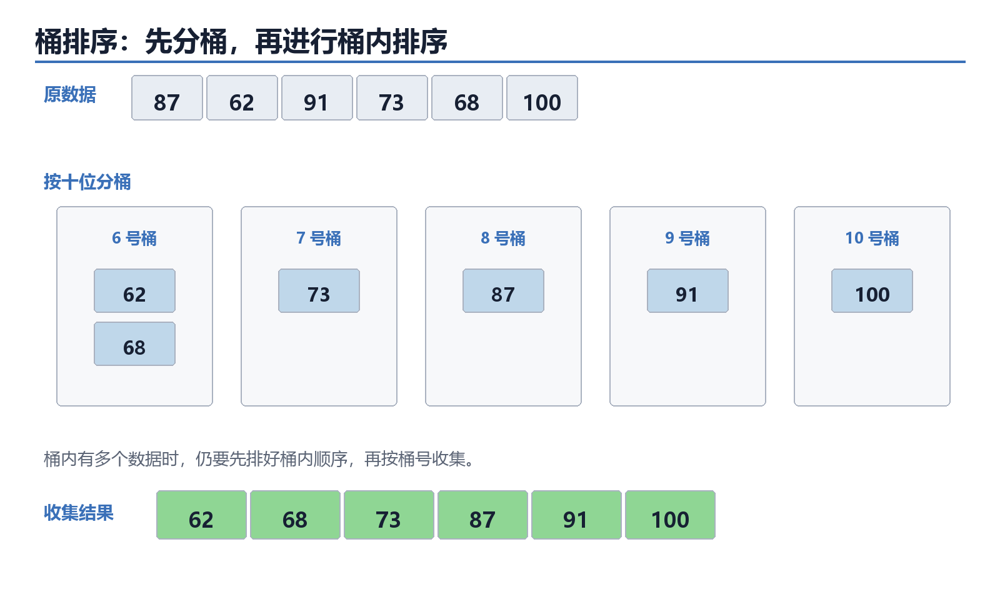

例：分数范围 0~100，按十位分桶。

```python
score = [87, 62, 91, 73, 68, 100]
bucket = [[] for i in range(11)]
for x in score:
    k = ____①____
    bucket[k].append(x)
ans = []
for b in bucket:
	b.sort() # <--- 必须加上这一步（也可以用插入排序等）
    for x in b:
        ans.append(x)
```
参考答案：① `x // 10`


这里的桶编号 `k` 代表分数段：0~9 放 0 号桶，10~19 放 1 号桶，以此类推。

桶排序适合数据范围清楚、分布较均匀的情况。若桶内还要排序，就需要在每个桶中再用一种排序方法。

在信息技术考试题中，代码 `bucket[x] += 1` 有时也被称为“桶排序思想”。这种写法的每个桶对应一个具体数值，本质上与后面的计数排序相同。读题时应以代码为准：

- 桶中保存数据列表：通常还要进行桶内排序。
- 桶中只保存出现次数：按数值下标计数并还原。

## 六、基数排序

基数排序不直接比较两个数的大小，而是按数位多轮排序。最常见的是最低位优先法（LSD）：先按个位排序，再按十位排序，最后按百位排序。

以 `[170, 45, 75, 90, 802, 24, 2, 66]` 为例，不足的高位按 `0` 处理：

| 轮次 | 本轮依据 | 收集后的顺序 |
|---:|---|---|
| 1 | 个位 | `170, 90, 802, 2, 24, 45, 75, 66` |
| 2 | 十位 | `802, 2, 24, 45, 66, 170, 75, 90` |
| 3 | 百位 | `2, 24, 45, 66, 75, 90, 170, 802` |

每一轮都要从 `0` 号桶到 `9` 号桶依次收集，并保持同一桶内原有的先后顺序。只有每一轮都稳定，后一位的排序才不会破坏前一轮已经排好的结果。

```python
a = [170, 45, 75, 90, 802, 24, 2, 66]
exp = 1
max_value = max(a)

while max_value // exp > 0:
    bucket = [[] for i in range(10)]
    for x in a:
        digit = ____①____
        bucket[____②____].append(x)

    a = []
    for b in bucket:
        a.extend(b)
    exp ____③____ 10

print(a)
```

参考答案：

- ① `(x // exp) % 10`
- ② `digit`
- ③ `*=`

数位提取规律：

- `exp = 1`：取个位。
- `exp = 10`：取十位。
- `exp = 100`：取百位。
- 每完成一轮，执行 `exp *= 10`，继续处理更高一位。

基数排序适合位数有限的非负整数或可以转成定长关键字的数据。若包含负数，需要先单独处理负数，不能直接套用上面的代码。

## 七、计数排序

计数排序适合整数范围不大时使用。核心是统计每个值出现了几次。

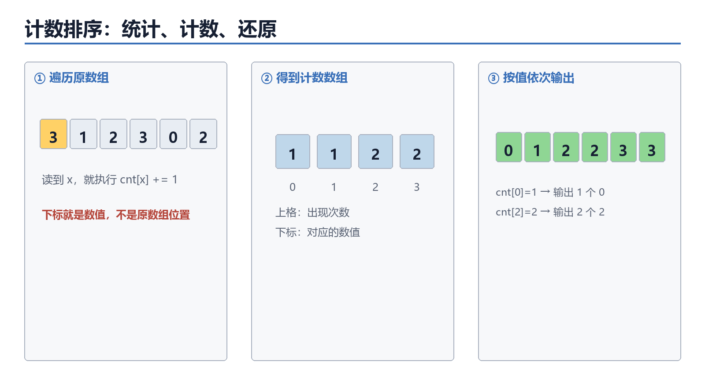

```python
a = [3, 1, 2, 3, 0, 2]
cnt = [0] * 4
for x in a:
    cnt[____①____] += 1

ans = []
for value in range(len(cnt)):
    for k in range(cnt[value]):
        ans.append(____②____)
```

参考答案：

- ① `x`
- ② `value`

追踪表：

| value | cnt[value] | 输出几个 |
|---:|---:|---:|
| 0 |  |  |
| 1 |  |  |
| 2 |  |  |
| 3 |  |  |

追踪表参考答案：

| value | cnt[value] | 输出几个 |
|---:|---:|---:|
| 0 | 1 | 1 |
| 1 | 1 | 1 |
| 2 | 2 | 2 |
| 3 | 2 | 2 |

如果题目要求稳定计数排序，就不能只按次数输出，还要用前缀和计算每个元素应该放到结果数组的位置。

课堂动态演示：

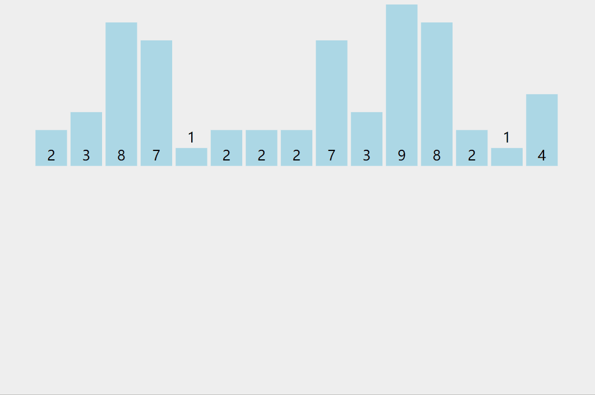


## 八、归并排序

归并排序的核心是先把数组分成两半，分别排好，再合并两个有序数组。

### 1. 合并两个有序数组

```python
def merge(left, right):
    i = j = 0
    ans = []

    # 第一阶段：双指针比较，将较小的元素依次放入 ans
    while _______________________________:
        if left[i] <= right[j]:
            ans.append(left[i])
            i += 1
        else:
            ans.append(right[j])
            j += 1

    # 第二阶段：处理 left 中剩余的元素
    while i < len(left):
        ans.append(___________)  
        i += 1

    # 第三阶段：处理 right 中剩余的元素
    while j < len(right):
        ans.append(___________) 
        j += 1

    return ans


# 测试运行
left = [1, 4, 6]
right = [2, 3, 5]
print(merge(left, right))  # 输出: [1, 2, 3, 4, 5, 6]
```

参考答案：

- 第一空：`i < len(left) and j < len(right)`
- 第二空：`left[i]`
- 第三空：`right[j]`
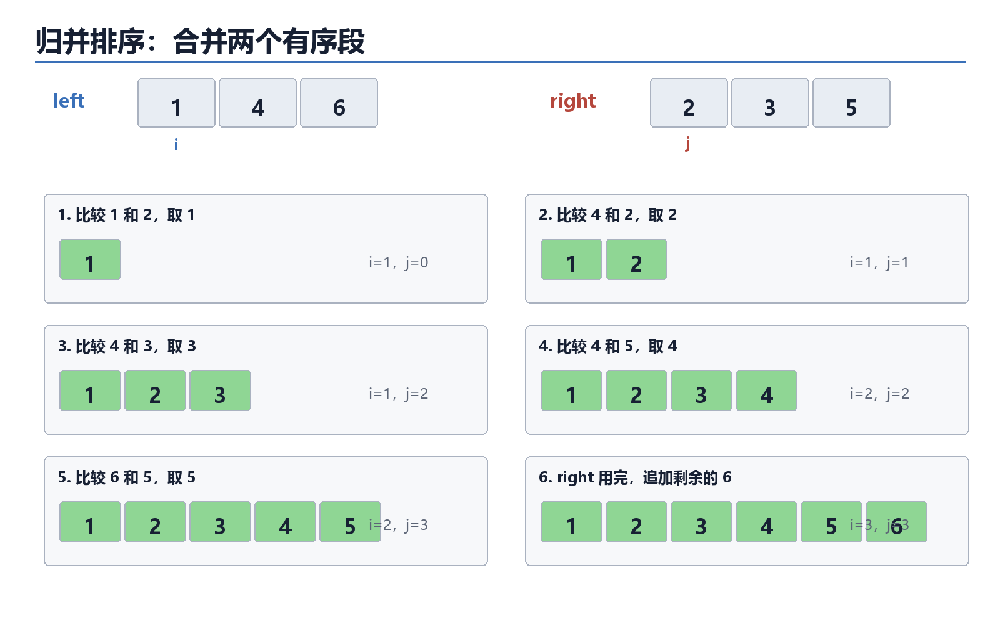

比较时只看两个有序段当前最前面的元素。较小者进入结果数组，对应指针向右移动；其中一段用完后，直接追加另一段的剩余元素。

### 2. 归并排序骨架

```python
def merge_sort(a):
    if len(a) <= 1:
        return a
    mid = len(a) // 2
    left = merge_sort(a[:mid])
    right = merge_sort(a[mid:])
    return merge(left, right)
```

递归题要看出口、拆分、合并三件事。归并排序的真正排序发生在“合并两个有序段”时。

课堂动态演示：

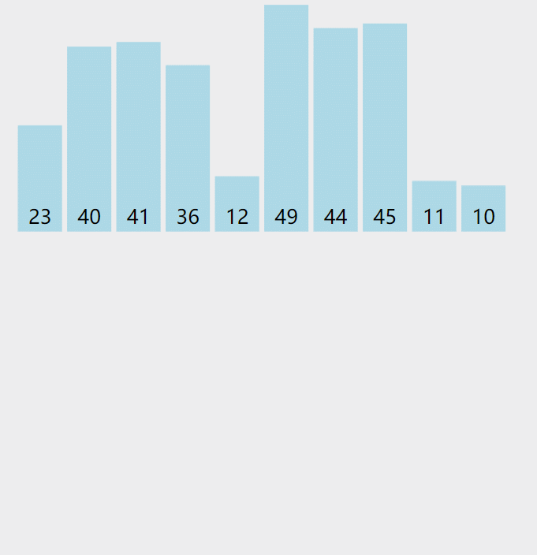


## 九、快速排序

快速排序的核心是选一个基准，把比基准小的放左边，比基准大的放右边，再递归处理左右两边。

### 1. 简化写法

```python
def quick_sort(a):
    if len(a) <= 1:
        return a
    pivot = a[0]
    left = []
    right = []
    for i in range(1, len(a)):
        if a[i] < pivot:
            left.append(____①____)
        else:
            right.append(____②____)
    return quick_sort(left) + [pivot] + quick_sort(right)
```

参考答案：

- ① `a[i]`
- ② `a[i]`
### 2. 原地分区的读法

很多考试代码不会创建 `left/right`，而是用左右指针交换。

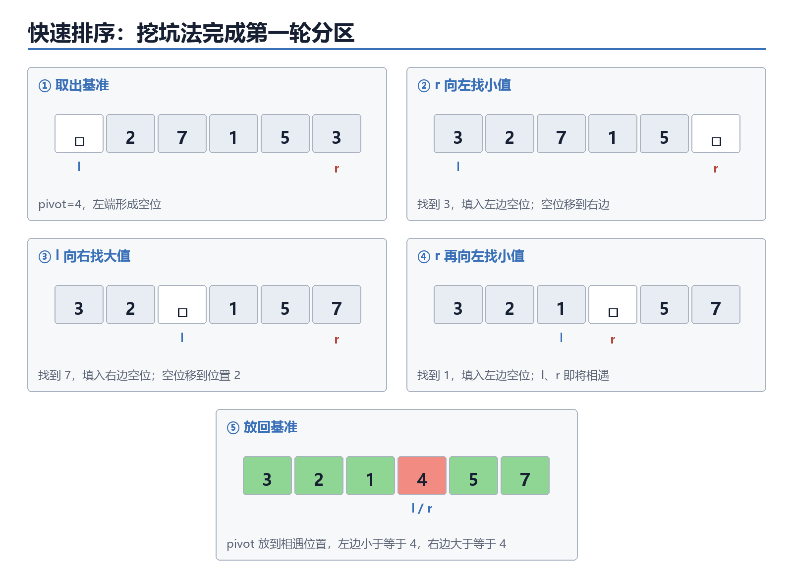

```python
l = 0
r = len(a) - 1
pivot = a[l]
while l < r:
    while l < r and a[r] >= pivot:
        r -= 1
    a[l] = a[r]
    while l < r and a[l] <= pivot:
        l += 1
    a[r] = a[l]
a[l] = pivot
```

读原地快速排序时，重点看：

1. 基准 `pivot` 是哪个元素。
2. 右指针找小于基准的元素，左指针找大于基准的元素。
3. 最后 `pivot` 放回 `l` 的位置。

第一轮分区结束，只能保证基准左边的元素不大于基准、右边的元素不小于基准；左右两段内部不一定有序，还需要递归处理。
```python
a = [5, 2, 4, 1, 3]

l = 0
r = len(a) - 1
pivot = a[l]  # 选取基准值

while l < r:
    # 1. 从右往左找第一个小于 pivot 的数
    while l < r and a[r] >= pivot:
        r -= 1

    # 2. 从左往右找第一个大于 pivot 的数
    while l < r and a[l] <= pivot:
        l += 1

    # 3. 找到后，直接交换这两个数
    if l < r:
        a[l], a[r] = a[r], a[l]

# 4. 最后把基准值放到正确的交界位置
# 此时需要将起点 a[0] 与最终重合位置 a[l] 进行交换
a[0], a[l] = a[l], pivot
```

```python
def quick_sort(arr, left, right):
    if ___________:
        return

    i, j = left, right
    pivot = arr[(left + right) // 2]

    while i <= j:
        while arr[i] < pivot:
            i += 1
        while arr[j] > pivot:
            j -= 1
        if i <= j:
            arr[i], arr[j] = arr[j], arr[i]
            i += 1
            j -= 1

    # 递归处理左右两半
    quick_sort(____,____,____)
    quick_sort(____,____,_____)


# 测试
a = [5, 2, 4, 1, 3]
quick_sort(a, 0, len(a) - 1)
print(a)  # 输出: [1, 2, 3, 4, 5]
```
参考答案：

- 递归出口：`left >= right`
- 第一次递归：`arr, left, j`
- 第二次递归：`arr, i, right`

课堂动态演示：

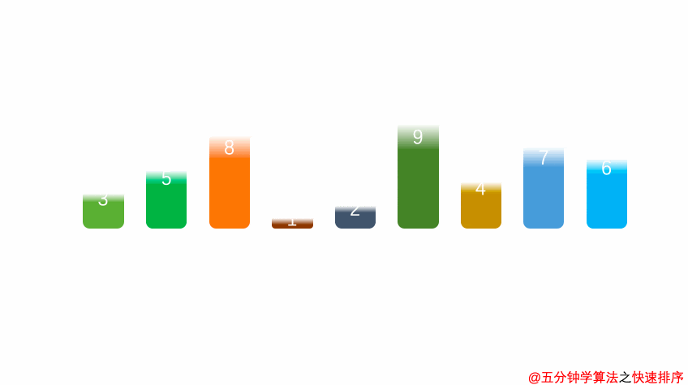


## 十、排序综合比较

设 `n` 为数据个数，`k` 为数据值域或桶的数量，`d` 为最大数的位数。

| 排序 | 平均时间 | 最坏时间 | 稳定性 | 关键变量与常见考法 |
|---|---:|---:|---|---|
| 选择排序 | `O(n²)` | `O(n²)` | 不稳定 | `min_i` / `max_i`、每轮结果 |
| 冒泡排序 | `O(n²)` | `O(n²)` | 相等不交换时稳定 | `i`、`j`、`flag`、逆序对、循环范围 |
| 插入排序 | `O(n²)` | `O(n²)` | 稳定 | `t`、`j`、元素后移次数 |
| 链表插入排序 | `O(n²)` | `O(n²)` | 可保持稳定 | `p`、`q`、`next` 指针填空 |
| 桶排序 | 与分布和桶内排序有关 | 与桶内排序有关 | 取决于桶内处理 | `bucket[k]`、分桶规则 |
| 基数排序 | `O(d(n+k))` | `O(d(n+k))` | 稳定 | `exp`、数位提取、稳定收集 |
| 计数排序 | `O(n+k)` | `O(n+k)` | 取决于还原方法 | `cnt`、值域、频次统计 |
| 归并排序 | `O(n log n)` | `O(n log n)` | 稳定 | `i`、`j`、`mid`、合并两个有序段 |
| 快速排序 | `O(n log n)` | `O(n²)` | 不稳定 | `pivot`、`l`、`r`、第一轮分区 |

补充判断：

- 已经基本有序时，优化冒泡排序和插入排序可能接近 `O(n)`。
- 选择排序无论原数组是否有序，都要扫描未排序区寻找最小值。
- 归并排序需要额外数组保存合并结果；原地快速排序主要依靠递归调用栈。


## 错题复盘栏

| 错题 | 错误原因 | 正确追踪方式 |
|---|---|---|
|  |  |  |
|  |  |  |

## 教师观察记录

| 观察点 | 记录 |
|---|---|
| 能否写对冒泡内层范围 |  |
| 能否解释每轮冒泡确定哪个位置 |  |
| 能否用逆序对判断冒泡交换次数 |  |
| 能否读懂最后交换位置优化 |  |
| 能否区分数组插入和链表插入 |  |
| 能否提取指定数位并解释稳定收集 |  |
| 能否读懂排序关键字 |  |
| 能否说出归并与快速排序的递归结构 |  |
