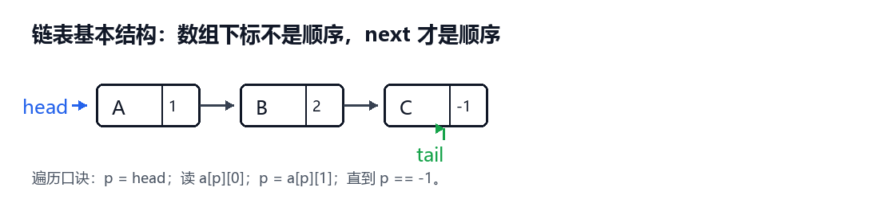
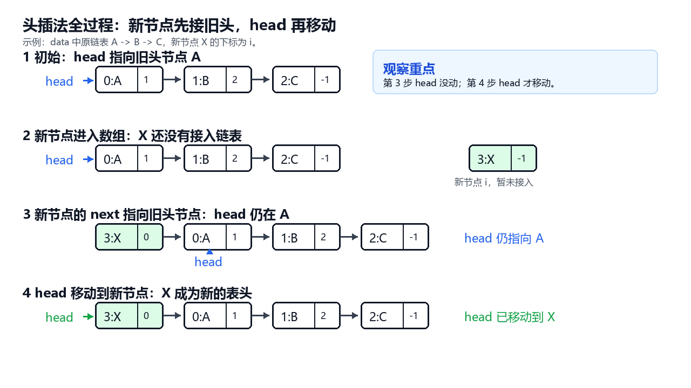
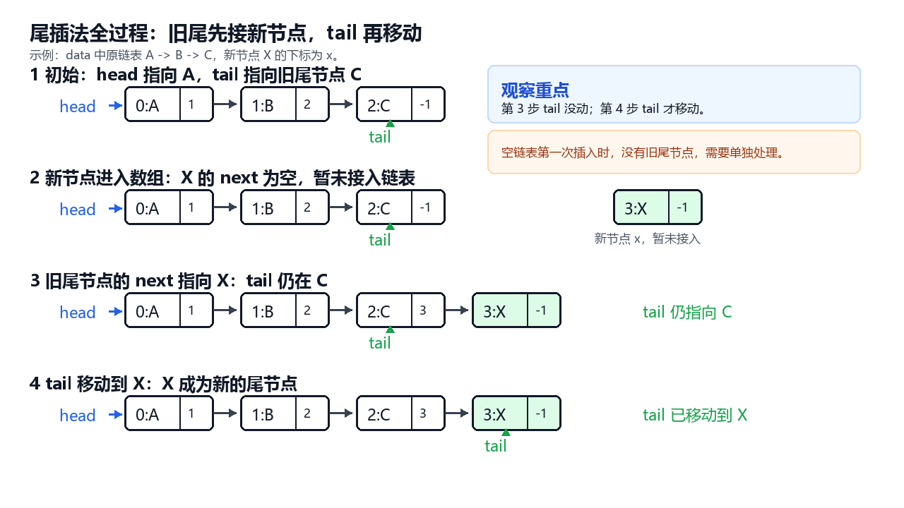
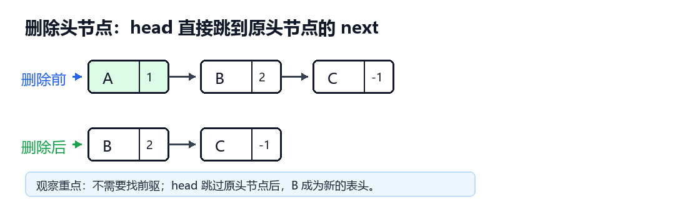
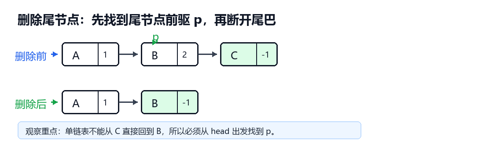
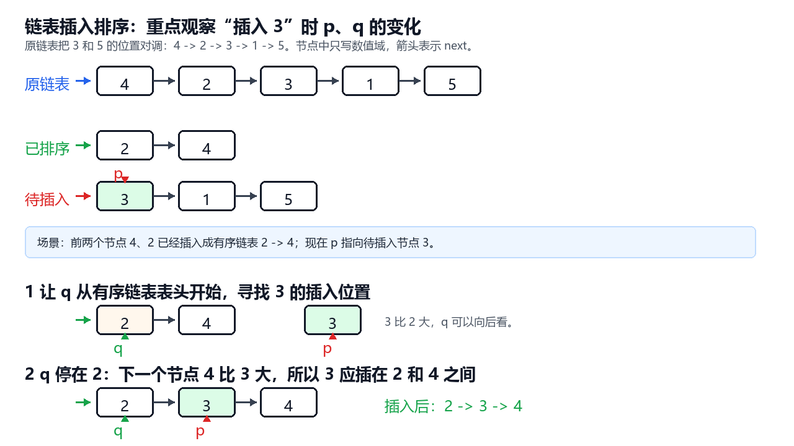

# 链表讲义：头插、尾插、删除与插入排序

目标：能画出 head / tail / next 的变化，并能补全关键指针代码。

## 一、先统一模型

本讲义都用列表模拟单链表。每个节点写成 [数据, next]，其中 next 存的是下一个节点在列表 a 中的下标；-1 表示没有下一个节点。
链表的真实顺序不由列表下标决定，而由 head 和 next 决定。做链表题时，先画 head，再顺着 next 画箭头。


## 二、头插法

头插法把新节点接到链表最前面。核心不是“把节点放到数组最前面”，而是改两条指针：新节点指向旧 head，head 指向新节点。
最容易错的地方是顺序。如果先 head = i，再 a[i][1] = head，新节点会指向自己，原来的链表头会丢失。



```python
def create_head(a):
    data = []        
    head = -1     
    
    # 循环遍历数据进行头插
    for x in a:
        data.append([x,_______ ])     
        ________              
    return data, head
```

参考答案：
head
head = len(data)-1
## 三、尾插法

尾插法把新节点接到链表最后。若链表非空，要让旧尾节点的 next 指向新节点，再把 tail 移到新节点。



```python
def create_tail(a):
    data = []        # 存储节点的二维数组
    head = -1     # 头指针
    tail = -1     # 尾指针
    
    # 循环遍历数据，依次执行尾插法
    for x in a:
        data.append([x,______])     
        x = len(data) - 1        
        
        if head == -1:        
            head = x          
            tail = x         
        else:                
            ____________   
            tail = ______          
            
    return data, head, tail
```

参考答案：
-1
`data[tail][1] = x ``
x
## 四、删除头节点

删除头节点就是让 head 跳过原来的头节点，指向原头节点的 next。


```python
def del_head(data, head):
    if head == -1:
        return head, tail
    head = ____①____
    return head
```

参考答案：
`head=data[head][1]`
## 五、删除尾节点

单链表每个节点只知道后继，不知道前驱。因此删除尾节点时，必须从 head 出发，找到 tail 的前一个节点 pre。
如果链表只有一个节点，head 和 tail 是同一个节点，删除后两者都变成 -1。



```python
def del_tail(data, head, tail):
    if head == -1:       # 1. 特殊情况：链表为空
        return head, tail
    
    if head == tail:     # 2. 特殊情况：链表中只有一个节点 
	    head = -1 
	    tail = -1 
	    return head, tail
	    
    p = head
    while  _______③________:
        p = ____④____
    data[p][1] = ____⑤____
    tail = ____⑥____
    return head, tail
```

参考答案：
`data[p][1] !=tail`
`p=data[p][1]`
`-1`
p

## 六、链表插入排序过程

链表插入排序的思路：准备一条空的有序链表 sorted_head；从原链表中每次摘下一个节点 p，把 p 插入到有序链表中正确的位置。



```python
def insert_sort(data, head):
    sorted_head = -1
    p = head
    while p != -1:
        next = ____①____
        # 情况 1：已排序链表为空，或者 p 的值比已排序链表的头节点还小（插在最前面）
        if sorted_head == -1 or data[p][0] < data[sorted_head][0]:
            data[p][1] = ____②____
            sorted_head = ____③____
        # 情况 2：插在已排序链表的中间或末尾
        else:
            q = sorted_head
            while data[q][1] != -1 and data[data[q][1]][0] <= data[p][0]:
                q = ____④____
            data[p][1] = ____⑤____
            data[q][1] = ____⑥____
        p = ____⑦____
    return sorted_head
```

参考答案：
`data[p][1]
sorted_head
p
`data[q][1]`
`data[q][1]`
`p` 
`next` 
## 七、综合随堂练习

初始链表顺序为 10 -> 20 -> 30。请补全代码，使它依次完成：头插 5、尾插 40、删除头节点、删除尾节点。
完成后，最终链表应回到 10 -> 20 -> 30。做题时不要凭感觉写下标，要先画出每一步的 head、tail 和 next。

```python
a = [[30, 2], [10, -1], [20, 0]]
head = 1
tail = 0

# 1. 头插 5
a.append([5, -1])
i = len(a) - 1
a[i][1] = ____①____
head = ____②____

# 2. 尾插 40
a.append([40, -1])
j = len(a) - 1
a[tail][1] = ____③____
tail = ____④____

# 3. 删除头节点
head = ____⑤____

# 4. 删除尾节点
pre = head
while a[pre][1] != tail:
    pre = ____⑥____
a[pre][1] = ____⑦____
tail = ____⑧____
```

## 八、课后检查清单

- [ ] 看到 head，能说出它保存的是“头节点下标”，不是节点值。
- [ ] 看到 next，能顺着 next 画出完整链表。
- [ ] 头插时知道为什么 a[i][1] = head 必须写在 head = i 前面。
- [ ] 尾插时知道空链表要单独处理。
- [ ] 删尾时知道为什么要从 head 找 pre。
- [ ] 链表插入排序时知道为什么要先保存 nxt。
