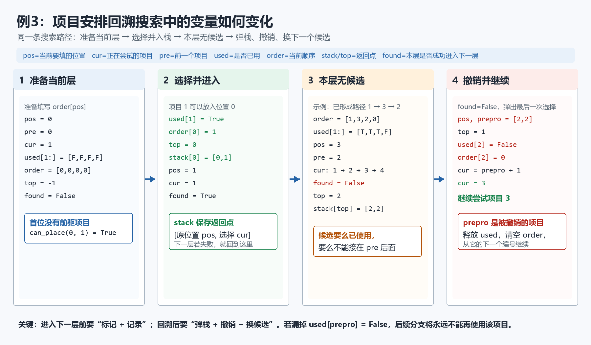
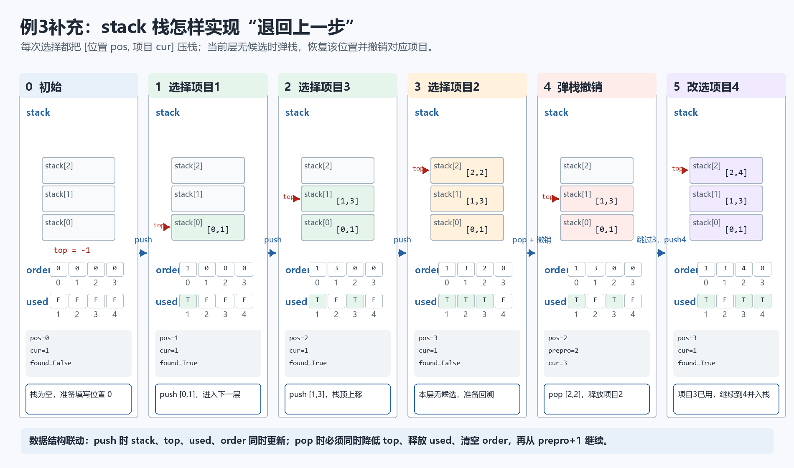
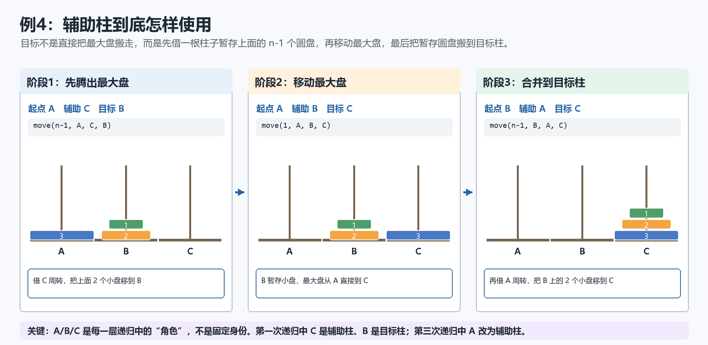
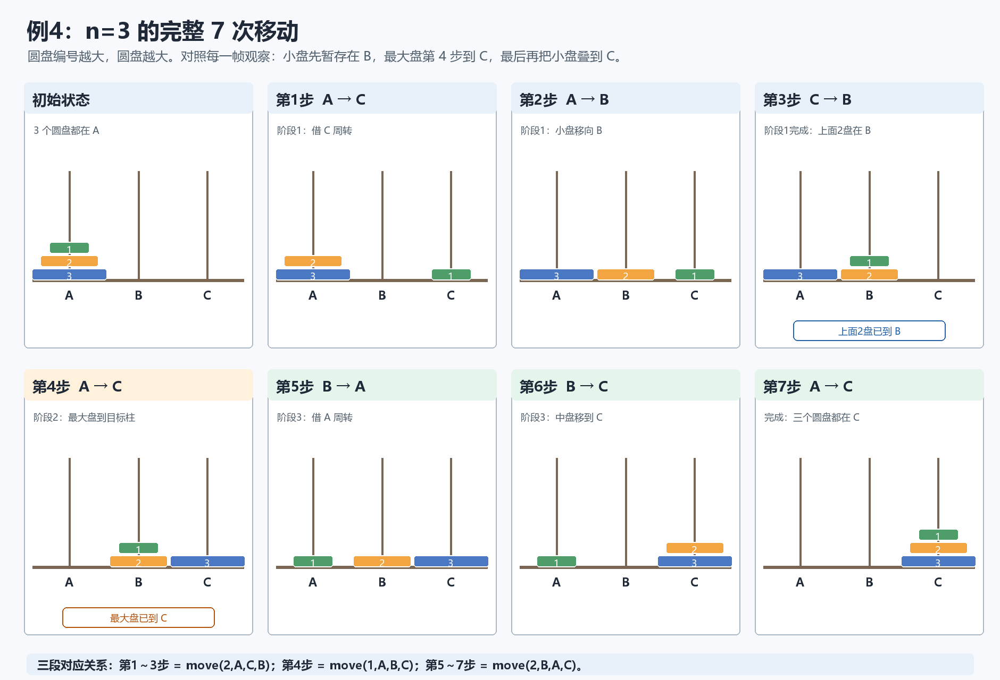

# 07 递归、回溯

## 学习目标

- 能看出递归函数的出口、递归调用和回溯返回值。
- 能用表格追踪递归调用栈，判断输出顺序和变量变化。
- 能读懂二进制状态枚举中“选/不选”的含义。
- 能读懂回溯搜索中的 `used` 标记、尝试、入栈、撤销。
- 能说清汉诺塔每一层的三步拆分、参数角色变化和移动次数。
- 能把手动栈实现的回溯搜索改写为递归深度优先搜索。
- 能区分递归、枚举、回溯和动态规划的关系。

本讲义选题已检查：与 00-04 讲义中使用过的题库原题不重复。

## 核心模型

### 1. 递归函数怎么读

递归就是函数在执行过程中再次调用自己。读递归时先抓三件事：

1. 出口：什么时候不再调用自己。
2. 缩小：下一次调用的参数是否变小、变短或更接近出口。
3. 回溯：递归返回后，当前层还要做什么。

常见骨架：

```python
def f(当前问题):
    if 到达出口:
        return 出口答案
    else:
        return 当前层处理 + f(更小的问题)
```

例如计算数字各位和：

```python
def f(n):
    if n == 0:
        return 0
    else:
        return n % 10 + f(n // 10)
```

以 `f(123)` 为例：

| 层数 | 当前 n | 当前层取出 | 下一层调用 | 返回时计算 |
|---:|---:|---:|---|---|
| 1 | 123 | 3 | `f(12)` | `3 + f(12)` |
| 2 | 12 | 2 | `f(1)` | `2 + f(1)` |
| 3 | 1 | 1 | `f(0)` | `1 + f(0)` |
| 4 | 0 | - | 出口 | `0` |

回溯时从最深层往外返回：`0 -> 1 -> 3 -> 6`。

### 2. 回溯顺序：先递归还是先处理

同样是递归，代码写法不同，输出顺序会不同。

```python
return str(n) + f(n - 1)
```

表示先放当前层，再处理下一层，结果通常从大到小。

```python
return f(n - 1) + str(n)
```

表示先递归到底，回溯时再放当前层，结果通常从小到大。

读这类题时，不要只看递归调用了哪些参数，还要看“当前字符/当前值”放在递归结果的左边还是右边。


### 3. 回溯搜索

回溯搜索是在一条路上不断尝试，走不通就退回上一步。

常见骨架：

```python
def dfs(pos):
    if pos == 目标层数:
        记录答案
        return
    for cur in 所有候选:
        if cur 可以放:
            used[cur] = True
            放入 cur
            dfs(pos + 1)
            used[cur] = False
            撤销 cur
```

如果题目用栈模拟回溯，也要抓住同样三件事：

| 操作 | 含义 |
|---|---|
| `used[cur] = True` | 当前对象已经被使用 |
| `top += 1` / 入栈 | 记录当前选择，方便以后退回 |
| `used[pre] = False` | 回退时撤销原来的选择 |
| `cur = pre + 1` | 回退后从下一个候选继续试 |

## 例题1：递归计算各位数字和

出处：选自 [[14迭代与递归/202501-宁波九校-高二-期末-10|202501-宁波九校-高二-期末-10]]。

定义如下递归函数，计算正整数 `n` 的每位数字值和，例如 `n=123`，函数返回值为 6。

```python
def f(n):
    x =      (1)
    if n == 0:
        return n
    else:
        y =      (2)
        return      (3)
```

上述程序段中划线处可选代码为：

① `n % 10`  
② `n // 10`  
③ `x + f(n-y)`  
④ `x + f(y)`

- A. ①②③
- B. ①②④
- C. ②①③
- D. ②①④

参考答案：B。

### 讲解

这段递归要做的是“每次拆出个位，再递归处理剩下的高位”。

- `x` 应该保存当前个位，所以填 `n % 10`。
- `y` 应该保存去掉个位后的数，所以填 `n // 10`。
- 下一层继续计算 `y` 的各位和，所以返回 `x + f(y)`。

以 `n = 123` 为例：

| 调用 | x | y | 返回式 |
|---|---:|---:|---|
| `f(123)` | 3 | 12 | `3 + f(12)` |
| `f(12)` | 2 | 1 | `2 + f(1)` |
| `f(1)` | 1 | 0 | `1 + f(0)` |
| `f(0)` | - | - | `0` |

回溯得到 `1 + 0 = 1`，`2 + 1 = 3`，`3 + 3 = 6`。

## 例题2：递归回溯中的拼接顺序

出处：选自 [[03python基础/202605-强基联盟-高三-月考-11|202605-强基联盟-高三-月考-11]]。

有如下 Python 程序：

```python
def func(n):
    if n == -1:
        return ""
    elif n % 3 == 0:
        return str(n % 2) + func(n - 1)
    else:
        return func(n - 1) + str(n % 2)
```

执行语句 `result = func(5)` 后，`result` 的值为（   ）

- A. `110010`
- B. `010101`
- C. `100101`
- D. `101001`

参考答案：D。

### 讲解

这题关键不是只看递归参数，而是看 `str(n % 2)` 放在递归结果左边还是右边。

- 当 `n % 3 == 0` 时，当前值放在前面：`str(n % 2) + func(n - 1)`。
- 其他情况，当前值放在后面：`func(n - 1) + str(n % 2)`。

先列出每一层：

| n | n % 3 | n % 2 | 返回形式 |
|---:|---:|---:|---|
| 5 | 2 | 1 | `func(4) + "1"` |
| 4 | 1 | 0 | `func(3) + "0"` |
| 3 | 0 | 1 | `"1" + func(2)` |
| 2 | 2 | 0 | `func(1) + "0"` |
| 1 | 1 | 1 | `func(0) + "1"` |
| 0 | 0 | 0 | `"0" + func(-1)` |
| -1 | - | - | `""` |

从出口回溯：

| 回溯到 | 结果 |
|---:|---|
| `func(-1)` | `""` |
| `func(0)` | `"0"` |
| `func(1)` | `"01"` |
| `func(2)` | `"010"` |
| `func(3)` | `"1" + "010" = "1010"` |
| `func(4)` | `"10100"` |
| `func(5)` | `"101001"` |

所以选 D。

## 练习1：路径压缩递归

出处：选自 [[14迭代与递归/202605-浙江七校-高三-月考-10|202605-浙江七校-高三-月考-10]]。

某 Python 递归函数定义如下：

```python
def f(x):
    if a[x] != x:
        a[x] = f(a[x])
    return a[x]
```

若数组 `a=[1,3,1,4,4,5]`，则执行 `f(0)` 后，函数返回值和数组 `a` 分别是（   ）

- A. `4 [4,4,1,4,4,5]`
- B. `4 [4,3,1,4,4,5]`
- C. `5 [1,3,1,4,4,5]`
- D. `4 [1,3,1,4,4,5]`

参考答案：A。

### 解析要点

这段代码的目标是沿着 `a[x]` 一直找根节点，并在回溯时压缩路径。

| 调用 | a[x] | 是否到根 | 下一层 |
|---|---:|---|---|
| `f(0)` | 1 | 否 | `f(1)` |
| `f(1)` | 3 | 否 | `f(3)` |
| `f(3)` | 4 | 否 | `f(4)` |
| `f(4)` | 4 | 是 | 返回 4 |

回溯时执行 `a[x] = f(a[x])`，所以 `a[3]` 仍为 4，`a[1]` 改为 4，`a[0]` 改为 4。最终返回 4，数组变为 `[4,4,1,4,4,5]`。


## 例题3：项目安排回溯搜索（15题）

出处：选自 [[03python基础/202605-诸暨-高三-三模-15|202605-诸暨-高三-三模-15]]。

学校举办学科实践成果展示活动，每个展示项目均由至少 2 名同学合作完成，部分同学会同时参与多个项目。活动安排规定：如果有同学参与了多个项目，则这些项目的展示顺序不能相邻。

（1）各个项目的参加人员如下所示：

![[attachments/202605诸暨高三三模_15_图1.png]]

这些项目按活动安排规定 ______ （填：能/不能）排定合理顺序。

（2）如果两个项目没有共同成员，则这两个项目可以相邻，函数 `can_place(last, new)` 用于判断项目 `new` 能否排在 `last` 后面。

```python
def has_common(p1, p2):
    # 判断两个项目是否有共同成员，如有返回 True，否则返回 False，代码略

def can_place(last, new):
    if last == 0:
        return True
    if _____:
        return False
    else:
        return True
```

（3）实现是否能按规则排定顺序的程序如下：

```python
def find_valid_order():
    global order
    used = [False] * (pcount + 1)
    order = [0] * pcount  # 记录最终排好项目顺序
    stack = [[0, 0] for i in range(pcount)]
    top = -1
    pos = 0
    cur = 1
    while pos < pcount:
        if pos == 0:
            pre = 0
        else:
            pre = order[pos - 1]
        found = False
        while cur <= pcount:
            if _____①_____:
                cur = cur + 1
            else:
                if can_place(pre, cur):
                    used[cur] = True
                    order[pos] = cur
                    _____②_____
                    stack[top] = [pos, cur]
                    pos = pos + 1
                    cur = 1
                    found = True
                    break
                else:
                    cur = cur + 1
        if not found:
            if top == -1:
                return False
            pos, prepro = stack[top]
            top = top - 1
            _____③_____
            order[pos] = 0
            cur = prepro + 1
    return True

"""
获取项目数 pcount 与每个项目成员表 pro，代码略。
pro 为一个字典结构为 {项目:[成员表]}，例如 pro = {1:["A","C","E","F","G","I"], ...}
"""
order = []
success = find_valid_order()
if success:
    print("合法展示顺序：")
    # 输出代码略
else:
    print("无法生成合理顺序！")
```

参考答案：

（1）不能

（2）`has_common(last, new)`

（3）① `used[cur]`；② `top += 1`；③ `used[prepro] = False`

### 讲解

这题是典型回溯搜索：从第 `pos` 个位置开始，尝试放一个还没使用过、且能接在前一个项目后面的项目。

- `used[cur]` 为 True，说明项目 `cur` 已经排进顺序，不能重复使用。
- `can_place(pre, cur)` 为 True，说明项目 `cur` 可以接在项目 `pre` 后面。
- 找到可放项目后，先标记 `used[cur] = True`，再写入 `order[pos]`，并用栈记录这一步。
- 如果某一层没有项目可放，就从栈顶取出上一步，撤销 `used[prepro]`，再从 `prepro + 1` 开始试下一个项目。

回溯过程可以看成：

| 阶段 | 动作 | 代码特征 |
|---|---|---|
| 尝试 | 找一个未使用项目 | `if used[cur]` |
| 判断 | 能否接在前一个项目后 | `can_place(pre, cur)` |
| 进入 | 标记并入栈 | `used[cur] = True`，`top += 1` |
| 失败 | 退回上一步 | `pos, prepro = stack[top]` |
| 撤销 | 释放原项目 | `used[prepro] = False` |

回溯题最容易错的是第 ③ 空：退回后必须把上次使用的项目释放，否则后面就永远不能再尝试它。

### 变量图解



#### `stack` 栈与状态数组的联动过程



图中的每个栈元素都是 `[pos, cur]`：

- `pos` 记录这个项目原来放在 `order` 的哪个位置。
- `cur` 记录这个位置选择了哪个项目。
- `top` 指向最近一次选择，因此回溯时总是先撤销栈顶。

前三次成功选择时，栈依次变化为：

```text
空栈
→ [[0,1]]
→ [[0,1], [1,3]]
→ [[0,1], [1,3], [2,2]]
```

当 `pos=3` 时没有候选项目可放，`found` 保持 False，于是弹出 `[2,2]`：

```python
pos, prepro = stack[top]  # 得到 pos=2，prepro=2
top -= 1                  # 栈顶回到 [1,3]
used[prepro] = False      # 释放项目2
order[pos] = 0            # 清空位置2
cur = prepro + 1          # 从项目3继续尝试
```

项目 3 已经使用，所以继续尝试项目 4。若项目 4 可以接在项目 3 后面，就把 `[2,4]` 压栈。此时：

```text
stack = [[0,1], [1,3], [2,4]]
order = [1,3,4,0]
used[1:] = [True,False,True,True]
```

因此，`stack` 不只是记录项目顺序，它保存了每次选择的“恢复点”。`used` 和 `order` 保存当前搜索状态，`stack/top` 决定失败后退回哪一步，三种数据结构必须同步修改。

读图时要把变量分成三组：

| 作用 | 变量 | 说明 |
|---|---|---|
| 描述当前层 | `pos`、`pre`、`cur` | `pos` 是当前要填的位置，`pre` 是前一个项目，`cur` 是正在尝试的项目 |
| 保存当前状态 | `used`、`order` | `used[cur]` 防止项目重复使用，`order[pos]` 保存当前选择 |
| 支持回溯 | `stack`、`top`、`found`、`prepro` | 栈保存“在哪个位置选择了哪个项目”；失败时弹栈，用 `prepro` 撤销并换候选 |

一次成功尝试会执行：

```python
used[cur] = True
order[pos] = cur
top += 1
stack[top] = [pos, cur]
pos += 1
```

这表示“标记项目已经使用、记录当前顺序、保存返回点，然后进入下一层”。

一次回溯会执行：

```python
pos, prepro = stack[top]
top -= 1
used[prepro] = False
order[pos] = 0
cur = prepro + 1
```

这表示“回到上一个选择位置、释放原项目、清空原位置，并从原项目的下一个编号继续尝试”。注意，回溯后不能把 `cur` 重新设为 1，否则会重复搜索已经失败的候选。

### 改编题：改写为递归回溯搜索

迭代程序用 `stack` 和 `top` 手动保存返回点。现在改用递归调用栈完成相同搜索，请在划线处填入合适代码。

```python
used = [False] * (pcount + 1)
order = [0] * pcount

def dfs(pos):
    if _____①_____:
        return True

    if pos == 0:
        pre = 0
    else:
        pre = order[pos - 1]

    for cur in range(1, pcount + 1):
        if _____②_____:
            used[cur] = True
            order[pos] = cur
            if _____③_____:
                return True
            _____④_____
            order[pos] = 0
    return False

success = dfs(0)
```

参考答案：

- ① `pos == pcount`
- ② `not used[cur] and can_place(pre, cur)`
- ③ `dfs(pos + 1)`
- ④ `used[cur] = False`

#### 递归版变量对应关系

| 迭代版 | 递归版 |
|---|---|
| `stack`、`top` 手动记录返回点 | Python 递归调用栈自动记录每一层的 `pos` |
| `while cur <= pcount` | `for cur in range(1, pcount + 1)` |
| `found = False` 后主动弹栈 | 本层所有候选失败后执行 `return False` |
| `used[prepro] = False` | `dfs(pos + 1)` 返回 False 后执行 `used[cur] = False` |
| `cur = prepro + 1` | `for` 循环自动进入下一个 `cur` |

递归回溯的核心顺序不能改变：

1. 判断候选是否可用。
2. 作出选择：修改 `used` 和 `order`。
3. 递归搜索下一层。
4. 下一层失败后撤销选择。
5. 继续尝试下一个候选。

## 例题4：汉诺塔递归

汉诺塔是递归的重点难点。难点不在代码长度，而在于每次递归调用中“三根柱子的角色会改变”。

有 A、B、C 三根柱子，A 上有 `n` 个从大到小叠放的圆盘。要求把所有圆盘从 A 移到 C，并满足：

1. 每次只能移动一个圆盘。
2. 大圆盘不能放在小圆盘上面。
3. B 可以作为辅助柱。

```python
def move(n, a, b, c):
    if n == 1:
        print(a, "-->", c)
        return
    move(n - 1, a, c, b)
    move(1, a, b, c)
    move(n - 1, b, a, c)
```

### 1. 四个参数分别表示什么

| 参数 | 当前调用中的作用 |
|---|---|
| `n` | 当前要移动的圆盘数量 |
| `a` | 起点柱 |
| `b` | 辅助柱 |
| `c` | 目标柱 |

`a、b、c` 表示的是“当前这一层的角色”，不是永远固定的柱子。例如：

- `move(n - 1, a, c, b)`：把上面 `n-1` 个圆盘从 `a` 移到 `b`，此时 `c` 变成辅助柱。
- `move(n - 1, b, a, c)`：把 `n-1` 个圆盘从 `b` 移到 `c`，此时 `a` 变成辅助柱。

### 2. 每一层固定拆成三步

要把 `n` 个圆盘从 `a` 移到 `c`：

1. 把上面的 `n-1` 个圆盘从 `a` 移到 `b`。
2. 把最大的第 `n` 个圆盘从 `a` 移到 `c`。
3. 把 `b` 上的 `n-1` 个圆盘移到 `c`。



从图中可以看出，辅助柱并不固定：

- 阶段 1 要把小盘从 A 移到 B，C 是辅助柱。
- 阶段 2 直接把最大盘从 A 移到 C，B 暂存小盘。
- 阶段 3 要把小盘从 B 移到 C，A 改成辅助柱。

因此递归关系为：

```text
move(n, a, b, c)
    = move(n-1, a, c, b)
    + move(1,   a, b, c)
    + move(n-1, b, a, c)
```

### 3. `move(3, "A", "B", "C")` 的完整过程



先看第 1～3 步：两个小盘借助 C 从 A 移到 B；第 4 步才移动最大盘；第 5～7 步再借助 A，把两个小盘从 B 移到 C。

| 输出行 | 移动 | 属于哪一步 |
|---:|---|---|
| 1 | `A --> C` | 先把上面 2 个圆盘移到 B 的子过程 |
| 2 | `A --> B` | 同上 |
| 3 | `C --> B` | 同上 |
| 4 | `A --> C` | 移动最大的圆盘 |
| 5 | `B --> A` | 再把 2 个圆盘移到 C 的子过程 |
| 6 | `B --> C` | 同上 |
| 7 | `A --> C` | 同上 |

所以第三行是 `C --> B`。

### 4. 移动次数与函数调用次数

设移动 `n` 个圆盘需要 `T(n)` 次：

```text
T(1) = 1
T(n) = 2T(n-1) + 1
```

可得 `T(n) = 2^n - 1`。当 `n=3` 时，共移动 `7` 次。

这段程序每次 `move(1,...)` 输出一次移动，且每个非出口调用又产生三个调用中的“一次单盘调用和两次子问题调用”，因此执行 `move(3,...)` 时，`move` 函数总调用次数也是 7 次。

## 课后作业

### 作业1：十进制转十六进制递归

出处：选自 [[14迭代与递归/202512-精诚联盟-高三-月考-10|202512-精诚联盟-高三-月考-10]]。

如下 Python 程序段，实现十进制数转十六进制数：

```python
def cal(dec):
    chars = "0123456789ABCDEF"
    if dec == 0:
        return ""
    else:
        return          ▲

n = int(input("请输入待转换的十进制数:"))
print(cal(n))
```

方框中应填入的正确代码为（   ）

- A. `cal(dec//16)+chars[dec%16]`
- B. `chars[dec//16]+cal(dec%16)`
- C. `cal(dec%16)+chars[dec//16]`
- D. `chars[dec%16]+cal(dec//16)`

参考答案：A。

### 作业2：汉诺塔递归输出

出处：选自 [[14迭代与递归/202512-诸暨统测-高三-月考-10|202512-诸暨统测-高三-月考-10]]。

有如下 Python 程序：

```python
def move(n, a, b, c):
    if n == 1:
        print(a, "-->", c)
        return
    move(n - 1, a, c, b)
    move(1, a, b, c)
    move(n - 1, b, a, c)

move(3, "A", "B", "C")
```

下列说法正确的是（   ）

- A. 该段程序主要使用了迭代算法
- B. 运行程序，函数 `move(n, a, b, c)` 共调用了 6 次
- C. 运行程序，输出的第三行内容为“C --> B”
- D. 加框处代码修改为“`n <= 1`”将影响运行结果

参考答案：C。

#### 详细解释

先把函数参数读成“把 `n` 个圆盘从 `a` 移到 `c`，`b` 作为辅助柱”。

```python
move(n - 1, a, c, b)  # 把上面的 n-1 个圆盘从 a 移到 b
move(1, a, b, c)      # 把最大的圆盘从 a 移到 c
move(n - 1, b, a, c)  # 把 n-1 个圆盘从 b 移到 c
```

执行 `move(3, "A", "B", "C")` 时，输出顺序为：

```text
A --> C
A --> B
C --> B
A --> C
B --> A
B --> C
A --> C
```

逐项判断：

- A 错误。`move` 函数直接调用自身，使用的是递归算法。
- B 错误。`n=3` 时输出 7 次移动，函数也共调用 7 次，不是 6 次。
- C 正确。第三行输出确实是 `C --> B`。
- D 错误。初始 `n` 为正整数，递归过程中最小只会调用到 `n=1`，不会调用 `n=0`。因此把 `n == 1` 改为 `n <= 1` 不影响本题运行结果。

快速检查调用次数：

| n | 调用次数 |
|---:|---:|
| 1 | 1 |
| 2 | `2×1+1=3` |
| 3 | `2×3+1=7` |

### 作业3：递归与迭代等价

出处：选自 [[14迭代与递归/202603-名校协作体-高三-月考-10|202603-名校协作体-高三-月考-10]]。

对于任意正整数 `n`，甲、乙程序段输出结果相同，则乙程序段划线处的正确代码为（   ）

甲程序段：

```python
k = 1
for i in range(n % 2, n, 2):
    k = k * (i + 2)
print(k)
```

乙程序段：

```python
def f(n):
    if      ①      :
        return n
    else:
        return      ②
print(f(n))
```

- A. ① `n < 2`；② `n * f(n + 2)`
- B. ① `n < 2`；② `n * f(n - 2)`
- C. ① `n <= 2`；② `n * f(n + 2)`
- D. ① `n <= 2`；② `n * f(n - 2)`

参考答案：D。

### 作业4：生产线分配枚举

出处：选自 [[08数组/202506-浙南名校-高二-期末-15|202506-浙南名校-高二-期末-15]]。

某工厂有 `n` 条生产线可加工 `a`、`b` 两类产品。为获取更大利润，需制定合适的生产线分配方案。同一生产线上的订单时间不能重叠；`a` 类和 `b` 类生产线至少各分配 1 条。`a` 类产品加工时长 5 单位，收益 10 元；`b` 类产品加工时长 7 单位，收益 15 元。若订单到达时没有空闲生产线，则该订单转给其他公司处理。

设 `n=4`，`task=[["a",0,10],["b",0,20],["a",20,30],["b",50,10],["a",30,20],["b",100,5],["b",200,30],["a",100,10],["b",300,10]]`，最佳方案：2 条 `a` + 2 条 `b`，最大收益 1550 元。

（1）若有 3 条生产线，`task=[["a",0,30],["b",0,20],["a",20,20],["b",50,10],["a",30,10]]`，则最佳方案中 `a` 类产品分配生产线数量为 ______ 条。

（2）定义 `sort(que)` 函数，根据到达时间升序排序。

```python
def sort(que):
    for i in range(1, len(que)):
        t = que[i]
        j = i - 1
        while j >= 0 and t[1] < que[j][1]:
            que[j + 1] = que[j]
            j -= 1
        que[j + 1] = t
```

若 `que` 为 `[['a", 10, 10], ["a", 0, 20], ["a", 50, 30], ["a", 30, 10]]`，加框处代码执行次数是 ______ 次。

（3）实现生产线分配方案，请在划线处填入合适代码：

```python
def check(s, e, j):
    money = 0
    if task[j][0] == "a":
        time, m = 5, 10
    else:
        time, m = 7, 15
    for i in range(s, e + 1):
        if top[i] == -1 or \
           task[st[i][top[i]]][1] + time * task[st[i][top[i]]][2] <= task[j][1]:
            top[i] += 1
            st[i].append(j)
            ①
            break
    return money


# 生产线总数和订单任务已存入 n、task
maxans = 0
best_allocation = 0
sort(task)
for a_lines in range(1, n):
    st = [[] for i in range(n)]
    top = [-1] * n
    ans = 0
    for j in range(len(task)):
        if task[j][0] == "a":
            ans += check(0, a_lines - 1, j)
        elif task[j][0] == "b":
            ②
    if ans > maxans:
        maxans = ans
        ③

print("最佳分配方案：", best_allocation, "条生产线加工 a 产品，",
      n - best_allocation, "条生产线加工 b 产品，最大收益是：",
      maxans, "元。")
```

参考答案：

（1）2

（2）2

（3）① `money = task[j][2] * m`；② `ans += check(a_lines, n - 1, j)`；③ `best_allocation = a_lines`

#### 详细解释

`task[j]` 的三个字段分别是：

```text
[产品类型, 到达时间, 产品数量]
```

`check(s, e, j)` 只允许把第 `j` 个订单安排到编号 `s~e` 的生产线中。

```python
task[st[i][top[i]]][1] + time * task[st[i][top[i]]][2]
```

上式计算第 `i` 条生产线最后一个订单的结束时间：

- `st[i][top[i]]`：该生产线最后一个订单的编号。
- `task[...][1]`：最后一个订单的到达时间。
- `time`：该类产品加工一个所需的时间。
- `task[...][2]`：最后一个订单的产品数量。
- 到达时间加“单件时长 × 数量”，得到该订单结束时间。

若 `top[i] == -1`，说明生产线还没有安排过订单，可以直接使用；否则只有“上一个订单结束时间不晚于当前订单到达时间”时才能安排。

安排成功后：

```python
top[i] += 1
st[i].append(j)
money = task[j][2] * m
```

分别表示更新栈顶、记录订单编号、计算当前订单收益。若所有候选生产线都不空闲，循环不会执行①，`money` 保持 0。

外层 `for a_lines in range(1, n)` 枚举 a 类生产线数量：

- a 类使用 `0 ~ a_lines-1` 号生产线。
- b 类使用 `a_lines ~ n-1` 号生产线。
- 当 `ans > maxans` 时，同时更新最大收益和最佳的 a 类生产线数量。

## 错题复盘栏

| 错题 | 错误原因 | 正确追踪方式 |
|---|---|---|
|  |  |  |
|  |  |  |

## 教师观察记录

| 观察点 | 记录 |
|---|---|
| 能否找出递归出口 |  |
| 能否区分递归前处理和回溯后处理 |  |
| 能否读懂二进制状态中每一位含义 |  |
| 能否说明回溯中的撤销语句为什么必要 |  |
| 能否说清汉诺塔三步递归及参数角色变化 |  |
| 能否把手动栈回溯改写为递归 DFS |  |
