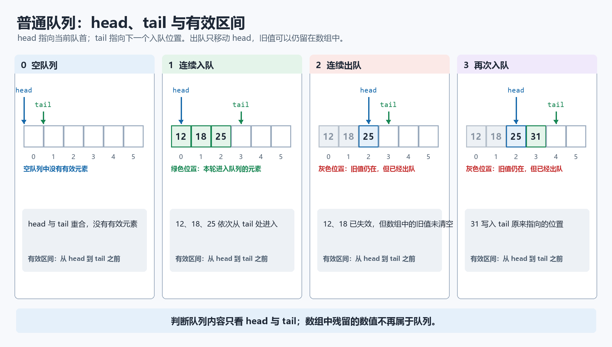
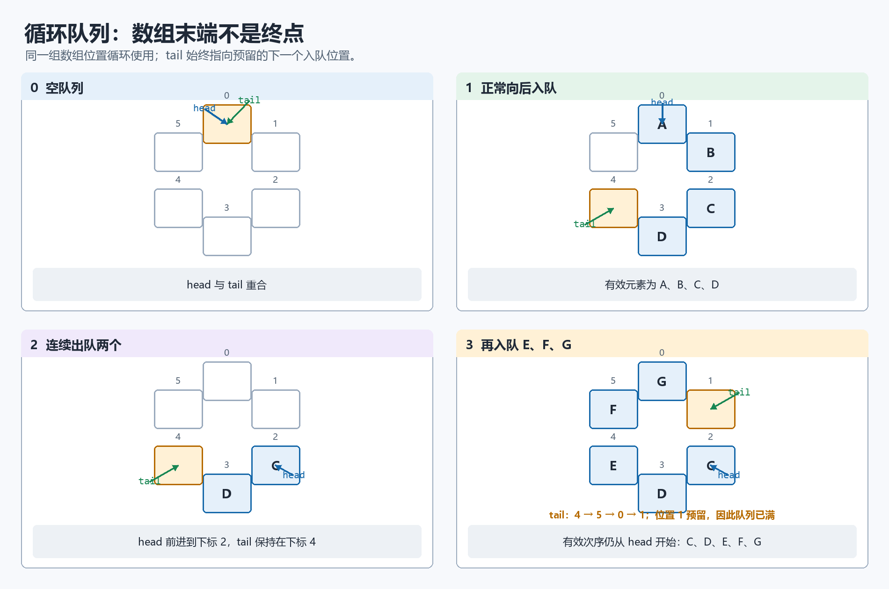
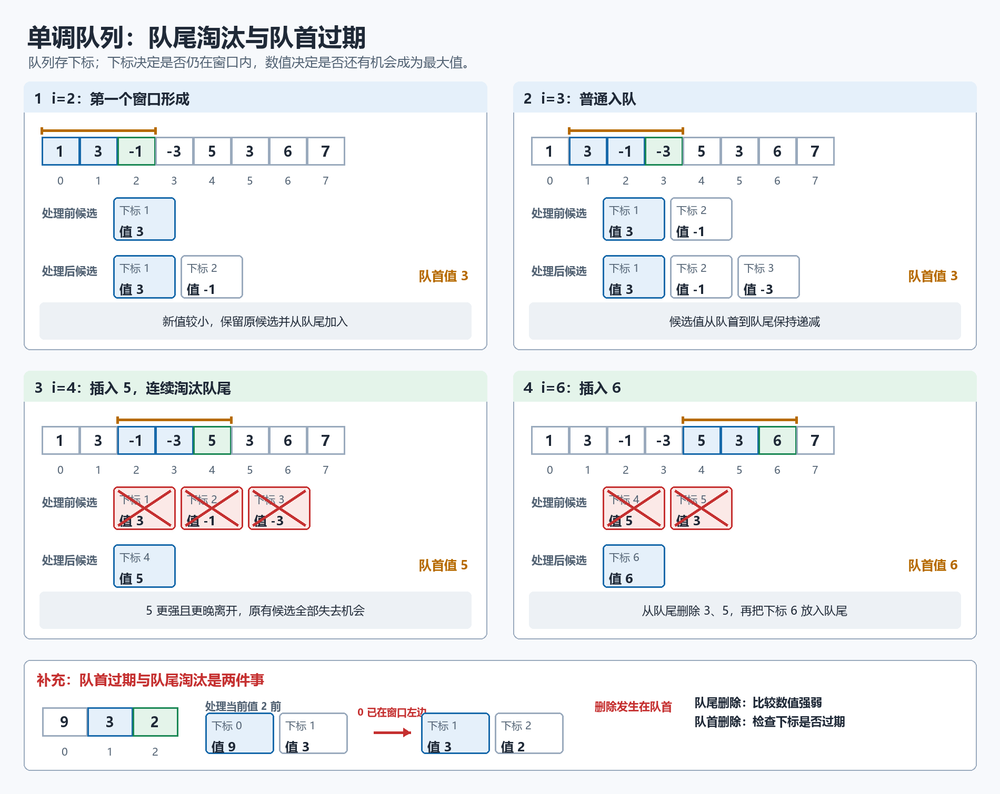
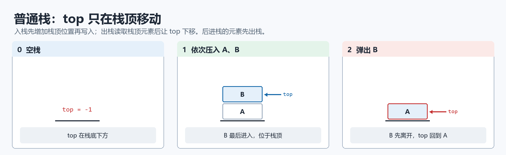
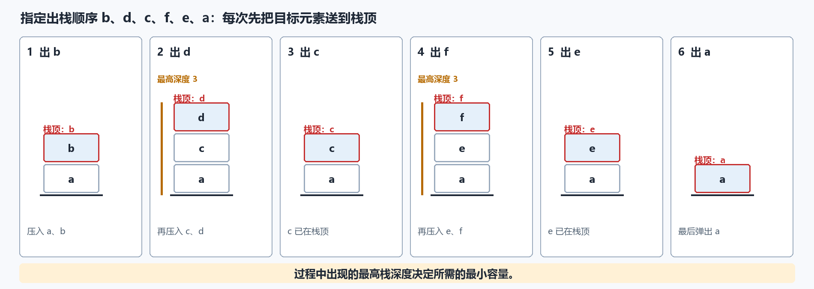
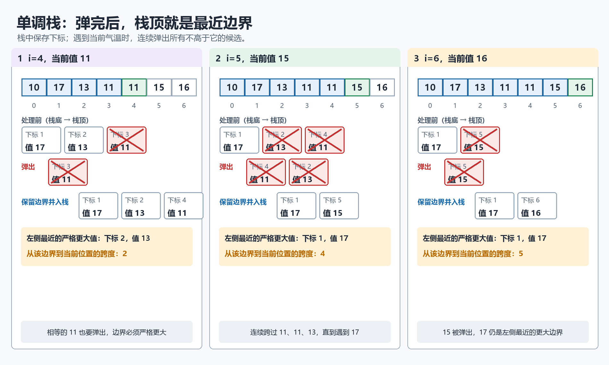
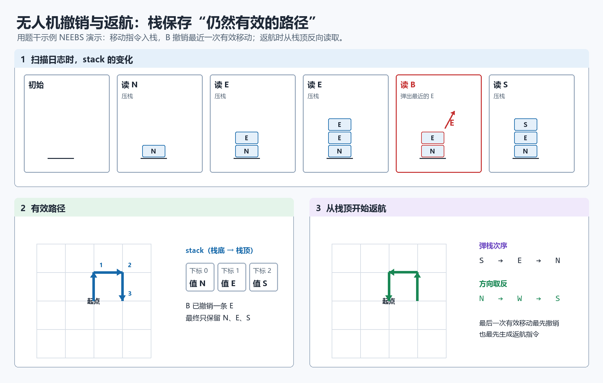
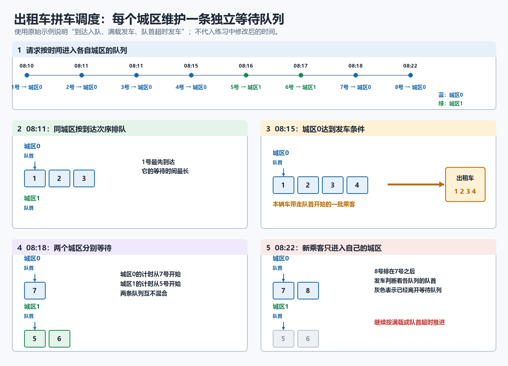

# 08 队列、栈讲义

目标：不只会模拟入队、出队、入栈、出栈，还要能读懂选考常见的“候选元素维护”代码：单调队列、单调栈、滑动窗口最大值、最近更大边界、气温跨度。

## 一、队列

`head` 指向队首，`tail` 指向下一个入队位置。

出队后旧位置的值不一定清空，但已经失效。判断队列状态必须看 `head`、`tail`，不能看数组里有没有旧值


| 结构   | 规则          | 插入  | 删除    | 关键指针                |
| ---- | ----------- | --- | ----- | ------------------- |
| 普通队列 | 先进先出        | 队尾  | 队首    | `head`、`tail`       |
| 循环队列 | 先进先出，数组循环使用 | 队尾  | 队首    | `head`、`tail`、`% n` |
| 单调队列 | 队列 + 候选值有序  | 队尾  | 队首或队尾 | `head`、`tail`、下标    |

### 普通队列

```python
#初始化
q = [0] * n
head = tail = 0
# 入队
__________
__________
# 出队
__________
__________
#当前队列元素个数
__________
```
参考答案
`q[tail] = x; tail += 1 `
`x = q[head]; head += 1`
count = tail - head 
### 循环队列



```python
#如果队未满
if __________：
	#入队
	________
#如果队不为空
if ________：
	#出队
	________
#当前队列元素个数
________
```
参考答案：
(tail + 1) % n ！= head
tail = (tail + 1) % n
head ！= tail
head = (head + 1) % n
count = (tail - head + n) % n

### 单调队列：滑动窗口最大值

### 1. 问题模型

给定数组 `nums` 和窗口长度 `k`，每次窗口向右移动一格，求每个窗口的最大值。

来源：[[09队列/202511-宁波-高三-一模-12|202511 宁波高三一模第12题]]（改编）

例如：

```python
nums = [1, 3, -1, -3, 5, 3, 6, 7]
k = 3
```

长度为 3 的窗口最大值依次为：

```python
[3, 3, 5, 5, 6, 7]
```

暴力做法每个窗口重新找最大值，窗口多时很慢。单调队列保存“仍可能成为当前或未来窗口最大值的下标”。

### 2. 单调队列模板

```python
q = [0] * len(nums)
head = tail = 0
ans = []

for i in range(len(nums)):
    # 1. 删除队尾中不如 nums[i] 的候选
    while head < tail and ____________:
        tail -= 1

    # 2. 当前下标入队
    q[tail] = i
    tail += 1

    # 3. 删除已经离开窗口的队首
    if ____________:
        head += 1

    # 4. 窗口形成后，队首就是最大值下标
    if i >= k - 1:
        ans.append(nums[q[head]])
```

参考答案：
`nums[q[tail - 1]] <= nums[i]`
`q[head] <= i - k`

这个模板有两个删除方向：

| 删除位置 | 删除原因               | 典型条件                         |
| ---- | ------------------ | ---------------------------- |
| 队尾   | 新元素更强，旧候选以后不可能当最大值 | `nums[q[tail-1]] <= nums[i]` |
| 队首   | 下标已经离开窗口           | `q[head] <= i-k`             |

### 3. 为什么队尾可以删

假设队尾下标为 `j`，当前下标为 `i`，且 `nums[j] <= nums[i]`。

因为 `i` 在 `j` 的右边，未来任何同时包含 `j` 和 `i` 的窗口中，`i` 都更晚离开窗口，值还不小于 `j`。所以 `j` 永远不可能再成为窗口最大值，可以删掉。

这句话是单调队列最关键的理由：不是为了让队列好看，而是因为被删候选已经没有机会成为答案。



### 4. 过程追踪

以 `nums = [1,3,-1,-3,5,3,6,7]`，`k = 3` 为例，队列中写下标和对应值。

| i | nums[i] | 队尾删除后 | 入队后候选 | 是否输出 |
|---:|---:|---|---|---|
| 0 | 1 | 空 | 0(1) | 未成窗 |
| 1 | 3 | 删 0(1) | 1(3) | 未成窗 |
| 2 | -1 | 保留 1(3) | 1(3),2(-1) | 3 |
| 3 | -3 | 保留 | 1(3),2(-1),3(-3) | 3 |
| 4 | 5 | 删 3、2、1 | 4(5) | 5 |
| 5 | 3 | 保留 4(5) | 4(5),5(3) | 5 |
| 6 | 6 | 删 5、4 | 6(6) | 6 |
| 7 | 7 | 删 6 | 7(7) | 7 |

输出：`[3, 3, 5, 5, 6, 7]`。

### 5. 单调队列易错点
#### 初始化
```python
for i in range(k):
    while head < tail and nums[i] >= nums[q[tail - 1]]:
        tail -= 1
    q[tail] = i
    tail += 1
ans.append(nums[q[head]])
```

| 易错点                     | 正确判断                      |
| ----------------------- | ------------------------- |
| 队列里存值，不存下标              | 滑动窗口必须存下标，否则无法判断是否过期      |
| 过期条件写成 `q[tail] <= i-k` | 过期的是队首候选，应检查 `q[head]`    |
| 输出条件写成 `i >= k`         | 第一个窗口在 `i == k-1` 时形成     |
| 最大值模板中把 `<=` 写成 `>=`    | 最大值要删掉队尾较小值，保留较大值在队首      |
| 忘记 `head < tail`        | 队列空时访问 `q[tail-1]` 会越界或读错 |

## 二、栈
| 结构  | 规则        | 插入  | 删除  | 关键指针     |
| --- | --------- | --- | --- | -------- |
| 栈   | 后进先出      | 栈顶  | 栈顶  | `top`    |
| 单调栈 | 栈 + 候选值有序 | 栈顶  | 栈顶  | `top`、下标 |
### 普通栈



```python
st = [0] * n
#初始化
top = -1
#入栈
________ 
________
#如果栈不为空
if  ________:
	#出栈
	________
	________  
```
参考答案：
`top += 1; st[top] = x `
top!=-1
`x = st[top]; top -= 1`

例：元素 `a,b,c,d,e,f` 依次入栈，出栈序列为 `b,d,c,f,e,a`。

来源：[[10栈/202406-宁波九校-高二-期末-09|202406 宁波九校高二期末第9题]]

栈的最小容量为____

| 目标出栈 | 操作 | 栈中剩余 |
|---|---|---|
| b | 入 a，入 b，出 b | a |
| d | 入 c，入 d，出 d | a, c |
| c | 出 c | a |
| f | 入 e，入 f，出 f | a, e |
| e | 出 e | a |
| a | 出 a | 空 |



可以实现，最大栈深为 3，所以容量至少为 3。


### 单调栈：最近边界与跨度

#### 1. 问题模型

单调栈常用来解决“离当前位置最近的更大/更小元素在哪里”。

例如气温跨度：

“某一天的气温跨度”表示这一天之前连续多少天的最高气温低于或等于这一天。

来源：[[10栈/202512-精诚联盟-高三-月考-12|202512 精诚联盟高三月考第12题]]（改编）

```python
d = [10, 17, 13, 11, 11, 15, 16]
```

跨度结果：

```python
[1, 2, 1, 1, 2, 4, 5]
```

对第 6 天气温 15 来说，前面连续的 `11, 11, 13` 都不超过 15，再往前的 17 大于 15，所以跨度为 4。

#### 2. 单调栈模板：找左侧最近更大值

```python
d = [10, 17, 13, 11, 11, 15, 16]
s = [0] * len(d)       # 存下标
top = -1
k = [1] * len(d)

for i in range(len(d)):
    # 弹出所有不高于 d[i] 的下标
    while top != -1 and __________:
        top -= 1

    # 弹完后，栈顶是左侧最近的更大值
    if top == -1:
        k[i] = i + 1
    else:
        k[i] = __________

    # 当前下标入栈，作为以后元素的边界候选
    top += 1
    s[top] = i
```

参考答案：
`d[s[top]] <= d[i]`
`i - s[top]`

栈里保存的是下标，不是直接保存气温。弹出后，栈从底到顶对应的气温保持严格递减。栈顶越靠右，所以它是“最近”的边界。



#### 3. 单调栈过程追踪

| i | d[i] | 弹出 | 弹完后栈顶 | k[i] | 入栈后 |
|---:|---:|---|---|---:|---|
| 0 | 10 | 无 | 无 | 1 | 0(10) |
| 1 | 17 | 0(10) | 无 | 2 | 1(17) |
| 2 | 13 | 无 | 1(17) | 1 | 1(17),2(13) |
| 3 | 11 | 无 | 2(13) | 1 | 1(17),2(13),3(11) |
| 4 | 11 | 3(11) | 2(13) | 2 | 1(17),2(13),4(11) |
| 5 | 15 | 4(11),2(13) | 1(17) | 4 | 1(17),5(15) |
| 6 | 16 | 5(15) | 1(17) | 5 | 1(17),6(16) |

结果：`[1, 2, 1, 1, 2, 4, 5]`。

#### 4. 单调栈的四种方向

| 目标 | 弹栈条件 | 弹完后栈顶表示 |
|---|---|---|
| 左侧最近更大 | `a[s[top]] <= a[i]` | 左侧第一个 `> a[i]` 的位置 |
| 左侧最近更大或相等 | `a[s[top]] < a[i]` | 左侧第一个 `>= a[i]` 的位置 |
| 左侧最近更小 | `a[s[top]] >= a[i]` | 左侧第一个 `< a[i]` 的位置 |
| 左侧最近更小或相等 | `a[s[top]] > a[i]` | 左侧第一个 `<= a[i]` 的位置 |

重点看题目是否允许“等于”。气温跨度中“不高于当天”可以跨过去，所以弹出条件是 `<=`。

## 三、单调队列 vs 单调栈

| 对比项 | 单调队列 | 单调栈 |
|---|---|---|
| 典型问题 | 滑动窗口最大/最小值 | 最近更大/更小边界、跨度 |
| 删除位置 | 队首和队尾都可能删 | 只从栈顶删 |
| 为什么要存下标 | 判断窗口是否过期 | 计算距离、跨度、边界 |
| 核心答案位置 | 队首 | 弹完后的栈顶 |
| 常见变量 | `head`, `tail`, `q` | `top`, `s` |

选择结构的判断：

- 有固定窗口长度 `k`，每次窗口右移，优先想单调队列。
- 问“左边/右边最近一个更大或更小”，优先想单调栈。
- 只说先进先出调度，不要求最大/最小候选，才是普通队列。
- 只说最近操作撤销、后缀表达式、括号匹配，才是普通栈。

## 四、课堂练习


### 练习 1：带 key 的单调递增栈追踪

来源：[[10栈/202509-嘉兴-高三-月考-12|202509 嘉兴高三月考第12题]]

有如下程序段：

```python
s = [0,1,6,7,3,5,8,9]
st = [0] * 10
top = -1
key = 0
for i in range(len(s)):
    if s[i] > key:
        while top >= 0 and s[i] <= st[top]:
            key = st[top]
            top -= 1
        top += 1
        st[top] = s[i]
```

运行后 `top` 的值为（   ）

- A. 3
- B. 4
- C. 5
- D. 6

讲解：

这段代码维护一个递增栈，同时用 `key` 记录被弹出的较大元素。只有 `s[i] > key` 时才可能入栈。

| i | s[i] | key | 操作后栈 |
|---:|---:|---:|---|
| 0 | 0 | 0 | 空 |
| 1 | 1 | 0 | 1 |
| 2 | 6 | 0 | 1, 6 |
| 3 | 7 | 0 | 1, 6, 7 |
| 4 | 3 | 6 | 1, 3 |
| 5 | 5 | 6 | 1, 3 |
| 6 | 8 | 6 | 1, 3, 8 |
| 7 | 9 | 6 | 1, 3, 8, 9 |

最后栈中 4 个元素，下标为 `0..3`，所以 `top=3`。

参考答案：A。


### 练习 2：单调队列边界

下面程序用单调队列求长度为 `k` 的窗口最大值。队列 `q` 中保存的是下标，`head` 指向当前队首候选，`tail` 指向下一个入队位置。

```python
nums = [2, 1, 4, 3, 5, 2]
k = 3
q = [0] * len(nums)
head = tail = 0
ans = []

for i in range(len(nums)):
    while head < tail and nums[q[tail-1]] <= nums[i]:
        tail -= 1
    q[tail] = i
    tail += 1
    if ______:
        head += 1
    if i >= k - 1:
        ans.append(nums[q[head]])
```

当程序处理到 `i=4` 时，当前窗口应为下标 `2,3,4`，所以所有下标 `<=1` 的候选都已经离开窗口。划线处应填（   ）

- A. `q[tail-1] <= i-k`
- B. `q[head] <= i-k`
- C. `q[head] < i-k`
- D. `q[tail] < i-k+1`

参考答案：B。

解析：过期判断只看队首候选，因为只有队首可能成为当前答案。窗口左边界是 `i-k+1`，离开窗口的条件是 `q[head] < i-k+1`，等价于 `q[head] <= i-k`。

### 练习 3：栈队列综合提升

来源：[[09队列/202604-杭州-高三-二模-08|202604 杭州高三二模第8题]]（改编）

队列 Q 从队首到队尾为 `a,b,c,d`，栈 S 为空。操作 A：队首出队并入栈；操作 B：栈顶出栈并入队。若希望栈 S 从栈底到栈顶变为 `a,c,d,b`，请写出一组操作序列，并尽量使操作次数少。

操作序列：______。

参考答案：`A A B A A A`。

过程：

| 操作 | Q | S |
|---|---|---|
| 初始 | a,b,c,d | 空 |
| A | b,c,d | a |
| A | c,d | a,b |
| B | c,d,b | a |
| A | d,b | a,c |
| A | b | a,c,d |
| A | 空 | a,c,d,b |

### 练习 4：无人机撤销与返航

无人机飞行日志 `path_log` 由 `N`、`S`、`E`、`W` 和 `B` 组成。`N/S/E/W` 表示向北/南/东/西移动一步，`B` 表示撤销上一条有效移动。例如 `"NEEBS"` 的有效路径为 `['N','E','S']`。

要求先用栈得到真实有效路径，再生成原路返航指令。返航时要从最后一步开始反向走，例如有效路径最后一步是 `E`，返航第一步应为 `W`。

（1）若 `path_log = "EBSSBNEB"`，则返航指令为 ______。

（2）补全程序：

```python
path_log = "NEEBSNBBWE"
stack = []
for cmd in path_log:
    if cmd == "B":
        if len(stack) > 0:
            ______①______
    else:
        stack.append(cmd)

opp = {'N':'S', 'S':'N', 'E':'W', 'W':'E'}
cmds = ""
while ______②______:
    curr = stack.pop()
    cmds += ______③______
print(cmds)
```




参考答案：（1）`SN`；（2）① `stack.pop()`；② `len(stack) > 0`；③ `opp[curr]`。

解析：`B` 撤销上一条有效移动，正好对应栈顶出栈。生成返航指令时，要不断弹出最后一条有效移动，并取相反方向。


### 练习 5：出租车拼车调度

来源：[[09队列/202603-名校协作体-高三-月考-15|202603 名校协作体高三月考第15题]]（改编）

某市火车站设置出租车拼车点。系统接收乘客请求，每个请求包含乘客编号、请求上车时间、目的地城区。系统按请求上车时间从小到大处理请求。同一目的地城区的乘客进入同一个等待队列。每辆出租车最多载客 `w` 人；乘客上车后最多等待 `t` 分钟，期间一旦满载或超时，则立即发车。

例如 `m=2`、`w=4`、`t=5`，请求如下：

| 乘客编号 | 1 | 2 | 3 | 4 | 5 | 6 | 7 | 8 |
|---|---|---|---|---|---|---|---|---|
| 请求上车时间 | 08:10 | 08:11 | 08:11 | 08:15 | 08:16 | 08:17 | 08:18 | 08:22 |
| 目的地城区 | 0 | 0 | 0 | 0 | 1 | 1 | 0 | 0 |


若将 4 号乘客的请求上车时间改为 `08:16`，则 8 号乘客的发车时间是 ______。

补全程序关键部分：

```python
sort(data)
ct = 0
i = 0
n = len(data)
que = [[1] for i in range(m)]    # que[k][0] 保存城区 k 队列的队首位置
flag = False
while i < n or flag == True:
    while i < n and data[i][1] <= ct:
        k = data[i][2]
        que[k].append(i)
        i += 1
    k = 0
    flag = False
    while k < m:
        ______①______
        tail = len(que[k])
        if head != tail:
            idx = que[k][head]
            if ct - data[idx][1] >= t or tail - head >= w:
                if head + w < tail:
                    tail = head + w
                ______②______
                pa = [data[idx][0] for idx in pa]
                print("发车时刻:", ct, "乘客:", pa)
                que[k][0] = tail
            k -= 1
            flag = True
        k += 1
    if flag == False and i < n:
        ct = data[i][1]
    else:
        ______③______
```




参考答案：8 号乘客发车时间为 `08:27`；① `head = que[k][0]`；② `pa = que[k][head:tail]`；③ `ct += 1`。

解析：4 号改为 `08:16` 后，城区 0 第一辆车在 `08:15` 带走 1、2、3；4、7、8 进入下一辆车。4 号最早上车时间为 `08:16`，等待 5 分钟到 `08:21` 时未满载会发车；8 号在 `08:22` 到达，只能进入下一辆，等到 `08:27` 发车。程序中 `que[k][0]` 保存队首位置，发车时切片 `que[k][head:tail]` 得到本次车内乘客索引；若当前时刻还有等待队列但未发车，则时间递增推进。


## 五、课后检查清单

- [ ] 能写出普通队列、循环队列、顺序栈的基本模板。
- [ ] 能解释循环队列为什么用 `(tail + 1) % n == head` 判满。
- [ ] 能说明单调队列为什么要存下标。
- [ ] 能区分单调队列的“队尾删除”和“队首过期删除”。
- [ ] 能写出滑动窗口最大值的单调队列模板。
- [ ] 能说明单调栈弹完后栈顶代表什么边界。
- [ ] 能根据“严格更大”“更大或相等”选择弹栈条件。
- [ ] 能用表格追踪单调队列和单调栈的过程。
