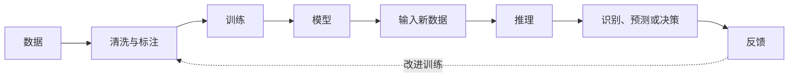
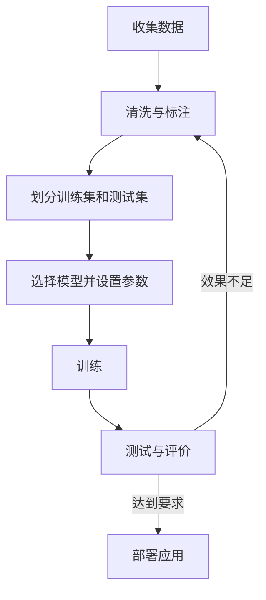

# 09-2 大数据与人工智能

本讲目标：不靠记忆“高科技名词”，而是能从数据来源、学习方式和系统行为判断人工智能方法，并能解释模型为什么成功、为什么失败。

## 一、总览



必须区分：

- 训练阶段：从训练数据中调整模型。
- 推理阶段：把新数据输入已经训练好的模型，得到识别或预测结果。

## 二、数据与大数据

### 1. 什么是大数据

大数据不是单纯“文件很大”或“记录很多”，而是规模、产生速度或复杂程度超出传统工具处理能力，需要新的存储和分析技术。

### 2. 大数据的4V特征

| 特征 | 含义 | 常见题干 |
| --- | --- | --- |
| Volume | 数据体量大 | 海量用户、长期监测、全网记录 |
| Velocity | 产生和处理速度快 | 实时推荐、实时预警 |
| Variety | 类型多样 | 文本、图像、视频、传感数据并存 |
| Value | 价值密度低 | 海量监控中真正有用的片段很少 |

高频陷阱：

- 价值密度低不等于数据没有价值。
- 数据量大不一定就是大数据。
- 大数据不一定只分析抽样数据，往往强调尽可能使用全体数据。
- 大数据分析更关注相关关系，但不等于因果关系完全没有意义。

### 3. 大数据处理的基本思想

#### 分治与分布式

把大任务拆成多个子任务，在多台计算机上并行处理，再汇总结果。

#### 批处理与流处理

| 处理方式 | 数据状态 | 适用场景 |
| --- | --- | --- |
| 批处理 | 数据已收集完成，相对静态 | 月度统计、历史数据分析 |
| 流处理 | 数据持续到达，需要及时处理 | 实时推荐、监测预警 |

同一个系统可以同时存在批处理和流处理。例如监测系统实时判断异常，同时每天生成统计报表。

## 三、人工智能的三种主要方法

### 1. 符号主义

核心：把知识和规则表示为符号，通过逻辑推理解决问题。

```text
知识库 + 推理引擎 → 结论
```

代表：专家系统。

特点：

- 规则明确、可解释性较强。
- 需要人工整理知识和规则。
- 面对难以写清规则的复杂感知问题时能力有限。

### 2. 联结主义

核心：模仿神经元连接，通过大量数据训练模型。

代表：人工神经网络、深度学习、卷积神经网络。

适合：图像识别、语音识别、自然语言处理等。

### 3. 行为主义

核心：智能体与环境交互，根据行为结果和反馈不断调整策略。

代表：强化学习。


### 4. 三种方法快速辨析

| 题干关键词 | 更可能对应的方法 |
| --- | --- |
| 知识库、规则、推理引擎、专家经验 | 符号主义 |
| 训练数据、神经网络、特征、深度学习 | 联结主义 |
| 环境、尝试、奖励、反馈、策略 | 行为主义 |

## 四、机器学习与深度学习

### 1. 基本概念

| 概念 | 含义 |
| --- | --- |
| 样本 | 一个训练或识别对象 |
| 特征 | 描述样本的属性 |
| 标签 | 训练时给出的正确类别或目标值 |
| 训练集 | 用于调整模型的数据 |
| 模型 | 从数据中学到的规律及参数 |
| 推理 | 用训练完成的模型处理新数据 |

### 2. 训练的一般过程



### 3. 决定模型效果的因素

- 训练数据数量是否足够。
- 数据是否具有代表性、多样性。
- 标签是否准确。
- 特征是否完整。
- 模型结构和训练参数是否合适。
- 实际使用环境是否与训练环境差异过大。

例：人脸识别一般正常，只在佩戴口罩时失败，优先考虑口罩遮挡导致特征不完整，不能直接认定模型所有参数都设置错误。

### 4. 训练与推理高频陷阱

- 训练神经网络需要训练数据。
- 模型部署后进行推理，不必每次都读取全部原始训练数据。
- 模型识别结果不保证永远正确。
- 训练数据越多通常越有利，但“只增加数量、不提高质量”不一定解决问题。
- 提高用户手机性能通常不会直接提高服务器端模型的识别准确率。

## 五、人工智能的应用

### 1. 识别、预测与生成

| 类型 | 典型应用 |
| --- | --- |
| 图像识别 | 人脸、车牌、交通标志、姿态识别 |
| 语音技术 | 语音识别、语音合成 |
| 自然语言处理 | 问答、翻译、文本分类、情感分析 |
| 推荐与预测 | 商品推荐、拥堵预测、风险预测 |
| 智能控制 | 自动驾驶、机器人 |
| 生成式人工智能 | 生成文本、图像、声音和程序代码 |

“自动完成”不一定是人工智能：

- 按固定公式生成考勤报表：普通数据处理。
- 根据固定阈值启动风扇：一般控制程序。
- 从图像中识别人脸或违规行为：人工智能应用。

### 2. 语料库与知识资源

问答机器人回答不准确时，应优先检查：

- 语料库是否完整、准确、及时。
- 问题表达是否在模型能力范围内。
- 模型训练是否覆盖相关内容。

单纯提升用户终端性能或网络速度，通常不能解决“回答内容不准确”。

### 3. 领域、跨领域与混合增强智能

- 领域人工智能：在特定领域内完成明确任务。
- 跨领域人工智能：能力能够迁移到其他领域。
- 混合增强智能：人和机器发挥各自优势，共同完成任务。

自动驾驶系统允许人工接管，是混合增强智能的典型体现。

## 六、人工智能的局限与社会影响

### 1. 技术局限

- 模型可能受到训练数据偏差影响。
- 对训练中很少出现的场景识别较差。
- 深度学习模型往往难以完整解释决策过程。
- 实际环境变化可能降低准确率。
- 生成式模型可能产生事实错误。

### 2. 社会影响

积极影响：

- 提高效率，辅助决策。
- 改善医疗、交通、教育等服务。
- 催生新产业和新职业。

风险：

- 隐私泄露与数据滥用。
- 算法偏见。
- 虚假内容和知识产权争议。
- 部分岗位变化。
- 对自动化决策过度依赖。

正确态度不是“拒绝人工智能”，也不是“人工智能完全没有风险”，而是在规范、监督和人机协作下合理应用。

## 七、历年真题串讲

### 真题1：人工智能方法

下列关于人工智能的说法，不正确的是（　）

A. 深度学习方法一般脱离数据进行学习  
B. 行为主义智能体通过与环境交互提升智能  
C. 符号主义依赖对符号的推理和运算  
D. 人工智能促进社会发展的同时也会带来社会担忧

参考答案：A。

解析：深度学习是典型的数据驱动方法，不能脱离数据学习。

出处：[[00真题/选考/202301-高考-高三-真题-02]]

### 真题2：识别人工智能应用

智慧课堂的下列应用中，体现人工智能技术的是（　）

A. 保存教学视频  
B. 自动生成考勤报表  
C. 通过摄像头刷脸签到  
D. 将教学资源发送到学生终端

参考答案：C。

解析：人脸识别需要从图像中提取特征并完成分类；其余功能可以用传统信息系统完成。

出处：[[00真题/选考/202306-高考-高三-真题-03]]

### 真题3：训练数据

为使校史问答机器人更准确地回答问题，下列方法可行的是（　）

A. 增加校友的最新作品  
B. 提高咨询终端性能  
C. 完善语料库中的校史资料  
D. 提升校史馆访问速度

参考答案：C。

解析：回答准确性与模型使用的知识和语料直接相关。

出处：[[00真题/选考/202406-高考-高三-真题-03]]

### 真题4：训练与推理

车载摄像头基于神经网络识别违规驾驶行为，下列说法不正确的是（　）

A. 该功能是人工智能应用  
B. 训练模型时需要驾驶行为数据  
C. 每次识别时仍离不开原始训练数据  
D. 识别结果并不总是正确

参考答案：C。

解析：推理使用训练完成的模型参数，不必每次重新读取原始训练集。

出处：[[00真题/选考/202506-高考-高三-真题-07]]

### 真题5：特征不完整

人脸识别系统仅在学生佩戴口罩时容易失败，最可能的原因是（　）

A. 人脸规则不完善  
B. 模型训练后未保留原始数据  
C. 所有训练参数均不合理  
D. 口罩遮挡导致提取的人脸特征不完整

参考答案：D。

解析：系统一般场景下能够工作，说明更可能是输入特征因遮挡而缺失。

出处：[[05人工智能/202511-台州-高三-一模-06]]

## 八、课堂训练

### 练习1：三种方法辨析

判断下列描述主要属于哪一种人工智能方法。

1. 医疗系统根据专家整理的疾病规则进行推理。  
2. 模型通过大量标注照片学习识别交通标志。  
3. 机器人不断尝试行走动作，根据是否摔倒调整策略。

参考答案：

1. 符号主义。  
2. 联结主义。  
3. 行为主义。

### 练习2：是否属于AI

判断下列功能是否必须使用人工智能。

1. 将成绩按总分从高到低排序。  
2. 识别照片中是否出现未佩戴安全帽的人员。  
3. 当温度大于30℃时启动风扇。  
4. 将一段语音自动转换成文字。  
5. 每天凌晨自动备份数据库。

参考答案：

1. 否，普通排序算法即可。  
2. 是，属于图像识别。  
3. 否，固定阈值控制即可。  
4. 是，属于语音识别。  
5. 否，定时任务即可完成。

### 练习3：诊断模型问题

某垃圾分类模型对训练中常见的塑料瓶、易拉罐识别准确，但对被压扁、污损的物品识别较差。提出两项有针对性的改进。

参考答案：

- 补充被压扁、污损物品的训练样本，提高数据多样性。
- 检查并修正样本标签，重新训练和测试模型。

单纯提高显示器分辨率或服务器硬盘容量不能直接解决这一问题。

### 练习4：大数据特征

交通平台每秒接收大量车辆位置、速度、图像和路况文本，并实时预测拥堵。分别指出题干体现的大数据特征。

参考答案：

- 大量车辆记录：体量大。
- 每秒持续接收并实时预测：速度快。
- 位置、速度、图像、文本并存：类型多样。

### 练习5：批处理还是流处理

判断以下任务更适合批处理还是流处理。

1. 统计上一学期每个班级的平均分。  
2. 检测到烟雾浓度异常后立即报警。  
3. 根据过去一年订单生成年度报表。  
4. 根据用户正在浏览的商品实时推荐。

参考答案：批处理、流处理、批处理、流处理。

## 九、课后真题清单

- [[00真题/选考/202301-高考-高三-真题-02|2023.01 人工智能基本思想]]
- [[00真题/选考/202306-高考-高三-真题-03|2023.06 人脸识别]]
- [[00真题/选考/202401-高考-高三-真题-06|2024.01 人工智能应用]]
- [[00真题/选考/202406-高考-高三-真题-03|2024.06 语料库]]
- [[00真题/选考/202501-高考-高三-真题-03|2025.01 信息系统中的AI]]
- [[00真题/选考/202506-高考-高三-真题-07|2025.06 神经网络训练与推理]]
- [[00真题/选考/202601-高考-高三-真题-03|2026.01 系统功能与AI]]

## 十、完成检查

- 能否根据“规则、数据、反馈”区分三种人工智能方法？
- 能否区分训练阶段和推理阶段？
- 能否解释为什么训练数据的数量、质量和代表性都会影响模型？
- 能否判断一个“自动完成”的功能是否真的属于人工智能？
- 能否区分批处理和流处理？
- 能否针对具体识别失败提出有针对性的改进？
