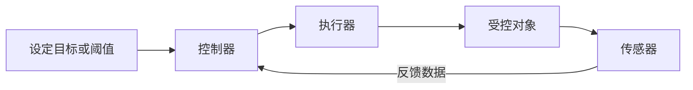

# 09-3 信息系统的完整数据流

本讲目标：面对一个陌生的信息系统，先画出完整数据流，再判断设备职责、网络连接、处理位置、故障影响和改进方案；同时能看懂信息系统综合题中的智能终端程序、pandas 中间结果和分组图表。

![[09-3-信息系统图片/04-全章知识图谱.svg|697]]

## 一、用一张图读懂信息系统

![[09-3-信息系统图片/01-信息系统完整数据流.svg]]

### 1. 一行抓住完整主流程

```text
外部环境 ⇄ 传感器/执行器 ⇄ 智能终端 ⇄ IoT模块
⇄ 通信网络 ⇄ Web服务器/数据库 ⇄ 浏览器或App
```

同一行中包含三种方向：

- 监测数据向右上传：传感器采集，智能终端读取并处理，服务器接收后写入数据库。
- 控制指令向左返回：服务器经网络向智能终端下发指令，智能终端控制执行器。
- 用户查询双向往返：浏览器或 App 发出请求，服务器查询数据库并返回结果。

执行器改变外部环境后，传感器再次采集，形成反馈。

### 2. 读图八问

1. 数据从哪里产生？
2. 哪个设备负责采集？
3. 哪个设备进行本地读取、初步处理或暂存？
4. 数据通过哪个通信模块、哪类网络上传？
5. 服务器和数据库各做什么？
6. 用户通过浏览器还是专用客户端访问？
7. 控制指令沿什么方向返回？
8. 哪个执行器最终改变外部环境？

### 3. 判断题：先沿箭头想，再判断

1. 传感器采集数据后，数据应先直接写入数据库，再交给智能终端。（　）
2. 智能终端既可以向服务器上传数据，也可以接收服务器的控制指令。（　）
3. 浏览器查询历史数据时，一般由浏览器直接打开数据库文件。（　）
4. IoT 模块损坏后，智能终端仍可能完成本地采集和本地控制。（　）
5. 执行器的作用是采集环境中的物理量。（　）

#### 核对答案

1. ×。常见流向是“传感器→智能终端→服务器→数据库”。
2. √。上传监测数据和接收控制指令是两个方向。
3. ×。通常由浏览器请求服务器，服务器查询数据库后返回结果。
4. √。通信故障不一定破坏终端本地的采集、计算和控制。
5. ×。传感器负责采集，执行器负责对受控对象施加作用。


## 二、信息系统的组成与功能

### 1. 信息系统的五类组成

| 组成 | 含义 | 常见例子 |
| --- | --- | --- |
| 硬件 | 参与系统工作的物理设备 | 服务器、终端、传感器、手机、打印机 |
| 软件 | 程序、相关数据和文档 | 操作系统、App、服务器程序 |
| 数据 | 系统采集、存储和处理的对象 | 监测数据、用户数据、权限、日志 |
| 用户 | 使用、管理、维护系统的人 | 普通用户、管理员、维护人员 |
| 通信网络 | 实现设备互联和数据传输 | 局域网、互联网、4G/5G |

### 2. 判断题：信息系统组成

1. 信息系统中的“用户”只包括直接操作手机或计算机的人。（　）
2. 手机 App 属于信息系统的软件。（　）
3. 用户用于访问系统的手机不属于系统硬件。（　）
4. 信息系统的数据只有传感器采集到的业务数据。（　）
5. 管理员账号、访问权限和运行日志也可以是系统数据。（　）

#### 核对答案

1. ×。管理员、维护人员也属于用户。
2. √。
3. ×。只要手机参与系统工作，就可以视为系统硬件。
4. ×。系统还有用户、权限、配置、日志等数据。
5. √。


### 3. 信息系统的基本功能

| 功能 | 典型行为 |
| --- | --- |
| 输入或采集 | 传感器获取温度、扫描条形码、用户录入 |
| 传输 | 终端把数据上传服务器 |
| 存储 | 保存到文件或数据库 |
| 处理 | 统计、筛选、识别、计算、判断 |
| 输出 | 显示报表、播放语音、打印小票 |
| 控制 | 向执行器发送指令并改变外部环境 |

#### 判断题：输入与输出

1. 显示屏呈现监测结果属于数据输入。（　）
2. 触摸屏只能作为输入设备。（　）
3. RFID 读写器读取电子标签属于信息系统的数据输入。（　）
4. 服务器判断温度是否异常属于数据处理。（　）

#### 核对答案

1. ×。显示属于输出。
2. ×。显示内容时是输出设备，接收触摸时是输入设备。
3. √。
4. √。


## 三、硬件、软件与移动终端

### 1. 计算机硬件五大部件

![[09-3-信息系统图片/02-计算机硬件五大部件.svg]]


> [!important] RAM 与 ROM 的考试区分
> 
> “断电后是否保留”是最常考的区别，但不要把 RAM 理解成“只能写”、ROM 理解成“任何时候绝对不能改”。

#### 判断题：硬件

1. CPU 主要由运算器和存储器组成。（　）
2. RAM 中的数据断电后一般会丢失。（　）
3. ROM 常用于保存相对固定的程序或数据。（　）
4. 固态硬盘和机械硬盘都属于外存。（　）
5. 摄像头只能用于输出图像。（　）
6. 服务器的存储器容量可能影响信息系统性能。（　）

#### 核对答案

1. ×。CPU 主要由运算器和控制器组成。
2. √。
3. √。
4. √。
5. ×。摄像头采集图像，是输入设备。
6. √。


### 2. 计算机软件

| 类型 | 作用 | 例子 |
| --- | --- | --- |
| 系统软件 | 管理软硬件资源，支持其他软件运行 | Windows、Linux、鸿蒙 |
| 应用软件 | 完成某项具体用户任务 | 监管 App、浏览器、办公软件 |

操作系统不是应用软件。服务器端和移动终端不要求使用相同操作系统，只要遵循约定的网络协议和数据格式即可通信。

### 3. 软件维护

软件升级可能包括：

- 增加或调整功能。
- 修复漏洞和错误。
- 优化性能。
- 适应硬件、操作系统和需求变化。

#### 判断题：软件

1. 手机 App 属于系统软件。（　）
2. 服务器与手机操作系统不同，因此二者无法通信。（　）
3. 软件升级只表示增加新功能。（　）
4. 信息系统设计合理，就可以认为它不存在局限性。（　）

#### 核对答案

1. ×。App 通常是应用软件。
2. ×。遵循相同协议和数据格式即可通信。
3. ×。还可能修复漏洞、优化性能或适应环境变化。
4. ×。任何信息系统都可能存在局限，需要维护和改进。


## 四、传感、识别与控制

### 1. 传感器

传感器负责把感受到的物理量转换为系统能够处理的信号。

常见传感器：

- 温度、湿度、光照、声音、压力、距离传感器。
- 摄像头可采集图像数据。
- 麦克风可采集声音数据。
- 同一种传感器配合不同程序，可以支持不同功能。

传感器负责采集，不负责完成整个系统的数据处理、数据库存储和网络服务。

### 2. RFID 与 NFC 辨析

| 项目   | RFID                     | NFC                  |
| ---- | ------------------------ | -------------------- |
| 中文   | 射频识别                     | 近场通信                 |
| 频段   | 高频                       | 高频                   |
| 距离   | 与频段、标签及功率有关，可从几厘米到数米甚至更远 | 典型距离不超过 10 cm，强调很近距离 |
| 常见用途 | 物流标签、图书管理、仓储盘点、门禁识别      | 手机支付、公交卡、门禁、近距离配对    |

1. 公交车位置实时显示需要北斗定位和网络通信，NFC 不是关键技术。（　）

#### 核对答案
1. √。


### 3. 大题中的智能终端完整代码

这类代码运行在智能终端中，不是 pandas 程序。题库中的典型硬件和函数是：

- `pin0.read_analog()`：从连接在 `pin0` 的传感器读取模拟量。
- `pin8.write_digital(...)`：向连接在 `pin8` 的执行器输出控制信号。
- `Obloq.connectWifi(...)`：让 IoT 模块连接 Wi-Fi。
- `Obloq.httpSet(IP, PORT)`：设置 Web 服务器地址和端口。
- `Obloq.get(...)`：采用 HTTP GET 方式向服务器提交数据，并接收服务器响应。

下面的程序不是另造一套函数，而是按题库中反复出现的 `micro:bit + Obloq` 风格补全。题库原题经常把导入、串口初始化和网络配置写成“代码略”，这里把这些固定步骤完整展开。

#### 完整程序：读取温度、联网、连接服务器、上传并接收控制结果

```python
from microbit import *
import Obloq

# 服务器与无线网络参数
IP = "192.168.0.11"
PORT = "8080"
SSID = "dp"
PASSWORD = "wdjcxt"

# IoT模块通过串口与智能终端通信
uart.init(baudrate=115200,bits=8,parity=None,stop=1,tx=pin2,rx=pin1)

# 连接无线网络；没有连接成功就继续等待
while Obloq.connectWifi(SSID, PASSWORD, 10000) != True:
    display.show(".")

# 显示IoT模块获得的网络地址
display.scroll(Obloq.ifconfig())

# 设置要连接的Web服务器
Obloq.httpSet(IP, PORT)

while True:
    # 温度传感器连接pin0，读取并换算温度
    tmp = (pin0.read_analog() / 1024) * 3000 / 10.24
    tmp = round(tmp, 1)

    # 向服务器的/get路由提交参数val
    errno, resp = Obloq.get("get?val=" + str(tmp),10000)

    if errno == 200:              # HTTP请求成功
        display.show(str(resp))
        if resp == '1':
            pin8.write_digital(1) # 打开执行器
        else:
            pin8.write_digital(0) # 关闭执行器
    else:
        display.show(str(errno))  # 显示错误状态码

    sleep(3 * 60 * 1000)          # 等待3分钟
```

#### `tx=pin2、rx=pin1` 到底是谁的引脚

这里初始化的是**智能终端与 IoT 模块之间的 UART 串口**：

| 代码 | 含义 | 应连接到 |
|---|---|---|
| `tx=pin2` | 把智能终端的 `pin2` 设为发送端 TX | IoT 模块的 RX |
| `rx=pin1` | 把智能终端的 `pin1` 设为接收端 RX | IoT 模块的 TX |

```text
智能终端 pin2（TX，发送） ─────→ IoT模块 RX（接收）
智能终端 pin1（RX，接收） ←───── IoT模块 TX（发送）
智能终端 GND             ─────── IoT模块 GND
```

TX 是 transmit（发送），RX 是 receive（接收）。通信双方都有自己的 TX 和 RX，所以接线时要“交叉连接”：一方的 TX 接另一方的 RX。

这段程序对应的完整上传地址为：

```text
http://192.168.0.11:8080/get?val=温度值
```

#### 按执行顺序拆解

```text
导入micro:bit与Obloq库
→ 设置IP、端口、SSID和密码
→ 初始化智能终端与IoT模块之间的串口
→ IoT模块连接Wi-Fi
→ 设置Web服务器IP和端口
→ pin0读取传感器数据
→ Obloq.get()向服务器提交数据
→ 根据服务器响应控制pin8上的执行器
→ 延时后再次采集
```

> [!important] 题库代码中的高频考点
>
> `10000` 是网络操作的超时时间；`errno == 200` 表示 HTTP 请求成功；`sleep()` 在这些题目中按毫秒计时；服务器数据库文件名不需要写进智能终端程序。
>
> 不同题目中的服务器响应可能写成数字 `1`，也可能写成字符串 `'1'`。考试时要根据题目已有代码判断，不能擅自改类型。


#### 判断题：程序与硬件

1. 采集时间间隔通常由传感器本身决定，与智能终端程序无关。（　）
2. 编写智能终端程序时，一般需要知道传感器连接的引脚。（　）
3. 智能终端上传数据时，一般需要知道服务器地址和端口。（　）
4. 智能终端程序必须知道服务器数据库文件名。（　）
5. 同一智能终端可以连接多个传感器和执行器。（　）

#### 核对答案

1. ×。采集间隔通常由智能终端程序控制。
2. √。
3. √。
4. ×。数据库文件名属于服务器端细节。
5. √。可连接到不同接口。


### 4. 执行器与反馈控制



例如土壤湿度低于阈值时启动水泵：

- 传感器：土壤湿度传感器。
- 执行器：控制水泵的装置。
- 受控对象：大棚土壤环境。
- 反馈：水泵工作后重新采集土壤湿度。

## 五、网络基础

### 1. 网络的三大组成部分

![[09-3-信息系统图片/03-网络三大组成.svg]]

#### 计算机系统

- 服务器：处理请求、管理数据、提供共享服务。
- 终端：接收用户输入、采集数据、发出请求、显示结果。

#### 数据通信系统

- 传输介质：双绞线、同轴电缆、光纤，以及无线电磁波传播所经过的空间。
- 网络互联设备：网卡、交换机、路由器、调制解调器等。

| 互联设备 | 主要功能 |
| --- | --- |
| 网卡 | 为设备提供网络接口，收发网络数据 |
| 交换机 | 连接同一局域网内的多台设备，转发数据 |
| 路由器 | 连接不同网络，并为数据选择传输路径 |
| 调制解调器 | 完成信号转换，帮助设备接入通信线路 |

#### 网络软件与网络协议

- 网络软件：管理网络资源，支持设备通信并提供网络应用服务。
- 网络协议：网络中通信双方必须共同遵守的规则。

| 网络协议        | 功能                               |
| ----------- | -------------------------------- |
| 网际协议（IP）    | 负责将信息从一个地方传送到另一个地方               |
| 传输控制协议（TCP） | 管理被传送内容的完整性                      |
| 应用程序协议（AP）  | 响应网络应用程序发出的请求，并将传输的信息转换成人能够识别的内容 |

### 2. 三大网络类型

![[09-3-信息系统图片/04-网络三大分类.svg]]

| 计算机网络分类 | 英文  | 典型覆盖范围         |
| ------- | --- | -------------- |
| 局域网     | LAN | 家庭、机房、校园中的局部范围 |
| 城域网     | MAN | 城市范围           |
| 广域网     | WAN | 跨城市、跨地区、跨国家    |

互联网是全球性的计算机网络，不等同于“网络”这个总概念。

### 3. 网络的基本功能

- 数据通信。
- 资源共享。
- 分布式处理。

网络资源包括硬件、软件和数据，不只包括硬件。

### 4. 局域网、互联网和网关

- 同一局域网内可以同时存在有线和无线设备。
- 多个局域网可以组成更大的校园网或企业网。
- 路由器可以连接不同网络，并帮助局域网接入互联网。
- 同一局域网中的访问不一定经过外部互联网。
- 能作为服务器的计算机也可以在其他场景中作为客户端。

#### 判断题：网络

1. 无线通信不需要传输介质。（　）
2. 局域网内部通信不需要网络协议。（　）
3. 网络资源只包括服务器、路由器等硬件。（　）
4. 同一局域网中可以同时存在有线设备和无线设备。（　）
5. 手机访问信息系统时只能使用移动通信网络。（　）
6. 路由器可以用于连接不同网络。（　）

#### 核对答案

1. ×。无线通信利用电磁波在空间中传播。
2. ×。局域网通信也需要协议。
3. ×。网络资源还包括软件和数据。
4. √。
5. ×。手机也可通过 Wi-Fi 等方式访问。
6. √。


## 六、B/S、C/S 与网络应用

### 1. 两种架构

| 架构 | 客户端形式 | 主要特点 |
| --- | --- | --- |
| C/S | 专用客户端软件 | 客户端可以承担较多处理 |
| B/S | 浏览器 | 主要功能集中在服务器，维护方便 |

题干出现“用户通过浏览器访问系统”，通常提示 B/S 架构。

### 2. 客户端与服务器

| 角色 | 常见职责 |
| --- | --- |
| 客户端 | 接收用户输入、发出请求、显示结果 |
| 服务器 | 处理请求、管理数据、提供共享服务 |

服务器不一定是昂贵的专用计算机；在负载较低时，普通计算机也可以提供服务器功能。

### 3. URL、主机与端口

```text
http://192.168.1.108:5000/input?id=s1&val=22.5
```

- `http`：协议。
- `192.168.1.108`：服务器地址。
- `5000`：端口号。
- `/input`：服务器路由或资源路径。
- `id=s1&val=22.5`：提交的参数。

### 4. Flask 服务器端的完整处理过程

这部分代码运行在 **Web 服务器** 中。题库原题通常保留 `@app.route(...)`、`request.args.get(...)` 和 `app.run(...)`，把建表、插入与查询数据库写成“代码略”。下面沿用题库的 Flask 结构，把省略的固定步骤补齐。

需要先纠正一个容易产生的误解：服务器端通常不用再写一条“连接智能终端”的语句。服务器运行 Flask 后在指定 IP 和端口等待请求；智能终端调用 `Obloq.get(...)`，HTTP 请求到达相应路由，服务器的返回值再沿原连接传回智能终端。

#### 完整程序：接收 GET/POST、写入数据库、返回控制值、查询数据

```python
from flask import Flask, request, jsonify
import sqlite3
from datetime import datetime

app = Flask(__name__)
DB_FILE = "monitor.db"

# 智能终端使用GET访问：/get?point=A点&val=35.7
@app.route("/get", methods=["GET"])
def receive_get():
    point = request.args.get("point", "A点")
    val = request.args.get("val")

    if val is None:
        return "缺少val参数", 400

    value = float(val)
    warning = 1 if value > 30 else 0
    save_data(point, value, warning)

    # 返回字符串"1"或"0"，智能终端据此控制执行器
    return str(warning)


# 也可以使用POST传输，接收表单或JSON数据
@app.route("/input", methods=["POST"])
def receive_post():
    if request.is_json:
        data = request.get_json(silent=True) or {}
        point = data.get("point", "A点")
        val = data.get("val")
    else:
        point = request.form.get("point", "A点")
        val = request.form.get("val")

    if val is None:
        return jsonify({"error": "缺少val参数"}), 400

    value = float(val)
    warning = 1 if value > 30 else 0
    save_data(point, value, warning)
    return jsonify({"status": "ok", "warning": warning})


# 浏览器使用GET访问/search，读取数据库中的最近20条数据
@app.route("/search", methods=["GET"])
def search():
    conn = sqlite3.connect(DB_FILE)
    conn.row_factory = sqlite3.Row
    cur = conn.cursor()
    cur.execute("""
        SELECT id, point, value, warning, collect_time
        FROM temperature
        ORDER BY id DESC
        LIMIT 20
    """)
    rows = cur.fetchall()
    conn.close()
    return jsonify([dict(row) for row in rows])


if __name__ == "__main__":
    init_db()
    app.run(host="192.168.0.11", port=8080)
```

#### 三条数据通路

```text
GET上传：
智能终端 Obloq.get("get?val=35.7", ...)
→ Flask的/get路由
→ request.args.get("val")
→ INSERT写入monitor.db
→ 服务器返回"1"或"0"
→ 智能终端控制执行器

POST上传：
客户端POST表单或JSON
→ Flask的/input路由
→ request.form或request.get_json()
→ INSERT写入monitor.db
→ 服务器返回JSON

浏览器查询：
浏览器访问/search
→ SELECT读取monitor.db
→ Flask返回JSON数据
→ 浏览器显示结果
```

与前面智能终端程序配套的 GET 地址是：

```text
http://192.168.0.11:8080/get?val=35.7
```

若还要上传监测点，可以把智能终端中的路径改为：

```python
"get?point=A点&val=" + str(tmp)
```

## 七、信息系统的搭建

### 1. 需求分析、概要设计、详细设计如何区分

最核心的区别是：**需求分析说清“要做什么”，概要设计确定“总体怎么做”，详细设计落实“具体怎么做”。**

| 阶段 | 核心问题 | 主要内容 | 考试中的典型表述 |
| --- | --- | --- | --- |
| 需求分析 | 系统要做什么、达到什么要求？ | 功能需求、性能需求、资源与环境需求、界面需求、可扩展性需求 | “系统应能……”“用户需要……”“响应时间不超过……” |
| 概要设计 | 系统总体上怎么实现？ | 划分模块、确定模块功能和调用关系、确定总体结构和硬件配置、选择数据库管理系统 | “分成采集、传输、存储、查询模块”“选择 SQLite”“绘制功能模块图” |
| 详细设计 | 每个模块具体怎么实现？ | 算法与处理流程、数据库表和字段、输入输出设计、人机界面设计、模块接口细节 | “设计数据表字段”“画程序流程图”“确定输入框和按钮”“写出模块接口” |

#### 用同一个监测系统对照

```text
需求分析：
系统需要每分钟采集一次温度，温度超过30℃时报警；
用户能够通过浏览器查看实时数据和历史数据。

概要设计：
系统分为数据采集、网络传输、服务器处理、数据库存储、
浏览器查询五个模块；采用B/S架构，选择SQLite管理数据。

详细设计：
temperature表包含id、point、value、time字段；
/input路由接收数据；value>30时返回1；
查询页面包含监测点下拉框和“查询”按钮。
```

#### 高频陷阱

- “系统要有报警功能”是**需求分析**；“用蜂鸣器实现报警”已经涉及实现方案。
- “把系统分成若干模块”是**概要设计**；“某个模块内部使用什么算法”是**详细设计**。
- “选择 SQLite、MySQL 等数据库管理系统”是**概要设计**；“设计数据表、字段、主键”是**详细设计**。
- “系统需要向用户显示历史数据”是**需求分析**；“页面中有哪些输入框、按钮和表格”是**详细设计**。
- 若选项中单独出现“开发模式的选择”或“体系结构模式的选择”，确定 B/S、C/S 时应优先选择这个专门阶段，不要机械地归入需求分析。

> [!tip] 三句话快速判断
>
> 还在描述用户目标与系统要求——需求分析。  
> 已经划分系统结构与模块——概要设计。  
> 已经深入表、字段、算法、界面和接口——详细设计。

### 2. 可行性分析

可行性分析问的是“这个方案能不能做、值不值得做”，与“要做什么”和“怎么设计”不同。

| 角度 | 要判断的问题 |
| --- | --- |
| 技术可行性 | 现有硬件、软件、网络和人员技术能否实现 |
| 经济可行性 | 建设、运行和维护成本是否能够承担 |
| 社会可行性 | 是否符合法律、伦理要求，用户和社会是否能够接受 |

例如，“学校现有网络带宽是否足够”“购买服务器的成本是否超出预算”属于可行性分析，不属于需求分析。

### 3. 设计完成后的实现

- 硬件搭建：连接服务器、智能终端、通信模块、传感器和执行器。
- 软件开发：编写智能终端程序、服务器程序、数据库程序和用户界面。
- 系统集成：让各个硬件和软件模块协同工作。

### 4. 软件、硬件与网络测试

#### 软件测试的三种方法

本教材中的三种软件测试方法是：**正确性证明、静态测试、动态测试**。

| 测试方法 | 是否运行程序 | 如何检查 | 一眼识别的关键词 |
| --- | --- | --- | --- |
| 正确性证明 | 通常不实际运行 | 根据程序、输入条件和预期结果，运用逻辑或数学方法证明程序满足要求 | 证明、推导、逻辑、数学方法 |
| 静态测试 | 不运行 | 人工阅读或使用工具检查源代码、流程图和文档 | 阅读代码、代码审查、人工检查、查语法和逻辑 |
| 动态测试 | 要运行 | 输入测试数据，比较实际结果与预期结果 | 运行程序、输入数据、观察结果、检验输出 |

```text
题目说“运行程序，用多组数据检验结果” → 动态测试
题目说“逐行阅读源代码，检查变量和分支” → 静态测试
题目说“通过逻辑推导证明程序满足要求” → 正确性证明
```

> [!important] 测试只能尽可能发现错误
>
> 没有发现错误，不等于程序绝对没有错误；正确性证明的推导过程本身也可能存在疏漏。

#### 软件、硬件、网络测试不要混淆

| 类型 | 主要检查对象 | 示例 |
| --- | --- | --- |
| 软件测试 | 程序功能、逻辑和输出是否正确 | 输入温度数据，检查预警结果是否符合阈值 |
| 硬件测试 | 设备、供电、接口和连线是否正常 | 检查传感器读数、执行器动作及引脚连接 |
| 网络测试 | 设备之间能否稳定通信 | 检查能否连接 Wi-Fi、访问服务器、上传和下载数据 |

系统运行后还要继续进行文档编写、故障处理、数据备份、软硬件升级和安全维护。

#### 判断题：搭建过程

1. 需求分析只需要考虑系统功能，不必考虑性能和安全。（　）
2. 将系统划分为采集、传输、存储和查询模块，属于概要设计。（　）
3. 设计数据库表中的字段和主键，属于概要设计。（　）
4. 运行程序并输入多组数据检查输出结果，属于动态测试。（　）
5. 不运行程序，只阅读源代码查找错误，属于静态测试。（　）
6. 测试没有发现错误，就能证明程序绝对没有错误。（　）
7. 检查智能终端能否连接服务器，属于网络测试。（　）
8. 系统投入运行后仍需要维护。（　）

#### 核对答案

1. ×。
2. √。
3. ×。数据表、字段和主键属于详细设计。
4. √。
5. √。
6. ×。测试只能尽可能发现错误，不能证明绝对无错。
7. √。
8. √。


## 八、数据整理、pandas 与可视化

本节不要只背函数。每执行一步，都要问：

1. 当前变量是 `Series` 还是 `DataFrame`？
2. 行索引 `index`、列名 `columns`、数据值 `values` 分别是什么？
3. 程序打印出来是什么样？
4. 下一步究竟要从哪个对象中选数据？

### 1. 数据整理

| 问题 | 处理思路 |
| --- | --- |
| 缺失值 | 删除、填充或根据业务规则处理 |
| 重复数据 | 核验后合并或删除 |
| 异常值 | 先判断是错误、噪声还是重要现象 |
| 逻辑错误 | 按业务规则修正 |
| 格式不一致 | 统一格式和数据类型 |

异常值不一定都是错误，也可能是值得研究的真实极端情况。

### 2. Series 

```python
import pandas as pd

s = pd.Series(
    [22.5, 23.1, 21.8],
    index=["A点", "B点", "C点"],
    name="温度"
)
print(s)
```

输出：

```text
A点    22.5
B点    23.1
C点    21.8
Name: 温度, dtype: float64
```

对应关系：

```text
左边：index（索引）       右边：values（数据值）
A点                      22.5
B点                      23.1
C点                      21.8
底部 Name 是 Series 名称，dtype 是数据类型
```

继续查看：

```python
print(s.index)
print(s.values)
```

输出：

```text
Index(['A点', 'B点', 'C点'], dtype='object')
[22.5 23.1 21.8]
```

### 3. DataFrame 

```python
df0 = pd.DataFrame(
    {
        "监测点": ["A点", "B点", "C点"],
        "温度": [22.5, 23.1, 21.8],
        "是否预警": [0, 1, 0]
    },
    index=[10, 20, 30]
)
print(df0)
```

输出：

```text
   监测点    温度  是否预警
10   A点  22.5      0
20   B点  23.1      1
30   C点  21.8      0
```

对应关系：

```text
columns（列名）→  监测点   温度   是否预警
index（行索引）↓
10                 A点    22.5      0
20                 B点    23.1      1
30                 C点    21.8      0

中间的 3×3 内容是 values
```

```python
print(df0.index)
print(df0.columns)
print(df0.values)
```

输出：

```text
Index([10, 20, 30], dtype='int64')
Index(['监测点', '温度', '是否预警'], dtype='object')
[['A点' 22.5 0]
 ['B点' 23.1 1]
 ['C点' 21.8 0]]
```

> [!important] index 不是“第几行”
> 
> `10、20、30` 是行标签；它们在当前对象中的位置仍是第 `0、1、2` 行。因此df0[0] df[10]的结果相同

### 4. 先学会选取，再做筛选与分组

#### 选一列：得到 Series

```python
print(df0["温度"])
```

```text
10    22.5
20    23.1
30    21.8
Name: 温度, dtype: float64
```

#### 选多列：得到 DataFrame

```python
print(df0[["监测点", "温度"]])
```

```text
   监测点    温度
10   A点  22.5
20   B点  23.1
30   C点  21.8
```

#### `loc`、`iloc`、`at`

```python
print(df0.loc[20, "温度"])    # 行标签20、列标签“温度”
print(df0.iloc[1, 1])         # 第1行、第1列，位置从0开始
print(df0.at[20, "温度"])     # 按标签选单个值
```

三句都输出：

```text
23.1
```

| 写法                  | 关注什么   | 常见结果      |
| ------------------- | ------ | --------- |
| `df["列名"]`          | 一个列标签  | Series    |
| `df[["列1", "列2"]]`  | 多个列标签  | DataFrame |
| `df.loc[行标签, 列标签]`  | 标签     | 单值        |
| `df.iloc[行位置, 列位置]` | 位置     | 单值        |
| `df.at[行标签, 列标签]`   | 单个标签位置 | 单值        |

### 5. 完整案例：输出监测点预警次数最高的监测点对应的日均积水深度

假设原始 Excel 文件 `data.xlsx` 如下：

| 监测点 | 月 | 日 | 积水深度 | 是否预警 |
| --- | ---: | ---: | ---: | ---: |
| A点 | 7 | 1 | 12 | 1 |
| A点 | 7 | 1 | 18 | 1 |
| A点 | 7 | 2 | 10 | 0 |
| A点 | 7 | 2 | 14 | 1 |
| B点 | 7 | 1 | 8 | 0 |
| B点 | 7 | 1 | 16 | 1 |
| B点 | 7 | 2 | 6 | 0 |
| B点 | 7 | 2 | 9 | 0 |
| A点 | 8 | 1 | 20 | 1 |

#### 第 1 步：读取原始数据

```python
import pandas as pd

df = pd.read_excel(________)
print(df)
```

参考答案：
"data.xlsx"

输出：

```text
  监测点  月  日  积水深度  是否预警
0   A点  7  1     12      1
1   A点  7  1     18      1
2   A点  7  2     10      0
3   A点  7  2     14      1
4   B点  7  1      8      0
5   B点  7  1     16      1
6   B点  7  2      6      0
7   B点  7  2      9      0
8   A点  8  1     20      1
```

#### 第 2 步：筛选 7 月数据

```python
df1 = ______________
print(df1)
```

参考答案：
`df[df["月"] == 7]`

输出：

```text
  监测点  月  日  积水深度  是否预警
0   A点  7  1     12      1
1   A点  7  1     18      1
2   A点  7  2     10      0
3   A点  7  2     14      1
4   B点  7  1      8      0
5   B点  7  1     16      1
6   B点  7  2      6      0
7   B点  7  2      9      0
```

注意：筛选后原行索引保留下来，不会自动重新编号。

#### 第 3 步：分组统计预警次数

**① 先只建立分组对象**

```python
g1 = df1.groupby("监测点")
print(g1)
```

此时还没有调用 `sum()`、`mean()` 等聚合函数，所以打印的不是分组后的表格，而是一个 `DataFrameGroupBy` 对象。对象后面的内存地址每次运行可能不同：

```text
<pandas.core.groupby.generic.DataFrameGroupBy object at 0x000001F...>
```

要真正看到每组中有哪些行，可以用 for 循环：

```python
for name, group in g1:
    print("分组名称：", name)
    print(group)
```

输出：

```text
分组名称： A点
  监测点  月  日  积水深度  是否预警
0   A点  7  1     12      1
1   A点  7  1     18      1
2   A点  7  2     10      0
3   A点  7  2     14      1

分组名称： B点
  监测点  月  日  积水深度  是否预警
4   B点  7  1      8      0
5   B点  7  1     16      1
6   B点  7  2      6      0
7   B点  7  2      9      0
```

for 循环中的 `name` 是分组键，`group` 是该组对应的 DataFrame。

**② 对所有可求和的数值列进行分组求和**

```python
g1 = df1.groupby("监测点").sum()
print(g1)
```

输出是一个 `DataFrame`：

```text
       月  日  积水深度  是否预警
监测点
A点    28  6     54      3
B点    28  6     39      1
```

**③ 只选取“是否预警”列后求和**

```python
g1 = df1.groupby("监测点").是否预警.sum()
print(g1)
```

输出是一个`Series`：

```text
监测点
A点    3
B点    1
Name: 是否预警, dtype: int64
```

**④ 比较默认 `as_index=True` 与 `as_index=False`**

默认写法：

```python
g1 = df1.groupby("监测点", as_index=True).是否预警.sum()
print(g1)
```

“监测点”成为索引，结果是 Series：

```text
监测点
A点    3
B点    1
Name: 是否预警, dtype: int64
```

设置 `as_index=False`：

```python
g2 = df1.groupby("监测点", as_index=False).是否预警.sum()
print(g2)
```

输出是一个 `DataFrame`：

```text
  监测点  是否预警
0   A点      3
1   B点      1
```

此时：

- `g2.index` 是默认的 `[0, 1]`。
- `g2.columns` 是 `['监测点', '是否预警']`。
- “监测点”仍是普通列，可以写 `g2["监测点"]`。

> [!important] `as_index` 改变的不是统计答案，而是结果的结构
> 
> `默认情况`下想访问监测点这一列要通过`g2.index`；
> `as_index=False` 时，“监测点”保留为普通列，可以通过`g2['监测点']`访问监测点这一列。

#### 第 4 步：分组结果如何直接画图

**画法 1：使用只统计“是否预警”的 Series**

```python
import matplotlib.pyplot as plt

g1 = df1.groupby("监测点").是否预警.sum()
plt.bar(_________，_________)
plt.show()
```

参考答案：
`g1.index, g1.values`

**画法 2：使用 `as_index=False` 的 DataFrame**

```python
g2 = df1.groupby("监测点", as_index=False).是否预警.sum()
plt.bar(__________，____________)
plt.show()
```

参考答案：
`g2["监测点"], g2["是否预警"]`

**画法 3：使用 `groupby("监测点").sum()` 得到的 DataFrame**

```python
g1 = df1.groupby("监测点").sum()
print(g1)

plt.bar(___________，___________)
plt.show()
```

参考答案：
`g1.index, g1["是否预警"]`
#### 第 5 步：把分组结果降序排列

```python
df2 = g2.sort_values("是否预警", ascending=False)
print(df2)
```

输出：

```text
  监测点  是否预警
0   A点      3
1   B点      1
```

`ascending=False` 表示降序。最高预警次数所在监测点：

```python
uid = df2.iloc[0]["监测点"]
print(uid)
```

输出：

```text
A点
```

这里用 `iloc[0]` 是取排序后位置上的第 1 行。

#### 第 6 步：回到明细数据中筛选 A点

```python
df3 = df1[df1["监测点"] == uid]
print(df3)
```

输出：

```text
  监测点  月  日  积水深度  是否预警
0   A点  7  1     12      1
1   A点  7  1     18      1
2   A点  7  2     10      0
3   A点  7  2     14      1
```

不能继续用只有“监测点、是否预警”两列的 `df2` 计算每日积水深度，因为明细列已经不在 `df2` 中。

#### 第 7 步：按日期求每日平均积水深度

```python
df4 = df3.groupby("日", as_index=False).积水深度.mean()
print(df4)
```

输出：

```text
   日  积水深度
0  1   15.0
1  2   12.0
```

计算过程：

- 7 月 1 日：`(12 + 18) / 2 = 15.0`
- 7 月 2 日：`(10 + 14) / 2 = 12.0`

#### 第 8 步：明确选取横纵坐标后画图

```python
x = df4["日"]
y = df4["积水深度"]

print(x)
print(y)

plt.plot(x, y, marker="o")
plt.xlabel("日")
plt.ylabel("平均积水深度")
plt.show()
```

`x` 的打印结果：

```text
0    1
1    2
Name: 日, dtype: int64
```

`y` 的打印结果：

```text
0    15.0
1    12.0
Name: 积水深度, dtype: float64
```

横坐标选择分组结果中的“日”，纵坐标选择分组结果中的“积水深度”。两列长度相同，并且每一行一一对应。

### 6. `sum()`、`count()`、`size()` 的区别

仍以 0/1 的“是否预警”列为例：

| 写法 | 统计含义 |
| --- | --- |
| `.是否预警.sum()` | 把 1 相加，得到预警次数 |
| `.是否预警.count()` | 统计该列非空数据个数 |
| `.size()` | 统计每组的总行数 |

若一组中数据是 `[1, 0, 1, 0]`：

- `sum()` 得到 `2`。
- `count()` 得到 `4`。
- `size()` 得到 `4`。

### 7. 常见增删改与合并

| 操作 | 常见写法 |
| --- | --- |
| 新增或计算一列 | `df["总分"] = df["语文"] + df["数学"]` |
| 在指定位置插入列 | `df.insert(0, "小时", "")` |
| 删除行或列 | `df.drop(...)` |
| 修改列名 | `df.rename(columns={"旧名": "新名"})` |
| 连接多组数据 | `pd.concat([df1, df2])` |

drop(axis=0/1)0删行，1删列
其他都是0处理列，1处理行（一般也不会加）

### 8. SQLite 与数据库基础

SQLite 是轻量级、跨平台的关系型数据库，数据库文件常使用 `.db` 扩展名。

```text
连接数据库 → 创建游标 → 执行SQL → 提交修改
→ 处理查询结果 → 关闭游标和连接
```

```python
import sqlite3

conn = sqlite3.connect("data.db")
cu = conn.cursor()
cu.execute(
    "create table data(id integer, value float, time text)"
)
conn.commit()
cu.close()
conn.close()
```

- 数据表由字段和记录组成。
- 字段有相应的数据类型。
- 查询数据通常不需要 `commit()`，增加、删除、修改数据后需要提交。
- 浏览器用户一般不直接操作数据库，而是通过服务器程序提出请求。

### 9. 判断题：pandas 与数据库

1. `df["温度"]` 通常得到一个 Series。（　）
2. `df[["温度"]]` 通常得到一个 DataFrame。（　）
3. `iloc` 根据行、列标签选取数据。（　）
4. `groupby(..., as_index=False)` 会让分组键保留为普通列。（　）
5. 分组统计后画图，横纵坐标必须从原始 `df` 中选取。（　）
6. SQLite 属于关系型数据库。（　）
7. 浏览器查看历史数据时必须知道数据库文件名。（　）

#### 核对答案

1. √。
2. √。
3. ×。`iloc` 按位置，`loc` 按标签。
4. √。
5. ×。可以直接从分组结果的索引、数据值或普通列中选取。
6. √。
7. ×。浏览器一般通过服务器访问数据。


## 九、故障判断

### 1. 先画数据流，再定位中断点

```text
传感器 → 智能终端 → 通信模块 → 服务器 → 数据库 → 浏览器
                         ↑
                      控制指令
                         ↓
                    智能终端 → 执行器
```

### 2. 典型故障

| 现象 | 可以排除 | 优先检查 |
| --- | --- | --- |
| 服务器能收到湿度，收不到温度 | 服务器整体、主网络通常正常 | 温度传感器、连线、对应代码 |
| 能预警但不能启动水泵 | 传感和异常判断通常正常 | 执行器、执行器连线、控制代码 |
| 浏览器能看历史数据，不能看实时数据 | 数据库和历史查询通常正常 | 终端网络、通信模块、上传程序 |
| 终端能本地控制，服务器无新数据 | 传感器和本地程序通常正常 | 网络、上传地址、服务器接收程序 |

答题不要把所有部件都列为原因。先利用仍然正常的功能排除部件，再定位最短的异常链路。

### 3. 故障判断四步图


## 十、系统优化

### 1. 带宽与存储压力

- 压缩后上传。
- 降低采集频率、分辨率或帧率。
- 只在异常或预警时采集。
- 在智能终端完成初步识别，只上传结果或关键片段。
- 分批上传，避开网络高峰。
- 设置定期清理、归档和备份策略。

### 2. 可靠性

- 为终端和服务器配置备用电源。
- 传输失败时本地暂存并重试。
- 使用精度合适、抗干扰的传感器。
- 增加设备状态检测和故障告警。
- 对关键设备和网络设置冗余。

### 3. 优化知识图谱

```text
系统优化
├─ 带宽：压缩、降频、降低分辨率、异常时上传、边缘处理
├─ 存储：清理、归档、备份、异地转存
├─ 可靠性：备用电源、本地暂存、失败重试、冗余
└─ 准确性：标准仪器对照、重复测量、校准传感器
```

## 十一、历年真题串讲

### 真题 1：信息系统组成

某图书馆系统使用条形码扫描仪、RFID 读写器、服务器和查询软件，下列说法正确的是（　）

A. 条形码扫描仪是输出设备  
B. 服务器存储器容量会影响系统性能  
C. 图书管理软件是系统软件  
D. 系统数据仅包含图书数据

参考答案：B。

解析：扫描仪是输入设备；图书管理软件是应用软件；系统还包含用户和借阅等数据。

出处：[[00真题/选考/202401-高考-高三-真题-03]]

### 真题 2：信息系统功能

图书馆系统中，下列说法不正确的是（　）

A. 可通过浏览器查询图书信息  
B. 可利用借阅数据分析阅读兴趣  
C. 所借图书信息需要保存在校园一卡通中  
D. RFID 读写器获取信息属于数据输入

参考答案：C。

解析：借阅记录应保存在服务器数据库中，一卡通主要用于身份识别。

出处：[[00真题/选考/202401-高考-高三-真题-04]]

### 真题 3：网络技术

下列关于图书馆系统网络技术的说法，正确的是（　）

A. 网络资源不包括软件  
B. 终端访问服务器不需要协议  
C. 手机必须通过移动通信网络访问  
D. 可以通过路由器接入互联网

参考答案：D。

出处：[[00真题/选考/202401-高考-高三-真题-05]]

### 真题 4：系统设计

关于智能回收箱系统功能与软件设计，正确的是（　）

A. 所有数据处理都由传感器完成  
B. 设计系统时需要考虑数字鸿沟  
C. 系统软件不包括手机 App  
D. 软件升级仅指增加新功能

参考答案：B。

出处：[[00真题/选考/202406-高考-高三-真题-05]]

### 真题 5：接入技术

下列技术不能用于智能回收箱接入互联网的是（　）

A. 5G　B. Wi-Fi　C. 光纤通信　D. RFID

参考答案：D。

解析：RFID 主要用于识别和数据读取，不是互联网接入方式。

出处：[[00真题/选考/202406-高考-高三-真题-06]]

### 真题 6：软硬件

关于智慧公交系统中的硬件和网络，正确的是（　）

A. 公交车上无需输出设备  
B. 车载终端中必定有处理器  
C. 上传数据不需要网络协议  
D. 只有使用 4G/5G 才能查询公交信息

参考答案：B。

解析：语音提醒需要输出设备；网络通信需要协议；用户也可以通过 Wi-Fi 等网络访问。

出处：[[00真题/选考/202506-高考-高三-真题-05]]

## 十二、课堂综合训练

### 练习 1：完整数据流

水质监测系统每小时由传感器采集三次 pH 数据，智能终端取中位数后通过 5G 上传服务器，服务器保存数据并在异常时控制指示灯闪烁。

1. 写出数据存入数据库前的流向。
2. 哪些处理发生在智能终端？
3. 哪些处理更适合放在服务器？
4. 5G 模块损坏后，浏览器还能否查看故障前的历史数据？

#### 参考答案

1. 传感器→智能终端→5G 模块→服务器→数据库。
2. 读取三次数据、排序并取中位数。
3. 长期存储、异常分析、用户查询和发送控制指令。
4. 一般仍能查看历史数据，但无法获取新上传的实时数据。


相关真题：[[00真题/选考/202506-高考-高三-真题-13]]。

### 练习 2：智能终端状态控制

加湿器关闭时，连续两次湿度低于阈值 `h` 才开启；加湿器开启时，连续两次湿度高于 `h` 才关闭。

```python
# 导入相关库，并从服务器获取阈值h，代码略
lasth = h
s = 0
while True:
    # 从传感器获取湿度值，保存在newh中，代码略
    if s == 0:
        if ______________________________:
            s = 1
            # 打开加湿器，代码略
    else:
        if ______________________________:
            s = 0
            # 关闭加湿器，代码略
    ______________________________
    # 将newh、s等数据传输到服务器，代码略
    sleep(1000 * 60)
```

#### 参考答案

```python
newh < h and lasth < h
newh > h and lasth > h
lasth = newh
```


出处：[[00真题/选考/202401-高考-高三-真题-13]]


### 练习 3：故障排查

同一智能终端连接温度和湿度传感器。服务器可以正常收到湿度数据，但温度数据始终不更新。最不应优先怀疑的是（　）

A. 温度传感器故障  
B. 温度传感器连线故障  
C. 读取温度的程序代码错误  
D. 服务器与互联网完全断开

#### 参考答案

D。服务器仍能收到湿度数据，说明终端到服务器的整体通信链路仍然正常。


## 十三、配套题库原题

以下题目均保留完整题干和全部小问。建议先独立完成，再展开答案核对。

### 原题 1：202506 宁波九校高二期末第 14 题

小杨搭建了一个大棚温度监测系统，该系统结构示意图如第 14 题图所示。

![[attachments/202506宁波九校高二_14_图1.png]]

（1）该系统的架构是 ______（单选，填字母：A. B/S 架构 / B. C/S 架构）。

（2）图中编号①②③④处表示的设备分别是 ______。（按顺序填字母：A. IoT 模块 / B. 执行器 / C. 数据库 / D. 传感器）

（3）小杨在搭建信息系统之前做了一系列的前期准备，其中一个准备工作是划分系统模块、确定模块功能和模块间的调用关系，这属于前期准备中的 ______（单选，填字母：A. 可行性分析 / B. 概要设计 / C. 需求分析 / D. 详细设计）。

（4）该系统智能终端的部分代码如下。程序中加框处代码有错，请改正。

```python
IP = "192.168.0.11"
PORT = "8080"
SSID = "dp"
PASSWORD = "wdjcxt"
# 部分网络配置的代码略
while True:
    tmp = (pin0.read_analog()/1024)*3000/10.24
    errno, resp = Oblog.get("get?val="+str(round(tmp,1)),10000)
    if errno == 200:
        display.show(str(resp))
        if resp == 1:
            pin8.write_digital(1)
        else:
            pin8.write_digital(0)
    else:
        display.show(str(errno))
    sleep(3*1000)    # 等待3分钟
```

（5）根据（4）的代码，判断下列说法不正确的是 ______（单选，填字母）。

- A. 该智能终端连接的 SSID 名称是“wdjcxt”
- B. 温度传感器应接在智能终端的 `pin0` 接口
- C. 执行器应接在智能终端的 `pin8` 接口

（6）若某时刻传感器获取到的数值为 35.7，则相应的网址为 `http://` ______。

#### 参考答案

（1）A；（2）D、B、A、C；（3）B；（4）`sleep(3*60*1000)` 或 `sleep(180*1000)` 或 `sleep(180000)`；（5）A；（6）`192.168.0.11:8080/get?val=35.7`


出处：[[06信息系统/202506-宁波九校-高二-期末-14]]

### 原题 2：202505 县域联盟高三月考第 14 题

某研究小组搭建了鱼缸环境检测系统。智能终端连接水位传感器和水质传感器，每隔 6 分钟采集 1 次水质数据并通过网络传输到服务器。用户可以通过浏览器查看历史数据和当前水质状态。

（1）构建该系统需要为 ▲ 编写代码（单选，填字母：A. 智能终端 / B. 服务器端 / C. 智能终端和服务器端）。

（2）智能终端水位检测部分代码如下，分析可知补水装置接在 ▲ 引脚上，补水装置开启后持续的时间至少为 ▲ 分钟。

```python
while True:
    h = pin0.read_analog()
    status, resp = Obloq.get("input?h=" + str(h), 2000)
    if status == 200:
        if resp == '1':
            pin8.write_digital(1)  # 开启补水装置
        else:
            pin8.write_digital(0)  # 关闭补水装置
    else:
        display.scroll(str(status))
    sleep(60 * 1000)
```

（3）若服务器 IP 地址为 192.168.1.101，端口号为 5000，水位值为 50，则上传 URL 为： ▲ 。

（4）水质浑浊但过滤装置未启动，请选择一种设备描述判定故障的方法： ▲ 。

（5）统计 3 月份 24 小时溶解氧均值并绘制折线图。

![[attachments/202505县域联盟_14_图a.jpg]]

![[attachments/202505县域联盟_14_图b.jpg]]

```python
import pandas as pd
import matplotlib.pyplot as plt

df = pd.read_csv("water_quality_data.csv")
hours = []
for time in df["时间"]:
    hour = int(time[0:2])
    hours.append(hour)

# 方框中的语句依次为 ____（选 4 项填数字序列）
① df = df["时间","溶解氧 (mg/L)"]
② df1["小时"] = hours
③ df1 = df1.sort_values("小时")
④ df1 = df["时间","溶解氧 (mg/L)"]
⑤ df1 = df1["时间","溶解氧 (mg/L)"]
⑥ df1 = df.groupby("小时", as_index=False)["溶解氧 (mg/L)"].mean()
⑦ df2 = df1.groupby("小时", as_index=False)["溶解氧 (mg/L)"].mean()
⑧ df3 = df2.sort_values("小时", ascending=False)
⑨ df3 = df2.sort_values("小时")

plt.plot(df3["小时"], df3["溶解氧 (mg/L)"])
plt.show()
```

#### 参考答案

（1）C；（2）pin8（或 p8），1；（3）`http://192.168.1.101:5000/input?h=50`；（4）示例：手动触发过滤装置，直接向服务器发送控制指令，观察过滤装置是否启动；（5）④②⑦⑨


出处：[[06信息系统/202505-县域联盟-高三-月考-14]]

### 原题 3：202506 绍兴高二期末第 14 题

小华为家中鱼缸搭建了一套水质监测系统，利用传感器实时监测水温、PH 值、浑浊度等，智能终端通过 IOT 模块将数据传输至 web 服务器并存储到数据库。若水质参数偏离预设范围，执行器启动警报并自动净化处理。

![[attachments/202506绍兴_14_图a.jpg]]

![[attachments/202506绍兴_14_图b.jpg]]

（1）该系统网络应用软件的实现架构是 B/S 架构，确定该架构方式属于信息系统前期准备过程中的 ▲（单选，填字母：A. 需求分析 / B. 开发模式的选择 / C. 概要设计 / D. 详细设计）。

（2）关于该系统中数据的传输，下列说法不正确的是 ▲（单选，填字母：A. 水温数据由智能终端传输到传感器 / B. 数据库中的水质数据可以由服务器传输到客户端 / C. 水质净化处理的控制数据由智能终端传输到执行器 / D. PH 值数据由智能终端传输到服务器）。

（3）智能终端程序如下，下列说法正确的是 ▲（多选，填字母：A. 服务器端程序中一定设有路由 "/input" / B. 智能终端采用 GET 形式向服务器提交数据 / C. 传感器采集数据实现了数字信号到模拟信号的转换 / D. 执行器接在智能终端的 pin0 引脚上）。

```python
while True:
    tmp = pin0.read_analog()
    error, resp = Obloq.get("input?t=" + str(tmp) + "&p=" + str(ph) + "&n=" + str(nut), 10000)
    sleep(60000)
```

（4）智能终端上传数据失败，以下原因中不可能的是 ▲（单选，填字母：A. 传感器获取的数据超过预设范围 / B. IoT 模块出现故障 / C. web 服务器连接网络故障 / D. 智能终端与 IoT 模块通讯故障）。

（5）利用 Python 分析每日平均浑浊度值：

```python
import pandas as pd
import matplotlib.pyplot as plt

df = pd.read_excel("data.xlsx")
df.insert(1, "日期", "")  # 插入日期列
for i in df.index:
    t = df.at[i, "时间"]
    df.at[i, "日期"] = ①
# 加框处代码实现每日浑浊度值的计算（选2项，填字母，次序错不得分）
# A. df = df[df.类型 == "浑浊度"]
# B. df = df.groupby("日期", as_index=False).mean()
# C. df = df["类型" == "浑浊度"]
# D. df = df.groupby("检测值", as_index=False).mean()
plt.plot(df.日期, df.检测值)
plt.title("一周 7 天平均浑浊度变化趋势", fontsize=15)
plt.show()
```

①处应填入 ▲；加框处应填入的代码依次为 ▲。

#### 参考答案

（1）B；（2）A；（3）A、B；（4）A；（5）① `t[0:6]`，② A、B


出处：[[06信息系统/202506-绍兴-高二-期末-14]]

### 原题 4：202604 湖衢丽高三期中第 13 题

某小组模拟搭建苗圃大棚环境监测系统，采用智能终端连接湿度传感器、光线传感器，每分钟采集一次湿度和光照数据，并通过 Wi-Fi 将数据传输至服务器，存储到数据库中。服务器处理数据后，通过智能终端控制加湿器等设备运行。用户可通过浏览器查询实时和历史数据。请回答下列问题：

**（1）** 该系统中数据流向不合理的是 ______（单选）。

- A. 智能终端 ← 执行器
- B. 智能终端 ↔ 服务器
- C. 服务器 ↔ 浏览器

**（2）** 编写智能终端程序时，需要知道 ______（多选）。（注：全部选对的得 2 分，选对但不全的得 1 分，不选或有选错的得 0 分）

- A. 与传感器连接的智能终端引脚
- B. Wi-Fi 的 SSID 及密码
- C. 服务器的地址及端口
- D. 数据库的文件名

**（3）** 下列关于该系统的说法，正确的有 ______（多选）。（注：全部选对的得 2 分，选对但不全的得 1 分，不选或有选错的得 0 分）

- A. 传感器和执行器不能连接至同一智能终端
- B. 可以基于 Flask Web 框架编写服务器端程序
- C. 服务器负责所有的数据存储，智能终端负责所有的数据处理
- D. 通过浏览器查看系统历史数据需要访问数据库

**（4）** 系统运行后，数据库逐渐庞大，在不影响系统功能且不更改任何硬件的前提下，为减轻服务器的存储压力，请写出 1 种合理的做法。

**（5）** 将当年 3 月份的湿度（单位：%RH）数据导出到文件 `data.xlsx` 中。部分数据如下图所示。统计 3 月 15 日每小时中湿度小于该日平均湿度的次数，选择次数最多的前 5 个小时的数据按时间（小时）升序排序，绘制如下图所示的柱形图。

![[attachments/202604湖衢丽高三期中_13_图1.png]]

实现上述功能的部分 Python 程序如下，请选择合适的代码填入划线处（单选）。

```python
import pandas as pd
import matplotlib.pyplot as plt

df=pd.read_excel("data.xlsx")       # 读取文件
df1=df[df["日"]==15]                # 筛选
____①____
df1=df1[df1["湿度"]<ave]
____②____
# 重命名 df2 中 "湿度" 列名称为 "次数"，代码略
df2=df2.sort_values("次数",ascending=False)   # 降序排序
df3=df2.head(5)                                # 获取前 5 条数据
____③____
# 设置绘图参数，选取 df3 中的数据创建图表，显示如图 b 所示的柱形图，代码略
```

程序中①②③处可选的代码有：

- A. `ave=df["湿度"].mean()`
- B. `ave=df1["湿度"].mean()`
- C. `df2=df1.groupby("小时",as_index=False).count()`
- D. `df2=df1.groupby("湿度",as_index=False).mean()`
- E. `df3=df2.sort_values("小时",ascending=False)`
- F. `df3=df3.sort_values("小时",ascending=True)`

#### 参考答案

（1）A；（2）A、B、C；（3）B、D；（4）定期将数据进行异地转存，或适当增大数据采集时间间隔；（5）① B，② C，③ F


出处：[[06信息系统/202604-湖丽衢-高三-二模-13]]

### 原题 5：202509 嘉兴高三月考第 13 题

某校搭建了实验室有害气体监测系统。在每个实验室部署 1 个监测点，检测一氧化碳的浓度值。智能终端连接传感器，每隔一段时间采集 1 次数据，通过网络传输到服务器并存储在数据库中。当浓度超过安全阈值时，服务器通过智能终端触发相应执行器进行预警。实验室管理员可通过浏览器查看实时监测结果和历史数据。请回答下列问题：

（1）该系统网络应用软件采用 B/S 架构实现，与采用 C/S 架构相比较，下面说法正确的是 ▲（单选，填字母）。

- A. 应用程序的升级和维护较困难
- B. 客户端无需专门的应用程序
- C. 服务器负荷较轻

（2）下列关于该系统的搭建与应用，正确的有 ▲（多选，填字母）。

- A. 若智能终端与服务器的网络连接出现故障，管理员将无法查看历史数据
- B. 在系统概要设计阶段，确定选择 SQLite 作为数据库管理系统
- C. 运行系统，用各种数据检验结果是否符合预期属于动态测试
- D. 智能终端无法进行数据的处理

（3）编写网络应用程序，部分代码如下，请在划线处填入合适的代码。

```python
app = Flask(__name__)
@app.route("/input")
def index():
    num = request.args.get("num")    # 获取智能终端编号
    id = request.args.get("id")      # 获取传感器编号
    h = float(request.args.get("h")) # 获取一氧化碳浓度值
    # 从服务器获取一氧化碳阈值存储在变量 limit 中，代码略
    if __▲__:
        # 打开相应执行器预警，代码略
    else:
        # 代码略
    # 服务器其它代码略
if __name__ == '__main__':
    app.run(host='192.168.3.6', port=5050)
```

（4）若智能终端编号 num 为“A”，传感器编号 id 为 1，一氧化碳浓度值 h 为 12，提交数据到 Web 服务器的 URL 为 `http://` ▲ `?num=A&id=1&h=12`。

（5）搭建完成进行测试时，浏览器上观察到一氧化碳浓度超标，但相应执行器没有发出预警信号，出现这种现象的可能原因是 ▲、▲（假设本系统中硬件的连接均正确无误）。（注：回答 2 项）

#### 参考答案

（1）B；（2）B、C；（3）`h > limit`；（4）`192.168.3.6:5050/input`；（5）示例：相应执行器故障；智能终端或服务器触发执行器的代码有误


出处：[[06信息系统/202509-嘉兴-高三-月考-13]]

### 原题 6：202406 宁波九校高二期末第 14 题

为了方便图书馆自习室的管理和使用，王老师为学校图书馆开发了自习室管理系统。他设计并搭建了一个自习室人流量监测系统，通过传感器采集人流量数据并由智能终端经无线网络传输到 Web 服务器，当室内总人数高于设定阈值时通过门口的红灯提醒学生自习室已无空位，图书馆管理人员可以通过浏览器查看相关数据。请回答下列问题：

![[attachments/202406宁波九校高二_14_图1.png]]

（1）为统计进出自习室的人数，该信息系统可以使用下列传感器中的 ______（单选，填字母：A. 霍尔传感器 / B. 近距离传感器 / C. 红外传感器）。

（2）以下关于该信息系统的说法，正确的是 ______（多选，填字母）。

- A. 搭建该信息系统采用了 C/S 模式
- B. 该系统的人流量历史数据存储在智能终端中
- C. 第 14 题图 a 中①处可使用 IoT 模块连接 Wi-Fi
- D. 把系统分成若干模块，每个模块完成一个特定功能，属于前期准备中的概要设计

（注：全部选对的得 2 分，选对但不全的得 1 分，不选或选错的得 0 分）

（3）王老师基于 Flask Web 框架编写服务器端的程序，部分代码如下。若通过浏览器查看人流量数据，则应访问的 URL 为 `http://` ______。

```python
# 导入 Flask 框架模块及其他模块，代码略
app = Flask(__name__)

@app.route("/up")
def sc():
    # 将传感器数据上传至服务器，并保存到数据库中，代码略

@app.route("/search")
def cx():
    # 从数据库中读取人流量数据，并呈现在网页页面中，代码略

# 服务器其他功能，代码略
if __name__ == "__main__":
    app.run(host="192.168.3.24", port=1000)
```

（4）王老师在系统开发完成后，想对该系统进行测试。测试时发现当天有不少学生进出图书馆，但浏览器中显示的人流量数据始终没有发生变化。请你帮助王老师分析系统出现故障可能的原因。（注：本系统中传感器和智能终端正常，并且传感器与智能终端的连接正常。回答两项，1 项正确得 1 分）

（5）王老师将系统中 2023-07-01 到 2023-07-07 的每天 8:00—9:00 数据导出，保存在 `library.xlsx` 文件中，部分数据如第 14 题图 b 所示，统计每天该时间段内进入自习室的人数，并绘制如第 14 题图 c 所示线形图，部分 Python 程序代码如下，请在划线处填入合适的代码。

![[attachments/202406宁波九校高二_14_图2.png]]

![[attachments/202406宁波九校高二_14_图3.png]]

```python
# 导入相应模块，代码略
df = pd.read_excel("library.xlsx")
for i in       ①        :
    df.at[i,'时间'] = df.at[i,'时间'][5:10]
df.rename(columns={'时间': '日期'}, inplace=True)
df = df[df.状态 == '进入']
df1 = df.groupby("日期").     ②
x = df1.index
y = df1.values
plt.plot(x,y)
```

#### 参考答案

（1）C；（2）C、D；（3）`192.168.3.24:1000/search`；（4）示例：IoT 模块故障、连接 IoT 模块的 Wi-Fi 网络故障、数据库无法保存数据；（5）① `range(len(df))` 或 `df.index`，② `count()`


出处：[[06信息系统/202406-宁波九校-高二-期末-14]]

### 原题 7：202504 “9+1”高中联盟高二期中第 14 题

小张搭建了空气质量指数（AQI）监测系统。该系统的传感器每隔 10 分钟采集 1 次数据，智能终端通过无线网络将数据传输至服务器，并存储在数据库中。AQI 值超过系统设置的阈值时，服务器将通过智能终端控制执行器报警。用户可通过浏览器查看 AQI 值的实时数据和历史数据。请回答下列问题：

**（1）** 该信息系统中的服务器属于 ______（单选，填字母：A. 硬件 / B. 软件）。

**（2）** 关于该信息系统，下列说法中正确的是 ______（多选，填字母）。（注：全部选对的得 2 分，选对但不全的得 1 分，不选或有选错的得 0 分）

- A. 数据库采用 SQLite3，属于前期准备中的概要分析
- B. 实现每隔 10 分钟采集数据的代码是 `sleep(10*1000)`
- C. 该系统中，数据既能从传感器传输至智能终端，也能从执行器传输至智能终端
- D. 若 AQI 值超过系统设置的阈值时，执行器没有报警，原因可能是执行器故障

**（3）** 服务器端程序采用 Flask Web 框架开发，部分代码如下：

```python
# 导入模块，代码略
@app.route("/view")
def hello():
    # 从数据库中查询历史数据并显示在网页，代码略

@app.route("/input", methods=["GET"])
def insert():
    # 将传感器编号等数据存入数据库，代码略

if __name__ == "__main__":
    app.run(host="192.168.1.158", port=8080)
```

若要查看历史数据，应在浏览器地址栏中输入 URL 为 `http://` ______。

**（4）** 该信息系统网络应用软件的开发模式是 B/S 架构，请写出该架构与 C/S 架构相比的两个优点。

**（5）** 小张将系统中数据导出并整理后的部分数据如第 14 题图 a 所示，现要比较 2024 年每月 AQI 平均值，并绘制如第 14 题图 b 所示的柱形图。

|   | A | B | C | D | E |
| --- | --- | --- | --- | --- | --- |
| 1 | 年 | 月 | 日 | 时间 | AQI |
| 2 | 2024 | 01 | 01 | 0 | 100 |
| 3 | 2024 | 01 | 01 | 1 | 94 |
| 4 | 2024 | 01 | 01 | 2 | 83 |
| 5 | 2024 | 01 | 01 | 3 | 80 |
| 6 | 2024 | 01 | 01 | 4 | 80 |
| 7 | 2024 | 01 | 01 | 5 | 78 |
| 8 | 2024 | 01 | 01 | 6 | 75 |
| 9 | 2024 | 01 | 01 | 7 | 74 |
| 10 | 2024 | 01 | 01 | 8 | 76 |
| 11 | 2024 | 01 | 01 | 9 | 76 |
| 12 | 2024 | 01 | 01 | 10 | 76 |
| 13 | 2024 | 01 | 01 | 11 | 78 |

第 14 题图 a

![[attachments/2025049+1高中联盟_14_图1.jpg]]

第 14 题图 b

实现上述功能的部分 Python 程序如下：

```python
import matplotlib.pyplot as plt
import pandas as pd
df=pd.read_excel("data.xlsx")
df1=df[df["年"]==2024]
df2=df1.groupby("____▲____",as_index=False)["AQI"].mean()
```

① 请在划线处填入合适的代码。

② 方框中应填入的语句为 ______（填字母）。

- A.

  ```python
  plt.bar(df2["月"], df2["AQI"])
  ```

- B.

  ```python
  plt.bar(df2.index, df2["AQI"])
  ```

#### 参考答案

（1）A；（2）A、D；（3）`192.168.1.158:8080/view` 或 `192.168.1.158:8080/view/`；（4）客户端无需专门的应用程序，应用程序的升级和维护只需在服务器端完成；（5）① `月`，② A


出处：[[06信息系统/202504-9+1高中联盟-高二-期中-14]]

### 原题 8：202306 高考第 14 题

小华要搭建书房环境监控系统，该系统能实现监测书房温度和湿度，出现异常时发出警报。用户通过浏览器查看实时监测结果和历史数据。小华已选择的硬件有：智能终端、温湿度传感器、执行器（如蜂鸣器）、服务器等，系统的硬件搭建方式是：服务器通过无线网络连接智能终端，智能终端连接传感器和执行器，请回答下列问题：

（1）该系统中，智能终端与服务器之间的数据传输 ▲（单选，填字母：A. 只能由智能终端到服务器端 / B. 只能由服务器端到智能终端 / C. 既可以由智能终端到服务器端，也可以由服务器端到智能终端）。

（2）下列功能需要在智能终端程序中实现的是 ▲（单选，填字母：A. 采集温湿度传感器上的数据 / B. 处理浏览器访问请求）。

（3）小华基于 Flask Web 框架编写服务器端的程序，部分代码如下。编写完成后，若要通过浏览器获取视图函数 `index()` 返回的页面，则应访问的 URL 是 `http://▲`。

```python
# 导入Flask框架模块及其他相关模块，代码略
app = Flask(__name__)

@app.route('/')
def index():
    # 从数据库读取温度和湿度数据，并返回页面，代码略

# 服务器其他功能，代码略
if __name__ == '__main__':
    app.run(host='192.168.1.108', port=5000)
```

（4）请通过增加传感器和执行器对该系统功能进行一项扩展，写出增加的传感器和执行器名称及实现的功能。

（5）小华将系统中某天 24 小时的湿度数据导出，部分数据如第 14 题图 a 所示（时间格式为“时:分:秒”），分析每小时的最大湿度值，线形图如第 14 题图 b 所示，部分 Python 程序如下：

```text
时间，类型，监测值
00:00:00，湿度，75
00:01:00，湿度，75
00:02:00，湿度，75
00:03:00，湿度，75
00:04:00，湿度，75
00:05:00，湿度，74
00:06:00，湿度，75
00:07:00，湿度，75
00:08:00，湿度，75
```

![[attachments/202306高考_14_图1.jpg]]

```python
import pandas as pd
import matplotlib.pyplot as plt

dft = pd.read_csv('data.csv')      # 读取文件data.csv中的数据
dft.insert(0, '小时', "")           # 插入列
for i in dft.index:
    t = dft.at[i, '时间']           # 通过行标签和列标签选取单个值
    dft.at[i, '小时'] = t[0:2]
dfh = dft.groupby(_____, as_index=False).max()  # 分组求最大值
plt.plot(dfh['小时'], dfh['监测值'])             # 绘制线形图
```

① 请在程序中划线处填入合适的代码。

② 小华分析线形图发现存在湿度值大于等于 100 的噪声数据，要删除 `dft` 对象中噪声数据，下列代码段中，能正确实现的有 ▲（多选，填字母）。（注：全部选对的得 2 分，选对但不全的得 1 分，不选或有选错的得 0 分）

- A. `dft = dft[dft['监测值'] < 100]`
- B. `dft = dft['监测值'] < 100`
- C.

  ```python
  n = len(dft[dft['监测值'] >= 100])
  dft = dft.sort_values('监测值')
  dft = dft.tail(n)
  ```

- D.

  ```python
  for i in dft.index:
      if dft.at[i, '监测值'] >= 100:
          dft = dft.drop(i)
  ```

#### 参考答案

（1）C；（2）A；（3）`192.168.1.108:5000/`；（4）示例：增加气体传感器和 LED 指示灯，采集房间空气质量数据并提示异常；（5）① `'小时'`，② A、D


出处：[[00真题/选考/202306-高考-高三-真题-14]]
