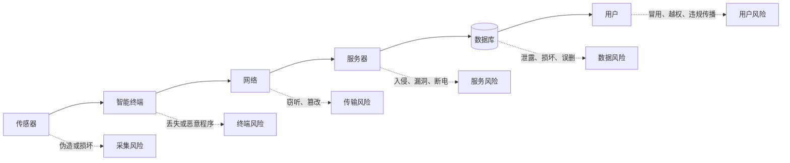
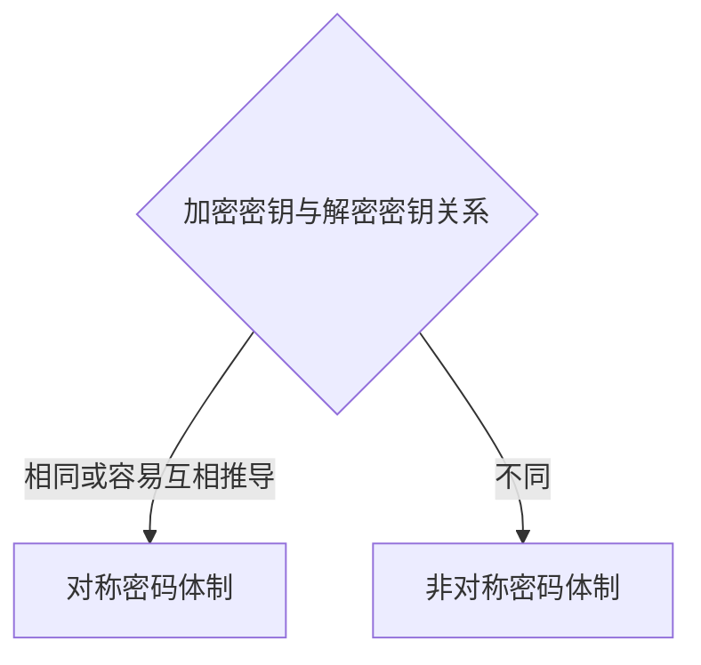
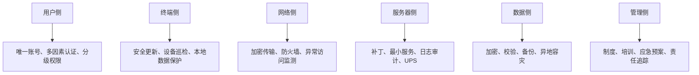

# 09-4 信息安全与信息社会责任

本讲目标：沿用上一讲的信息系统，判断系统面临什么风险、哪项措施解决什么问题，并区分身份认证、访问控制、加密、校验、备份、防火墙和社会责任。

## 一、从“能运行”到“安全运行”

上一讲的信息系统可以正常采集、传输、存储和显示数据，但每个环节都可能出现安全问题。

安全题的基本方法：

1. 找到要保护的对象。
2. 判断题干中的具体威胁。
3. 确定安全目标。
4. 选择能直接降低该风险的措施。

不要看到“安全”二字就把所有措施都选上。

## 二、信息安全的基本目标

### 1. 保密性

只有获得授权的人才能读取信息。

典型措施：

- 数据加密。
- 身份认证。
- 访问控制。
- 防止账户共享。

### 2. 完整性

数据没有被未经授权地修改、删除或伪造。

典型措施：

- 数据校验。
- 权限控制。
- 数字签名。
- 备份与版本记录。

### 3. 可用性

授权用户需要时可以正常使用系统和数据。

典型措施：

- 备用电源。
- 设备和网络冗余。
- 数据备份与恢复。
- 定期维护、故障监测。

### 4. 真实性与不可否认性

- 真实性：确认信息或用户来自所声称的来源。
- 不可否认性：行为完成后，相关方不能轻易否认。

身份认证、数字签名等技术可以提供相应支持。

## 三、常见威胁与对应措施

| 威胁 | 主要后果 | 更直接的措施 |
| --- | --- | --- |
| 账户被冒用 | 非授权访问 | 强口令、动态口令、多因素认证 |
| 合法用户越权 | 读取或修改不应接触的数据 | 分级授权、最小权限 |
| 网络窃听 | 数据泄露 | 加密传输 |
| 数据被篡改 | 完整性受损 | 校验、签名、权限控制 |
| 硬盘损坏或误删 | 数据丢失 | 备份、恢复机制 |
| 自然灾害 | 本地设备和备份同时损坏 | 异地容灾 |
| 断电 | 服务中断、未保存数据丢失 | UPS、不间断电源 |
| 病毒和恶意程序 | 系统异常、文件损坏 | 防病毒软件、补丁、安全习惯 |
| 系统漏洞 | 被攻击、控制或窃取数据 | 漏洞扫描、及时修复 |
| 外部非法访问 | 内网受攻击 | 防火墙、访问控制 |

高频陷阱：

- 借阅到期提醒属于业务功能，不是数据安全措施。
- 安装杀毒软件不能保证系统绝对安全。
- 防火墙不能预防现实中的火灾。
- 数据备份不能阻止网络窃听，但能降低数据丢失的影响。
- UPS不能防止黑客入侵，但能应对断电。

## 四、个人信息与隐私保护

### 1. 个人信息

个人信息是能够单独或与其他信息结合识别特定自然人的信息。

敏感个人信息包括：

- 身份证号码、电话号码。
- 生物特征。
- 医疗健康信息。
- 金融账户。
- 精确位置等。

不同情境中的敏感程度不同。公开姓名不代表可以随意公开身份证号、位置轨迹或医疗记录。

### 2. 保护原则

- 收集前说明目的和范围。
- 只收集完成业务所必需的数据。
- 未经许可不得随意传播。
- 对敏感数据加密存储和传输。
- 限制访问权限。
- 达到保存期限后按规定处理。

### 3. 个人安全习惯

- 不在公共计算机上保存账号密码。
- 不使用过于简单或多个平台完全相同的密码。
- 谨慎连接来源不明的公共Wi-Fi。
- 不随意点击链接或安装来源不明的软件。
- 及时更新系统和应用。

## 五、口令、密码与密钥

### 1. 概念区别

| 概念 | 含义 |
| --- | --- |
| 口令 | 用于验证用户身份，例如登录密码 |
| 明文 | 加密前可直接理解的数据 |
| 密文 | 加密后不易直接理解的数据 |
| 密钥 | 控制加密或解密过程的参数 |
| 密码算法 | 明文、密文之间变换的规则 |

登录网站时输入的“密码”在身份认证语境中通常是口令，不等于用来加密文件内容的密钥。

### 2. 对称与非对称密码体制

| 类型 | 特点 |
| --- | --- |
| 对称加密 | 加密和解密使用相同密钥，速度快，密钥分发困难 |
| 非对称加密 | 使用公钥和私钥，便于身份验证和安全交换 |

不能认为所有密码算法的加密密钥和解密密钥都相同。

## 六、加密、校验与数字签名

### 1. 加密

主要解决：未经授权的人不能读懂数据，即保密性。

加密不能自动解决：

- 数据是否有备份。
- 服务器是否断电。
- 用户是否具有合理权限。

### 2. 数据校验

数据校验用于发现传输或存储过程中数据是否发生变化。

教材中常见MD5、CRC、SHA等校验方法。它们可以辅助验证完整性，但不能把“得到相同校验值”简单理解为解决了所有安全问题。

### 3. 数字签名

数字签名主要支持：

- 验证数据来源。
- 检查内容是否被篡改。
- 提供不可否认性。

数字签名不等于在电子文档末尾插入一张手写签名图片。

## 七、身份认证与访问控制

### 1. 身份认证

回答“你是谁”。

常见依据：

- 所知道的信息：用户名、静态口令、动态口令。
- 所拥有的物品：校园卡、USB Key、手机验证码。
- 自身生物特征：指纹、人脸、虹膜。

完成身份认证只说明系统确认了用户身份，不代表用户可以访问全部资源。

### 2. 访问控制

回答“你能做什么”。

访问控制三要素：

- 主体：发起访问的人或程序。
- 客体：被访问的资源。
- 控制策略：主体对客体拥有哪些权限。

例：

| 用户 | 可查看 | 可修改 | 可删除 |
| --- | --- | --- | --- |
| 普通用户 | 自己的数据 | 部分个人信息 | 否 |
| 教师 | 所教班级数据 | 成绩和评语 | 部分 |
| 管理员 | 全部业务数据 | 系统配置 | 按制度执行 |

原则：

- 账号身份具有唯一性，不应多人共享。
- 权限应满足工作需要，但不应过大。
- 已经登录却看不到某些资源，通常是访问权限不足，不是身份认证失败。

## 八、数据备份、容灾与恢复

### 1. 备份

备份是把重要数据复制到其他介质或位置，以便原数据损坏时恢复。

注意：

- “每天备份”不等于任何情况下都不会丢失数据。
- 备份要定期验证能否恢复。
- 重要数据应避免原件和备份处于同一故障范围。

### 2. 磁盘阵列与异地容灾

- 磁盘阵列可以提高本地存储可靠性或性能。
- 异地容灾用于降低火灾、洪水等区域性灾害同时损坏本地系统和备份的风险。

用磁盘阵列预防所有自然灾害并不合理。

### 3. UPS

UPS可以在市电中断时短时间供电，为系统继续工作或安全关机提供时间。

它主要提升可用性，不能代替杀毒、防火墙或数据加密。

## 九、病毒、漏洞与防火墙

### 1. 计算机病毒

计算机病毒是人为编制、能够破坏系统或数据并具有自我复制能力的程序代码。

常见特征：

- 传染性
- 寄生性
- 隐蔽性
- 潜伏性
- 破坏性
- 可触发性

防治原则：预防为主、查杀为辅。

### 2. 漏洞

漏洞是系统设计、程序实现或配置中存在的弱点。

防护措施：

- 定期漏洞扫描。
- 及时更新系统和补丁。
- 关闭不必要的服务和端口。
- 加强权限和配置管理。

### 3. 防火墙

防火墙位于不同安全区域之间，根据规则检查和控制网络流量。

能做：

- 阻止部分未经授权的访问。
- 过滤不符合策略的流量。
- 记录网络访问情况。

不能保证：

- 消除所有病毒。
- 修复应用程序自身漏洞。
- 防止合法用户内部违规。
- 系统永远不会受到攻击。

## 十、信息社会责任

### 1. 合格数字公民

应当安全、合法、符合道德规范地使用信息技术，并对自己的数字行为负责。

### 2. 常见责任问题

- 未经授权复制、销售他人作品，可能侵犯知识产权。
- 冒用他人身份注册账号是不合适的。
- 未经本人同意公开其敏感信息可能侵犯隐私。
- 随意剪辑、歪曲或传播材料可能造成误导。
- 网络行为同样受法律和道德规范约束。

### 3. 数字鸿沟

数字鸿沟指不同人群在获取、使用信息技术和从中受益方面存在差距。

系统设计应考虑：

- 老年人、儿童和残障人士的使用能力。
- 界面是否清晰、操作是否简便。
- 是否提供替代渠道和必要帮助。
- 设备、网络和数字技能差异。

技术发展不会自动消除数字鸿沟。

### 4. 信息社会的基本要求

- 以人为本。
- 可持续发展。
- 促进信息公平与共享。
- 重视信息和知识资源。
- 在技术创新与安全、伦理之间取得平衡。

## 十一、为一套信息系统设计安全方案

以环境监测系统为例：

一道“提高系统安全性”的题，合理答案通常要针对题干风险：

- 防泄露：加密、权限控制。
- 防误删或设备损坏：备份。
- 防断电：UPS。
- 防漏洞攻击：及时修复。
- 防多人混用账号：唯一账号。
- 防自然灾害：异地容灾。

## 十二、历年真题串讲

### 真题1：安全措施

为提升智能收银系统数据安全性，下列措施不合理的是（　）

A. 为不同授权用户设置相应权限  
B. 非营业时间关闭服务器防火墙  
C. 升级服务器端杀毒软件  
D. 定期备份服务器数据

参考答案：B。

解析：防火墙不应在非营业时间随意关闭，服务器仍可能面临网络攻击。

出处：[[00真题/选考/202301-高考-高三-真题-04]]

### 真题2：不能绝对保证安全

关于智慧课堂系统安全和信息社会责任，正确的是（　）

A. 刷卡认证能确保系统没有安全隐患  
B. 安装杀毒软件后数据不会被病毒侵害  
C. 每天定时备份是保护数据安全的重要措施  
D. 未经授权可销售课堂视频

参考答案：C。

解析：认证和杀毒软件都只能降低特定风险，不能保证绝对安全；未经授权销售视频可能侵权。

出处：[[00真题/选考/202306-高考-高三-真题-04]]

### 真题3：安全与责任

下列说法正确的是（　）

A. 多人共享账户不影响安全  
B. 定期查杀病毒能确保免受网络攻击  
C. 网络上的不当行为可能触犯法律  
D. 所有密码算法的加密与解密密钥必须相同

参考答案：C。

出处：[[00真题/选考/202401-高考-高三-真题-02]]

### 真题4：隐私与备份

数字校史馆的下列做法中，合理的是（　）

A. 定期备份数据  
B. 未经校友同意发布资料  
C. 随意剪辑活动影像  
D. 明文保存注册信息

参考答案：A。

出处：[[00真题/选考/202406-高考-高三-真题-02]]

### 真题5：与安全无关的措施

下列措施不能有效提升在线图书馆数据安全的是（　）

A. 向用户发送借阅到期提醒  
B. 加密存储用户信息  
C. 定期修改管理员密码  
D. 为服务器增加不间断电源

参考答案：A。

解析：到期提醒是业务服务功能，不解决数据安全问题。

出处：[[00真题/选考/202506-高考-高三-真题-02]]

### 真题6：访问控制

下列安全与防护做法不合理的是（　）

A. 对所有用户设置相同的数据访问权限  
B. 对重要数据定期备份  
C. 定期检查传感器和网络设备  
D. 及时修复系统漏洞

参考答案：A。

解析：不同用户的工作职责和所需数据不同，应设置分级权限。

出处：[[00真题/选考/202601-高考-高三-真题-05]]

## 十三、课堂训练

### 练习1：安全目标

判断下列措施主要保护保密性、完整性还是可用性。

1. 对用户信息加密存储。  
2. 为服务器配置UPS。  
3. 使用校验值检查文件传输后是否改变。  
4. 设置数据库定期备份与恢复。  
5. 限制普通用户修改系统配置。

参考答案：

1. 保密性。  
2. 可用性。  
3. 完整性。  
4. 主要保障可用性，也有助于恢复完整数据。  
5. 完整性和访问控制。

### 练习2：认证还是授权

判断以下问题属于身份认证还是访问控制。

1. 系统要求用户输入短信验证码。  
2. 学生登录后只能查看自己的成绩。  
3. 管理员可以修改用户权限。  
4. 进入机房前需要刷卡并核验人脸。  
5. 教师无法查看其他年级的学生数据。

参考答案：身份认证、访问控制、访问控制、身份认证、访问控制。

### 练习3：选择对应措施

某系统出现以下问题，请分别给出最直接的措施。

1. 停电时服务器立即关闭，最近数据丢失。  
2. 多名员工共用管理员账号，无法追踪操作责任。  
3. 总部发生火灾后，服务器和同机房备份同时损坏。  
4. 用户信息在网络传输中可能被窃听。  
5. 已知系统存在可被远程利用的漏洞。

参考答案：

1. 配置UPS并完善安全关机、事务提交机制。  
2. 为每名员工设置唯一账号并分配最小权限。  
3. 建立异地备份或异地容灾。  
4. 使用加密传输。  
5. 及时安装补丁、修复漏洞并检查是否已被利用。

### 练习4：综合安全审查

某校监测系统采用以下做法：

- 所有教师和学生共用一个查询账号。
- 数据库每天备份到服务器的另一文件夹。
- 用户注册信息以明文保存。
- 服务器已安装杀毒软件，因此长期不更新系统。

指出四处问题并给出改进。

参考答案：

- 共用账号：改为唯一账号并分级授权。
- 备份仍在同一服务器：增加独立介质或异地备份，并验证恢复。
- 明文保存敏感信息：进行合理的加密或安全处理。
- 只依赖杀毒软件：及时更新系统、修复漏洞，并综合使用防火墙、访问控制等措施。

## 十四、课后真题清单

- [[00真题/选考/202301-高考-高三-真题-04|2023.01 信息系统安全]]
- [[00真题/选考/202306-高考-高三-真题-04|2023.06 数据备份与社会责任]]
- [[00真题/选考/202401-高考-高三-真题-02|2024.01 安全与加密]]
- [[00真题/选考/202406-高考-高三-真题-02|2024.06 隐私与备份]]
- [[00真题/选考/202501-高考-高三-真题-02|2025.01 信息社会责任]]
- [[00真题/选考/202506-高考-高三-真题-02|2025.06 数据安全措施]]
- [[00真题/选考/202601-高考-高三-真题-05|2026.01 访问控制与备份]]

## 十五、完成检查

- 能否根据风险判断主要涉及保密性、完整性还是可用性？
- 能否区分身份认证与访问控制？
- 能否区分口令、密钥、加密和数字签名？
- 能否针对断电、误删、自然灾害、窃听和漏洞分别选择措施？
- 能否解释为什么杀毒软件、防火墙和认证都不能保证绝对安全？
- 能否判断一项措施究竟是安全措施还是普通业务功能？
- 能否在信息技术应用中识别隐私、知识产权和数字鸿沟问题？
